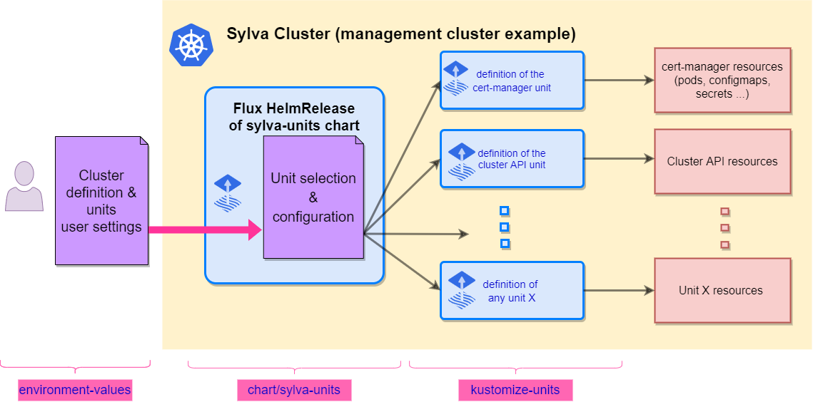

# Sylva-core project

This project provides the tools and configuration to set up a Sylva management cluster in a declarative way. It relies on [Cluster API](https://cluster-api.sigs.k8s.io/) to manage cluster lifecycle, and uses [Flux](https://fluxcd.io/flux/) to keep clusters and infrastructure components in sync with their definitions in Git.

This project is delivering the sylva-units helm chart that creates Flux objects used to deploy various software components, called "units". Each of these unit definition will be derived into a set of flux resources (Gitrepositories, Kustomizations, HelmReleases...) following the specific settings defined for the deployment.

Helm has indeed several features that can be advantageously leveraged to fullfill our goals:

- The templating enables us to ease the configuration of flux objects with a very limited boilerplate
- Thanks to an internal templating of values, we can share user provided values among several units, and add some extra logic in their configuration
- As several layers of user values can be merged on top of default ones, it provides a convenient way to adapt this upstream chart to various deployment contexts
- Its internal schema validation allows to control user values prior to interpret them
- And finally as it centralizes the versions of all units, it can be used to tag releases of the Sylva stack.

In following readme, we assume that the reader is familiar with [cluster-api](https://cluster-api.sigs.k8s.io/) technology, as well as [flux](https://fluxcd.io/flux/) gitops tool (that is in turn heavily relying on [kustomize](https://kubectl.docs.kubernetes.io/references/kustomize/) and [helm](https://helm.sh/docs/))



## Repository structure

- [kustomize-units](kustomize-units) contains the manifests used to deploy various cluster-api & infrastructure units, they will be deployed as flux Kustomizations, and must contain some Kustomizations.yaml for that purpose. Note that such units could also live in external Git repositories.
- [charts/sylva-units](charts/sylva-units/README.md) is the main helm chart that controls the installation of selected/relevant flux Kustomizations in the cluster, as well as HelmReleases, depending on the context (bootstrap, management, workload cluster) and the type of cluster-api infrastructure/bootstrap providers that are used.
- [environment-values](environment-values) contains user-provided values to control the deployment of the cluster. They attempt to provide default parameters for various deployment scenarios, but may be modified to adapt  to deployment scenarios. They will be rendered locally using kustomize tool to generate values (and secrets for security-sensitive data) that will control the behavior of the helm chart.
- [tools](tools) contains some helper scripts for the bootstrap script, as well as some other utilities
- [bootstrap.sh](bootstrap.sh) scripts will bootstrap the management cluster using a temporary cluster as described below.
- [apply.sh](apply.sh) enables to install or update the units of the management cluster. It can be used on a pre-existing cluster installed manually, or on a cluster that has been bootstrapped with this project.

## How to deploy Sylva

### Requirements

- The Sylva clusters must have access to the internet (through proxy if required) to be able to fetch kustomization maintained in the Sylva repositories and container images.
- You must first use a temporary kind cluster that can access to both internet and the infrastructure where you want to deploy the Sylva clusters.

### Defining your environment values

Management cluster configuration is done through the `sylva-units` chart values, as overrides over the chart defaults. In order properly configure the cluster, it is important to understand how this configuration will be generated. The values are made of two sections:

- The first one contains a list of sources and units that will be installed by Flux in the cluster. For example, following repo & unit definition will install the OpenStack infrastructure provider for cluster api (aka. capo) using a kustomization [./kustomize-units/capo](./kustomize-units/capo) hosted in the current repository.

```yaml
### Chart values ###
source_templates: # defines Flux GitRepository/OCIRepository resources
  [...]
  sylva-core:
    spec:
      url: https://gitlab.com/sylva-projects/sylva-core.git
      ref:
        branch: develop
units: # defines Flux Kustomizations & HelmReleases
  [...]
  capo:
    enabled: '{{ eq .Values.cluster.capi_providers.infra_provider "capo" | include "preserve-type" }}'
    repo: sylva-core
    depends_on:
      cert-manager: true
    kustomization_spec:
      path: ./kustomize-units/capo
      wait: true
```

- The second section contains "high level" values that are meant to be used in [goTpl expressions](https://helm.sh/docs/chart_template_guide/function_list/). For example, the capo controller unit defined above will occur if the user also provides following values to the chart (as `.Values.cluster.capi_providers.infra_provider` will be equal to `capo` ):

```yaml
### User values ###
cluster:
  capi_providers:
    infra_provider: capo
    bootstrap_provider: cabpk
  image: ...
```

As these values can be shared among multiple units, they'll allow us to define some global values like `proxies` that will be configured in multiple places

As user-provided parameters are merged over default chart values, we can also easily override anything in units definitions. For example, even if you choose kubeadm infra provider for you management cluster using `bootstrap_provider: cabpk` as in example above, you may also want to install rke2 infrastructure provider unit:

```yaml
### Chart values ###
units:
  [...]
  cabpr:  # RKE2
    enabled: '{{ .Values.cluster.capi_providers.bootstrap_provider | eq "cabpr" | include "preserve-type" }}'
    repo: sylva-core
    depends_on:
      cert-manager: true
    kustomization_spec:
      path: ./kustomize-units/cabpr
      wait: true
```

This can be done by overwriting the chart value presented by forcing the `enabled` value of the unit:

```yaml
### User values ###
units:
  cabpr:
    enabled: yes
cluster:
  capi_providers:
    infra_provider: capo
    bootstrap_provider: cabpk
  image: ...
```

This mechanism is quite powerful, as it enables to adapt values to various contexts. In this project, we intent to maintain several configuration references that are provided as references in the [environment-values](environment-values) directory.

### Process to be followed for various infrastructure provider

<details><summary>
Deploying clusters in Docker using CAPD (click to expand)
</summary>

Event if it is not representative of any real-life deployment use-case, running clusters in Docker is useful to enable the testing of lifecycle management of clusters without any infrastructure requirement.

It can be used to test that stack on a laptop or in [GitLab-ci](.gitlab-ci.yml). You just have to [install Docker](https://docs.docker.com/engine/install/) as a prerequisite, and then clone this [project](https://gitlab.com/sylva-projects/sylva-core).

Then you'll have to create a kind cluster with access to Docker socket:

```shell
cat <<EOF | kind create cluster --name capd --config=-
kind: Cluster
apiVersion: kind.x-k8s.io/v1alpha4
nodes:
- role: control-plane
  extraMounts:
    - hostPath: /var/run/docker.sock
      containerPath: /var/run/docker.sock
EOF
```

As we'll be creating a fair amount of containers, it is recommended to increase the filesystem watcher limit in order to avoid reaching the limit.

```shell
echo "fs.inotify.max_user_watches = 524288" | sudo tee -a /etc/sysctl.conf
echo "fs.inotify.max_user_instances = 512" | sudo tee -a /etc/sysctl.conf
sudo sysctl -p /etc/sysctl.conf
```

Then you may adapt your environment values (in `environment-values/kubeadm-capd/values.yaml`)
For capd deployment, you have to:

- provide the proxy address if you are using one:

```yaml
proxies:
  http_proxy: http://your.company.proxy.url
  https_proxy: http://your.company.proxy.url
  no_proxy: 127.0.0.1,localhost,192.168.0.0/16,172.16.0.0/12,10.0.0.0/8
```

- modify existing parameter `cluster_external_ip: xx.xx.xx.xx` in file [`environment-values/kubeadm-capd/values.yaml`](https://gitlab.com/sylva-projects/sylva-core/-/blob/main/environment-values/kubeadm-capd/values.yaml#L21) accordingly

Then you can bootstrap the management cluster creation:

```shell
./bootstrap.sh environment-values/kubeadm-capd
```

If you want to deploy a cluster using cluster-api-rke2 bootstrap provider, you just have to use the [environment-values/rke2-capd](environment-values/rke2-capd) directory instead.

> **_NOTE:_** If you intent to contribute back to this project (we would be happy to welcome you!), you should probably create your own copy of environment-values prior to edit them. This way you won't be editing files that are tracked by Git, and will not commit them by inadvertence:
>
> ```shell
> cp -a environment-values/rke2-capd environment-values/my-rke2-capd
> ```

For more details on environment-values generation you can have a look at the [dedicated README](environment-values/README.md).

</details>

<details><summary>Deploying clusters in OpenStack using CAPO</summary>

The workflow is quite similar to previous one with Docker, you'll only have to provide different variables

Before triggering bootstrap.sh, certain prerequisites need to be done/followed

- Create a **bootstrap vm** using OpenStack or use existing vm.
- Set the **proxies** environment variables (http_proxy, https_proxy, no_proxy) if using corporate proxy
- Install **kubectl** and **[kind](https://kind.sigs.k8s.io/docs/user/quick-start/#installation)**
- Clone **sylva-core** project on bootstrap vm
- Create **kind** cluster using the below command.

  ```shell
  kind create cluster --name bootstrap
  ```

  Note that you can create multiple kind clusters on a single bootstrap vm. You just need to switch the context to the cluster you want to work with

  ```shell
  kind export kubeconfig --name <cluster-name>
  ```

- Reserve a pair of **neutron ports** or allocate **floating IP's**.
  These will be used as external IPs for management and sample workload cluster. These ports should be created in a network that is reachable from the bootstrap cluster (typically an external network).

  ```shell
  openstack port create --network c314d52c-80fe-42b6-9092-55be383d1951 management-cluster-external
  openstack port create --network c314d52c-80fe-42b6-9092-55be383d1951 workload-cluster-external
  ```

  ```shell
  openstack floating ip create <management-cluster-vip-name>
  openstack floating ip create <sample-workload-cluster-vip-name>
  ```

- Create your own copy of **environment-values** (this will prevent you from accidentally committing your secrets).

  ```shell
  cp -a environment-values/kubeadm-capo environment-values/my-capo-env
  ```

- Provide your **OpenStack credentials** in `environment-values/my-capo-env/secrets.yaml`

  ```shell
  auth_url: # replace me
    user_domain_name: # replace me
    project_domain_name: # replace me
    project_name: # replace me
    username: # replace me
    password: # replace me
  ```

> **_NOTE:_** obviously, the `secrets.yaml` file is sensitive and meant to be ignored by Git (see `.gitignore`). However, for the sake of security, it can be good idea to [secure these files with SOPS](./sops-howto.md) to mitigate the risk of leakage.

- Adapt `environment-values/my-capo-env/values.yaml` to suit your environment:

  ```yaml
  ...
      workload-cluster:
          kustomization_spec:
            postBuild:
              substitute:
                CLUSTER_EXTERNAL_IP: 1.2.2.1 # IP address of workload-cluster external port

      cluster:
        image: capo-ubuntu-2004-kube-v1.23.6-calico-3.23.1 # Image build with image-builder and uploaded in glance
        flavor:
          infra_provider: capo #capd pr capo
          bootstrap_provider: cabpk # cabpr (RKE2) or cabpk (kubeadm)
        capo:
          ssh_key_name: # put the name of your nova SSH keypair here, you'll need it if you intent to ssh to cluster nodes
          network_id: c314d52c-80fe-42b6-9092-55be383d1951 # The id of the network in which cluster nodes will be created (must be the same as the one in which you've reserved external IPs)
          cluster_external_ip: 1.2.3.4  # IP address of management-cluster-external port

      proxies:
        http_proxy: http://your.company.proxy.url  #replace me
        https_proxy: http://your.company.proxy.url  #replace me
        no_proxy: 127.0.0.1,localhost,192.168.0.0/16,172.16.0.0/12,10.0.0.0/8
  ```

- Run the bootstrap script:

  ```shell
  ./bootstrap.sh environment-values/my-capo-env
  ```

</details>

<details><summary>Deploying clusters in VMware vSphere using CAPV</summary>

Before trigerring bootstrap.sh, some prerequisites need to be satisfied.

- Create a **bootstrap vm** using OpenStack, vsphere or use an existing vm.
- Set the **proxies** environment variables (http_proxy, https_proxy, no_proxy) if using corporate proxy
- Install **kubectl** and **[kind](https://kind.sigs.k8s.io/docs/user/quick-start/#installation)**
- Clone **sylva-core** project on bootstrap vm
- Create **kind** cluster using the below command.

  ```shell
   kind create cluster --name bootstrap
  ```

  Note that you can create multiple kind clusters on a single bootstrap vm. You just need to switch the context to the cluster you want to work with

  ```shell
   kind export kubeconfig --name <cluster-name>
  ```

- Create your own copy of **environment-values** (this will prevent you from accidentally committing your secrets).

  ```shell
   cp -a environment-values/kubeadm-capv environment-values/my-capv-env
  ```

- Provide your **vCenter credentials** in `environment-values/my-capv-env/secrets.yaml`

    ```shell
      username: # replace me
      password: # replace me
   ```

- Adapt `environment-values/my-capv-env/values.yaml` to suit your environment:

  ```yaml
      ...
      cluster:
        name: management-cluster

        # image reference depends provider
        image: "ubuntu-2004-kube-v1.22.8"

        # for now, the choice below needs to be made
        # consistently with the choice of a matching kustomization path
        # for the 'cluster' unit
        # e.g. you can use ./management-cluster-def/rke2-capd
        capi_providers:
          infra_provider: capv   # capv
          bootstrap_provider: cabpk  # RKE2 or kubeadm

        capv:
          # -- Datacenter to use
          dataCenter: # replace me
          # -- VSphere network for VMs and CSI
          network: # replace me
          # -- VSphere server dns name
          server: # replace me
          # -- VSphere https TLS thumbprint
          tlsThumbprint: # replace me

        cluster_external_ip: # replace me

      proxies:
        http_proxy: http://your.company.proxy.url  #replace me
        https_proxy: http://your.company.proxy.url  #replace me
        no_proxy: 127.0.0.1,localhost,192.168.0.0/16,172.16.0.0/12,10.0.0.0/8
  ```

  - The `image` field contains the name of the VM template used to deploy the VMs for the management cluster. The VM template is created from an OVA image. You can find a set of pre-built images in the [repository of CAPV provider](https://github.com/kubernetes-sigs/cluster-api-provider-vsphere#Kubernetes-versions-with-published-OVAs).
  - The `bootstrap_provider` field can currently be set to `cabpk` for kubeadm or to `cabpr` for rke2
  - The `tlsThumbprint` field contains the SHA1 thumbprint of the vCenter certificate. It can be retrieved from the certificate with this command:

  ```shell
  openssl x509 -sha1 -fingerprint -in ca.crt -noout
  ```

> **_NOTE:_** If your bootstrap cluster machine is behind a corporate proxy, then all the above proxies should be included as environment variables before running bootstrap.sh

- The deployment of the management cluster on vSphere uses the [cluster-vsphere](https://gitlab.com/sylva-projects/sylva-elements/helm-charts/cluster-vsphere) Helm Chart to configure and install the relevant manifests. The file `environment-values/my-capv-env/management-cluster-capv-values.yaml` provides the values for the chart. Adapt it to suit your environment.
  - The provided file contains the minimum set of values required to setup the cluster. There are a few values that depends on the specific vSphere environment and have to be filled:
    - Specify the API server endpoint. It must corresponds to the value provided to `cluster_external_ip`.

    ```yaml
    cluster:
    controlPlaneEndpoint:
      # -- IP or DNS name of the kubernetes endpoint
      host: # set the same value as ./values.yaml:cluster.cluster_external_ip
    ```

    - In case your environment is behind a corporate proxy, replace the proxy placeholders with the values that apply to your setup
    - To access the VMs of the cluster via SSH, provide your SSH key:

    ```yaml
    # Vsphere VMs configuration
    machines:
      # -- users to create on machines
      # see https://github.com/kubernetes-sigs/cluster-api/blob/main/bootstrap/kubeadm/api/v1beta1/kubeadmconfig_types.go#L257 for documentation about user config object
      users:
      - name: capv
        sshAuthorizedKeys:
        - ssh-rsa <your ssh key>
          <username>@<hostname>
        sudo: ALL=(ALL) NOPASSWD:ALL
    ```

    - Provide a few additional values specific to the vSphere environment:

    ```yaml
    # Control plane VMs configuration
    controlPlane:
      ...
      # -- Control plane VSphere resource pool
      resourcePool: # replace me
      # -- Control plane VSphere machine template to clone, must contain kubeadm at the same version as specified in kubernetes.version
      template: # replace me, use the same value used for the above image field
      # -- Control plane VSphere folder to store VM
      folder: # replace me
      # -- Control plane VSphere datastore to create/locate machine
      dataStore: # replace me
    
    ...

    workers:
    # -- Name of the standard worker pool, you can define as many others pools as required
      worker-md-0:
        ...
        # -- workers VSphere resource pool
        resourcePool: # replace me
        # -- workers VSphere machine template to clone, must contain kubeadm at the same version as specified in kubernetes.version
        template: # replace me, use the same value used for the above image field
        # -- workers VSphere folder to store VM
        folder: # replace me
        # -- workers VSphere datastore to create/locate machine
        dataStore: # replace me

    ```

- Run the bootstrap script:

   ```shell
    no_proxy="127.0.0.0/8,10.0.0.0/8,172.16.0.0/12,192.168.0.0/16" http_proxy=<proxy-url> https_proxy=<proxy-url> ./bootstrap.sh environment-values/my-capv-env
   ```

</details>

### Deploying the management cluster from scratch (Bootstrap workflow)

In previous deployment examples we use an intermediate temporary/disposable bootstrap cluster to provision the management cluster using Cluster API. This is the recommended path as it will enable you to manage the lifecycle of the management cluster itself in the future. The bootstrap process works with the following workflow:

- Use `kind` to deploy a temporary bootstrap cluster
- Install Flux on that cluster
- Instruct flux to deploy the `sylva-units` HelmRelease that will in turn install cluster-api and infrastructure units in the bootstrap cluster
- `sylva-units` will also install dependent Kustomizations defining Cluster API manifests for the management cluster
- Once the management cluster is ready, Flux will be installed in it, as well as the `sylva-units` HelmRelease that will deploy again cluster-api & infrastructure units in the management cluster
- Management cluster definitions are moved (aka. pivoted) to management cluster, that will become independent and self-managed
- Once the management cluster is deployed, you can connect to it with the kubeconfig file created, named `management-cluster-kubeconfig` (using `kubectl --kubeconfig management-cluster-kubeconfig ...` or `export KUBECONFIG=management-cluster-kubeconfig`).
- At this stage, bootstrap cluster can be deleted

### Deploying workload clusters

Deploying a workload cluster the gitops way means that some specific kustomizations defining the workload clusters have to be defined. This is done by the unit named `test-workload-cluster`. If this unit is enabled in the user values given to the `sylva-units` Helm chart, then a workload cluster will be deployed. You'll be able to see it from the Rancher Web UI.

## Tips and Troubleshooting

As the stack if highly relying on flux, it is the main entry point to start with when something goes wrong. As all units are managed by kustomizations, this is the fist thing to look at:

```shell
kubectl get kustomizations
```

> You can also install and use use [flux cli](https://fluxcd.io/flux/installation/#install-the-flux-cli) to watch these ressources. As we are creating flux resources in default namespace, we recommand you to `export FLUX_SYSTEM_NAMESPACE=default`, this way you'll be able to issue flux commands without having to provide the namespace at each time. With flux cli, the equivalent of previous command would be `flux get kustomizations`

If you don't have any kustomization in your cluster, it means that the sylva-units chart has not been properly instantiated. In that case you should have a look at the resources that are managing that chart:

```shell
kubectl get gitrepositories.source.toolkit.fluxcd.io sylva-units
kubectl get helmcharts.source.toolkit.fluxcd.io default-sylva-units
kubectl get helmreleases.helm.toolkit.fluxcd.io sylva-units
```

If your management cluster is not properly deploying you should have a look at cluster-api resources:

```shell
kubectl get cluster
kubectl get machine
kubectl get openstackmachine
```

If you don't have enough info in the status of these resources, you can also have a look at the logs of capi infrastructure & bootstrap providers:

```shell
kubetail -n capo-system -s 12h
```

You can also install and use the [clusterctl tool](https://github.com/kubernetes-sigs/cluster-api/releases), it can be used to have a summary of the cluster deployment status:

```shell
clusterctl describe cluster management-cluster --show-conditions all
```

### Knowing the state of a deployment

When a deployment (a first one or an update) is done, this is reflected in the status of the `sylva-units`
HelmRelease:

```terminal
$ kubectl get helmreleases sylva-units -o yaml | yq .status.conditions
- lastTransitionTime: "2023-02-28T13:14:19Z"
  message: Release reconciliation succeeded
  reason: ReconciliationSucceeded
  status: "True"
#         ^^^^^^
  type: Ready
- lastTransitionTime: "2023-02-28T13:14:19Z"
  message: Helm upgrade succeeded
  reason: UpgradeSucceeded
  status: "True"
  type: Released
```

To know _what_ has been deployed you can find information in the `sylva-units-status` ConfigMap
which is produced by a Kustomization that has a dependency on all top-level Kustomizations for each units
and is hence only produced when the deployment or update proceeded to completion.

```terminal
$ kubectl get configmap sylva-units-status -o yaml | yq .data
release-revision: "16"
release-time: "2023-02-28 14:30:16.847929741 +0100 CET m=+0.638859234"
sylva-units-chart-version: 0.1.0+7e1c2369eddf.2
values-checksum: 644d1efc8e0818f815306c705014a39421ee14f8c6b47685e98d341c9ab19808
```

This information allows you to determine what was the last exact version of `sylva-units` which
was successfully deployed (including the `sylva-core` Git commit id, `61e2cc0f64ec` in this example).

The configmap also includes a checksum of the values.

The information in this ConfigMap can be compared with the annotations of the `sylva-units-status` Kustomization;
these annotations contains the target values of any in progress deployment.

```terminal
$ kubectl get kustomizations.kustomize.toolkit.fluxcd.io/sylva-units-status -o jsonpath='{.metadata.annotations}' | jq
  {
    "meta.helm.sh/release-name": "sylva-units",
    "meta.helm.sh/release-namespace": "default",
    "reconcile.fluxcd.io/requestedAt": "2023-02-28T12:14:56.267009104+01:00",
    "release-time": "2023-02-28 14:30:16.847929741 +0100 CET m=+0.638859234"
    "target-release-revision": "16",
    "target-sylva-units-chart-version": "0.1.0+7e1c2369eddf.2",
    "target-values-checksum": "644d1efc8e0818f815306c705014a39421ee14f8c6b47685e98d341c9ab19808"
  }
```

### Working directly on the management cluster

Once the bootstrap phase is done, and the pivot is done, the management cluster can be updated with:

```
./apply.sh <your-environment-name>
```

### Cleaning things up

<!-- markdownlint-disable MD044 -->

One limitation of this approach is that management cluster can not delete himself properly, as it will shoot itself in the foot at some point. [openstack-cleanup.sh](tools/openstack-cleanup.sh) script is provided to help cleaning the resources created by capo.

<!-- markdownlint-enable MD044 -->
