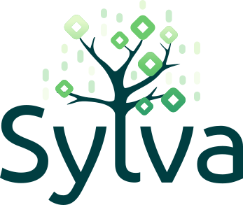

Note: Document has been modified and split into multiple unitary documents available on the [documentation portal](https://sylva-projects.gitlab.io/dev-zone/getting-started).

# Sylva-core

This repository provides the tools and configurations to set up a Sylva management cluster in a declarative way.

## Start using Sylva

See our documentation on [Sylva Documentation Portal](https://sylva-projects.gitlab.io).

## Sylva stack

- [ClusterAPI](https://cluster-api.sigs.k8s.io/) used to manage cluster lifecycle
- [Flux](https://fluxcd.io/flux/) used to keep clusters and infrastructure components in sync with their definitions in Git
- [Helm](https://helm.sh/) used to deploy charts
- [Kustomize](https://kustomize.io/) used to customize untemplated YAML files, leaving the original files untouched
- [Sylva-units helm chart](https://gitlab.com/sylva-projects/sylva-core/-/tree/main/charts/sylva-units?ref_type=heads), a custom helm chart, used to deploy various software components called "units". Each unit is then derived into a set of Flux ressources (GitRepositories, HelmRepositories, OCIRepositories, Kustomizations, HelmReleases)

## Repository structure

- [kustomize-units](kustomize-units) contains the manifests used to deploy various cluster-api & infrastructure units, they will be deployed as flux Kustomizations, and must contain some `kustomization.yaml` for that purpose. Note that such units could also live in external Git repositories.
- [charts/sylva-units](charts/sylva-units/README.md) is the main helm chart that controls the installation of selected/relevant flux Kustomizations in the cluster, as well as HelmReleases, depending on the context (bootstrap, management, workload cluster) and the type of cluster-api infrastructure/bootstrap providers that are used.
- [environment-values](environment-values) contains user-provided values to control the deployment of the cluster. They attempt to provide default parameters for various deployment scenarios, but may be modified to adapt  to deployment scenarios. They will be rendered locally using kustomize tool to generate values (and secrets for security-sensitive data) that will control the behavior of the helm chart.
- [tools](tools) contains some helper scripts for the bootstrap script, as well as some other utilities
- [bootstrap.sh](bootstrap.sh) scripts will bootstrap the management cluster using a temporary cluster.
- [apply.sh](apply.sh) enables to install or update the units of the management cluster. It can be used on a pre-existing cluster installed manually, or on a cluster that has been bootstrapped with this project.
- [apply-workload-cluster.sh](apply-workload-cluster.sh) enables to install or update the units of the workload cluster.
