## [Kustomization dependencies](https://fluxcd.io/flux/components/kustomize/kustomizations/#dependencies) diagrams

Following diagrams were created using [tools/unit-dependency-diagram](../../../../tools/unit-dependency-diagram) and calling [mermaid-cli](https://github.com/mermaid-js/mermaid-cli) for SVG transformation.

<Tabs groupId="flavor-tabs">

### kubeadm-capd

<TabItem value="kubeadm-capd" label='bootstrap cluster for kubeadm-capd deployment'>

bootstrap cluster for kubeadm-capd deployment:

</TabItem>

### kubeadm-capo

<TabItem value="kubeadm-capo" label='bootstrap cluster for kubeadm-capo deployment'>

bootstrap cluster for kubeadm-capo deployment:

</TabItem>

### kubeadm-capv

<TabItem value="kubeadm-capv" label='bootstrap cluster for kubeadm-capv deployment'>

bootstrap cluster for kubeadm-capv deployment:

</TabItem>

### rke2-capd

<TabItem value="rke2-capd" label='bootstrap cluster for rke2-capd deployment'>

bootstrap cluster for rke2-capd deployment:

</TabItem>

### rke2-capo

<TabItem value="rke2-capo" label='bootstrap cluster for rke2-capo deployment'>

bootstrap cluster for rke2-capo deployment:

</TabItem>

### rke2-capv

<TabItem value="rke2-capv" label='bootstrap cluster for rke2-capv deployment'>

bootstrap cluster for rke2-capv deployment:

</TabItem>

### rke2-capm3

<TabItem value="rke2-capm3" label='bootstrap cluster for rke2-capm3 deployment'>

bootstrap cluster for rke2-capm3 deployment:

</TabItem>

### rke2-capm3-virt

<TabItem value="rke2-capm3-virt" label='bootstrap cluster for rke2-capm3-virt deployment'>

bootstrap cluster for rke2-capm3-virt deployment:

</TabItem>

</Tabs>
