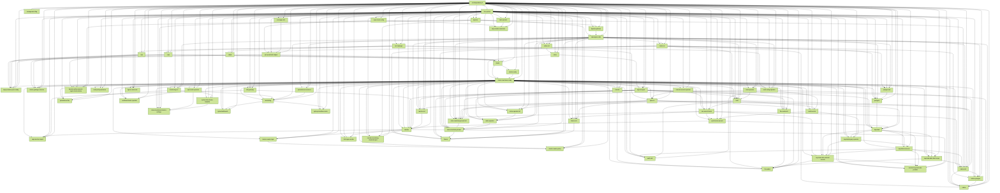
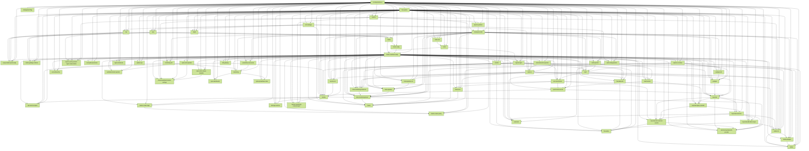
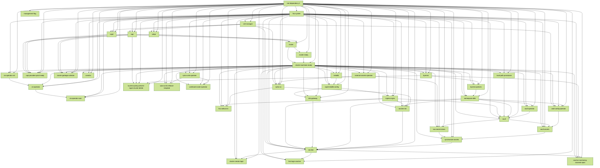
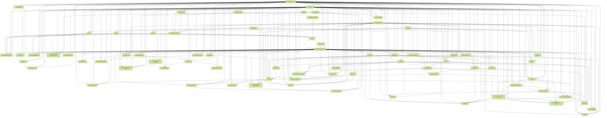
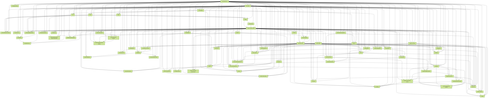
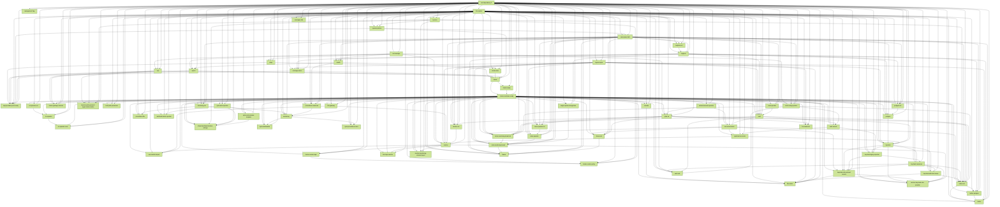
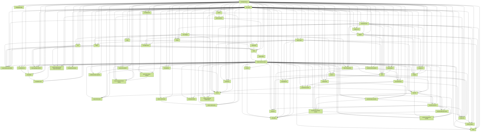

## [Kustomization dependencies](https://fluxcd.io/flux/components/kustomize/kustomizations/#dependencies) diagrams

```mermaid
%%{init: {'theme': 'forest'} }%%
graph TD;
  cert-manager --> cabpk
  flux-system --> cabpk
  root-dependency-1 --> cabpk
  calico-crd --> calico
  flux-system --> calico
  root-dependency-1 --> calico
  flux-system --> calico-crd
  namespace-defs --> calico-crd
  root-dependency-1 --> calico-crd
  cert-manager --> capi
  flux-system --> capi
  root-dependency-1 --> capi
  cabpk --> capi-providers-pivot-ready
  capi --> capi-providers-pivot-ready
  capo --> capi-providers-pivot-ready
  cluster-machines-ready --> capi-providers-pivot-ready
  flux-system --> capi-providers-pivot-ready
  get-openstack-images --> capi-providers-pivot-ready
  root-dependency-1 --> capi-providers-pivot-ready
  cluster-machines-ready --> capi-rancher-import
  flux-system --> capi-rancher-import
  k8s-gateway --> capi-rancher-import
  rancher --> capi-rancher-import
  root-dependency-1 --> capi-rancher-import
  cert-manager --> capo
  flux-system --> capo
  root-dependency-1 --> capo
  flux-system --> capo-cloud-config
  root-dependency-1 --> capo-cloud-config
  capo-cloud-config --> capo-cluster-resources
  flux-system --> capo-cluster-resources
  heat-operator --> capo-cluster-resources
  root-dependency-1 --> capo-cluster-resources
  flux-system --> cert-manager
  root-dependency-1 --> cert-manager
  flux-system --> cinder-csi
  namespace-defs --> cinder-csi
  root-dependency-1 --> cinder-csi
  cabpk --> cluster
  capi --> cluster
  capo --> cluster
  capo-cluster-resources --> cluster
  get-openstack-images --> cluster
  root-dependency-1 --> cluster
  cluster-machines-ready --> cluster-creator-login
  flux-system --> cluster-creator-login
  rancher --> cluster-creator-login
  root-dependency-1 --> cluster-creator-login
  cluster-creator-login --> cluster-creator-policy
  cluster-machines-ready --> cluster-creator-policy
  flux-system --> cluster-creator-policy
  kyverno --> cluster-creator-policy
  root-dependency-1 --> cluster-creator-policy
  capi --> cluster-garbage-collector
  capo --> cluster-garbage-collector
  cluster-machines-ready --> cluster-garbage-collector
  flux-system --> cluster-garbage-collector
  root-dependency-1 --> cluster-garbage-collector
  calico --> cluster-machines-ready
  cluster --> cluster-machines-ready
  cluster-ready --> cluster-machines-ready
  root-dependency-1 --> cluster-machines-ready
  cluster --> cluster-ready
  root-dependency-1 --> cluster-ready
  cluster-machines-ready --> coredns
  flux-system --> coredns
  root-dependency-1 --> coredns
  cluster-machines-ready --> eso-secret-stores
  external-secrets-operator --> eso-secret-stores
  flux-system --> eso-secret-stores
  root-dependency-1 --> eso-secret-stores
  vault --> eso-secret-stores
  cluster-machines-ready --> external-secrets-operator
  flux-system --> external-secrets-operator
  root-dependency-1 --> external-secrets-operator
  cluster-machines-ready --> first-login-rancher
  flux-system --> first-login-rancher
  rancher --> first-login-rancher
  root-dependency-1 --> first-login-rancher
  root-dependency-1 --> flux-system
  cluster-machines-ready --> flux-webui
  coredns --> flux-webui
  flux-system --> flux-webui
  flux-webui-init --> flux-webui
  ingress-nginx --> flux-webui
  keycloak-add-client-scope --> flux-webui
  keycloak-oidc-external-secrets --> flux-webui
  root-dependency-1 --> flux-webui
  cluster-machines-ready --> flux-webui-init
  flux-system --> flux-webui-init
  ingress-nginx --> flux-webui-init
  root-dependency-1 --> flux-webui-init
  sylva-ca --> flux-webui-init
  capo-cloud-config --> get-openstack-images
  cinder-csi --> get-openstack-images
  flux-system --> get-openstack-images
  os-images-info --> get-openstack-images
  root-dependency-1 --> get-openstack-images
  cinder-csi --> harbor
  cluster-machines-ready --> harbor
  flux-system --> harbor
  harbor-init --> harbor
  harbor-postgres --> harbor
  ingress-nginx --> harbor
  namespace-defs --> harbor
  root-dependency-1 --> harbor
  cluster-machines-ready --> harbor-init
  eso-secret-stores --> harbor-init
  flux-system --> harbor-init
  keycloak-add-client-scope --> harbor-init
  keycloak-resources --> harbor-init
  kyverno --> harbor-init
  namespace-defs --> harbor-init
  root-dependency-1 --> harbor-init
  sylva-ca --> harbor-init
  vault --> harbor-init
  vault-config-operator --> harbor-init
  cinder-csi --> harbor-postgres
  cluster-machines-ready --> harbor-postgres
  flux-system --> harbor-postgres
  harbor-init --> harbor-postgres
  namespace-defs --> harbor-postgres
  root-dependency-1 --> harbor-postgres
  flux-system --> heat-operator
  root-dependency-1 --> heat-operator
  calico --> ingress-nginx
  cluster-machines-ready --> ingress-nginx
  flux-system --> ingress-nginx
  root-dependency-1 --> ingress-nginx
  cluster-machines-ready --> k8s-gateway
  flux-system --> k8s-gateway
  root-dependency-1 --> k8s-gateway
  cluster-machines-ready --> keycloak
  flux-system --> keycloak
  ingress-nginx --> keycloak
  postgres --> keycloak
  root-dependency-1 --> keycloak
  sylva-ca --> keycloak
  synchronize-secrets --> keycloak
  cluster-machines-ready --> keycloak-add-client-scope
  flux-system --> keycloak-add-client-scope
  keycloak --> keycloak-add-client-scope
  keycloak-resources --> keycloak-add-client-scope
  root-dependency-1 --> keycloak-add-client-scope
  cluster-machines-ready --> keycloak-legacy-operator
  flux-system --> keycloak-legacy-operator
  keycloak --> keycloak-legacy-operator
  root-dependency-1 --> keycloak-legacy-operator
  vault-secrets --> keycloak-legacy-operator
  cluster-machines-ready --> keycloak-oidc-external-secrets
  eso-secret-stores --> keycloak-oidc-external-secrets
  flux-system --> keycloak-oidc-external-secrets
  keycloak --> keycloak-oidc-external-secrets
  keycloak-legacy-operator --> keycloak-oidc-external-secrets
  keycloak-resources --> keycloak-oidc-external-secrets
  root-dependency-1 --> keycloak-oidc-external-secrets
  cluster-machines-ready --> keycloak-resources
  flux-system --> keycloak-resources
  keycloak --> keycloak-resources
  keycloak-legacy-operator --> keycloak-resources
  root-dependency-1 --> keycloak-resources
  flux-system --> kyverno
  root-dependency-1 --> kyverno
  flux-system --> kyverno-policies
  kyverno --> kyverno-policies
  root-dependency-1 --> kyverno-policies
  capi --> kyverno-policy-prevent-mgmt-cluster-delete
  cluster-machines-ready --> kyverno-policy-prevent-mgmt-cluster-delete
  flux-system --> kyverno-policy-prevent-mgmt-cluster-delete
  kyverno --> kyverno-policy-prevent-mgmt-cluster-delete
  root-dependency-1 --> kyverno-policy-prevent-mgmt-cluster-delete
  cluster-machines-ready --> local-path-provisioner
  flux-system --> local-path-provisioner
  root-dependency-1 --> local-path-provisioner
  root-dependency-1 --> management-flag
  cinder-csi --> minio-monitoring-tenant
  cluster-machines-ready --> minio-monitoring-tenant
  flux-system --> minio-monitoring-tenant
  ingress-nginx --> minio-monitoring-tenant
  minio-monitoring-tenant-init --> minio-monitoring-tenant
  minio-operator --> minio-monitoring-tenant
  namespace-defs --> minio-monitoring-tenant
  root-dependency-1 --> minio-monitoring-tenant
  cluster-machines-ready --> minio-monitoring-tenant-init
  eso-secret-stores --> minio-monitoring-tenant-init
  flux-system --> minio-monitoring-tenant-init
  namespace-defs --> minio-monitoring-tenant-init
  root-dependency-1 --> minio-monitoring-tenant-init
  sylva-ca --> minio-monitoring-tenant-init
  vault --> minio-monitoring-tenant-init
  vault-config-operator --> minio-monitoring-tenant-init
  cluster-machines-ready --> minio-operator
  flux-system --> minio-operator
  ingress-nginx --> minio-operator
  minio-operator-init --> minio-operator
  namespace-defs --> minio-operator
  root-dependency-1 --> minio-operator
  cluster-machines-ready --> minio-operator-init
  flux-system --> minio-operator-init
  namespace-defs --> minio-operator-init
  root-dependency-1 --> minio-operator-init
  sylva-ca --> minio-operator-init
  cluster-machines-ready --> monitoring
  flux-system --> monitoring
  monitoring-crd --> monitoring
  namespace-defs --> monitoring
  prometheus-resources --> monitoring
  root-dependency-1 --> monitoring
  cluster-machines-ready --> monitoring-crd
  flux-system --> monitoring-crd
  namespace-defs --> monitoring-crd
  root-dependency-1 --> monitoring-crd
  flux-system --> namespace-defs
  kyverno-policies --> namespace-defs
  root-dependency-1 --> namespace-defs
  flux-system --> os-images-info
  root-dependency-1 --> os-images-info
  cinder-csi --> postgres
  cluster-machines-ready --> postgres
  flux-system --> postgres
  namespace-defs --> postgres
  postgres-init --> postgres
  root-dependency-1 --> postgres
  cinder-csi --> postgres-init
  cluster-machines-ready --> postgres-init
  flux-system --> postgres-init
  namespace-defs --> postgres-init
  root-dependency-1 --> postgres-init
  cluster-machines-ready --> prometheus-flux
  flux-system --> prometheus-flux
  monitoring-crd --> prometheus-flux
  root-dependency-1 --> prometheus-flux
  cluster-machines-ready --> prometheus-resources
  flux-system --> prometheus-resources
  namespace-defs --> prometheus-resources
  root-dependency-1 --> prometheus-resources
  cert-manager --> rancher
  cluster-machines-ready --> rancher
  flux-system --> rancher
  ingress-nginx --> rancher
  k8s-gateway --> rancher
  namespace-defs --> rancher
  rancher-init --> rancher
  root-dependency-1 --> rancher
  synchronize-secrets --> rancher
  cluster-machines-ready --> rancher-init
  flux-system --> rancher-init
  ingress-nginx --> rancher-init
  namespace-defs --> rancher-init
  root-dependency-1 --> rancher-init
  sylva-ca --> rancher-init
  cluster-machines-ready --> rancher-keycloak-oidc-provider
  flux-system --> rancher-keycloak-oidc-provider
  keycloak --> rancher-keycloak-oidc-provider
  keycloak-oidc-external-secrets --> rancher-keycloak-oidc-provider
  keycloak-resources --> rancher-keycloak-oidc-provider
  rancher --> rancher-keycloak-oidc-provider
  root-dependency-1 --> rancher-keycloak-oidc-provider
  cluster-machines-ready --> rancher-monitoring-clusterid-inject
  flux-system --> rancher-monitoring-clusterid-inject
  kyverno --> rancher-monitoring-clusterid-inject
  rancher --> rancher-monitoring-clusterid-inject
  root-dependency-1 --> rancher-monitoring-clusterid-inject
  cluster-machines-ready --> shared-workload-clusters-settings
  flux-system --> shared-workload-clusters-settings
  kyverno --> shared-workload-clusters-settings
  root-dependency-1 --> shared-workload-clusters-settings
  sylva-units-operator --> shared-workload-clusters-settings
  sylva-units-release-template --> shared-workload-clusters-settings
  cert-manager --> sylva-ca
  cluster-machines-ready --> sylva-ca
  external-secrets-operator --> sylva-ca
  flux-system --> sylva-ca
  root-dependency-1 --> sylva-ca
  cluster-machines-ready --> sylva-dashboards
  flux-system --> sylva-dashboards
  monitoring --> sylva-dashboards
  root-dependency-1 --> sylva-dashboards
  cluster-machines-ready --> sylva-prometheus-rules
  flux-system --> sylva-prometheus-rules
  monitoring --> sylva-prometheus-rules
  root-dependency-1 --> sylva-prometheus-rules
  cluster-machines-ready --> sylva-units-operator
  flux-system --> sylva-units-operator
  root-dependency-1 --> sylva-units-operator
  cluster-machines-ready --> sylva-units-release-template
  flux-system --> sylva-units-release-template
  root-dependency-1 --> sylva-units-release-template
  sylva-units-operator --> sylva-units-release-template
  cluster-machines-ready --> synchronize-secrets
  eso-secret-stores --> synchronize-secrets
  flux-system --> synchronize-secrets
  root-dependency-1 --> synchronize-secrets
  vault-secrets --> synchronize-secrets
  cinder-csi --> thanos
  cluster-machines-ready --> thanos
  flux-system --> thanos
  ingress-nginx --> thanos
  minio-monitoring-tenant --> thanos
  namespace-defs --> thanos
  root-dependency-1 --> thanos
  thanos-init --> thanos
  cluster-machines-ready --> thanos-init
  eso-secret-stores --> thanos-init
  flux-system --> thanos-init
  namespace-defs --> thanos-init
  root-dependency-1 --> thanos-init
  sylva-ca --> thanos-init
  cluster-machines-ready --> tigera-clusterrole
  flux-system --> tigera-clusterrole
  root-dependency-1 --> tigera-clusterrole
  cinder-csi --> vault
  cluster-machines-ready --> vault
  flux-system --> vault
  ingress-nginx --> vault
  namespace-defs --> vault
  root-dependency-1 --> vault
  vault-operator --> vault
  cert-manager --> vault-config-operator
  cluster-machines-ready --> vault-config-operator
  flux-system --> vault-config-operator
  namespace-defs --> vault-config-operator
  root-dependency-1 --> vault-config-operator
  cluster-machines-ready --> vault-oidc
  flux-system --> vault-oidc
  keycloak-resources --> vault-oidc
  root-dependency-1 --> vault-oidc
  vault --> vault-oidc
  vault-config-operator --> vault-oidc
  cluster-machines-ready --> vault-operator
  flux-system --> vault-operator
  namespace-defs --> vault-operator
  root-dependency-1 --> vault-operator
  cluster-machines-ready --> vault-secrets
  flux-system --> vault-secrets
  root-dependency-1 --> vault-secrets
  vault --> vault-secrets
  vault-config-operator --> vault-secrets
  cluster-machines-ready --> workload-cluster-operator
  flux-system --> workload-cluster-operator
  root-dependency-1 --> workload-cluster-operator
  sylva-units-operator --> workload-cluster-operator
```

```mermaid
%%{init: {'theme': 'forest'} }%%
graph TD;
  cert-manager --> cabpk
  flux-system --> cabpk
  root-dependency-1 --> cabpk
  calico-crd --> calico
  flux-system --> calico
  root-dependency-1 --> calico
  flux-system --> calico-crd
  namespace-defs --> calico-crd
  root-dependency-1 --> calico-crd
  cert-manager --> capi
  flux-system --> capi
  root-dependency-1 --> capi
  cabpk --> capi-providers-pivot-ready
  capi --> capi-providers-pivot-ready
  capv --> capi-providers-pivot-ready
  cluster-machines-ready --> capi-providers-pivot-ready
  flux-system --> capi-providers-pivot-ready
  root-dependency-1 --> capi-providers-pivot-ready
  cluster-machines-ready --> capi-rancher-import
  flux-system --> capi-rancher-import
  k8s-gateway --> capi-rancher-import
  rancher --> capi-rancher-import
  root-dependency-1 --> capi-rancher-import
  cert-manager --> capv
  flux-system --> capv
  root-dependency-1 --> capv
  flux-system --> cert-manager
  root-dependency-1 --> cert-manager
  cabpk --> cluster
  capi --> cluster
  capv --> cluster
  root-dependency-1 --> cluster
  cluster-machines-ready --> cluster-creator-login
  flux-system --> cluster-creator-login
  rancher --> cluster-creator-login
  root-dependency-1 --> cluster-creator-login
  cluster-creator-login --> cluster-creator-policy
  cluster-machines-ready --> cluster-creator-policy
  flux-system --> cluster-creator-policy
  kyverno --> cluster-creator-policy
  root-dependency-1 --> cluster-creator-policy
  capi --> cluster-garbage-collector
  capv --> cluster-garbage-collector
  cluster-machines-ready --> cluster-garbage-collector
  flux-system --> cluster-garbage-collector
  root-dependency-1 --> cluster-garbage-collector
  calico --> cluster-machines-ready
  cluster --> cluster-machines-ready
  cluster-ready --> cluster-machines-ready
  root-dependency-1 --> cluster-machines-ready
  cluster --> cluster-ready
  root-dependency-1 --> cluster-ready
  cluster-machines-ready --> coredns
  flux-system --> coredns
  root-dependency-1 --> coredns
  cluster-machines-ready --> eso-secret-stores
  external-secrets-operator --> eso-secret-stores
  flux-system --> eso-secret-stores
  root-dependency-1 --> eso-secret-stores
  vault --> eso-secret-stores
  cluster-machines-ready --> external-secrets-operator
  flux-system --> external-secrets-operator
  root-dependency-1 --> external-secrets-operator
  cluster-machines-ready --> first-login-rancher
  flux-system --> first-login-rancher
  rancher --> first-login-rancher
  root-dependency-1 --> first-login-rancher
  root-dependency-1 --> flux-system
  cluster-machines-ready --> flux-webui
  coredns --> flux-webui
  flux-system --> flux-webui
  flux-webui-init --> flux-webui
  ingress-nginx --> flux-webui
  keycloak-add-client-scope --> flux-webui
  keycloak-oidc-external-secrets --> flux-webui
  root-dependency-1 --> flux-webui
  cluster-machines-ready --> flux-webui-init
  flux-system --> flux-webui-init
  ingress-nginx --> flux-webui-init
  root-dependency-1 --> flux-webui-init
  sylva-ca --> flux-webui-init
  cluster-machines-ready --> harbor
  flux-system --> harbor
  harbor-init --> harbor
  harbor-postgres --> harbor
  ingress-nginx --> harbor
  namespace-defs --> harbor
  root-dependency-1 --> harbor
  vsphere-csi-driver --> harbor
  cluster-machines-ready --> harbor-init
  eso-secret-stores --> harbor-init
  flux-system --> harbor-init
  keycloak-add-client-scope --> harbor-init
  keycloak-resources --> harbor-init
  kyverno --> harbor-init
  namespace-defs --> harbor-init
  root-dependency-1 --> harbor-init
  sylva-ca --> harbor-init
  vault --> harbor-init
  vault-config-operator --> harbor-init
  cluster-machines-ready --> harbor-postgres
  flux-system --> harbor-postgres
  harbor-init --> harbor-postgres
  namespace-defs --> harbor-postgres
  root-dependency-1 --> harbor-postgres
  vsphere-csi-driver --> harbor-postgres
  calico --> ingress-nginx
  cluster-machines-ready --> ingress-nginx
  flux-system --> ingress-nginx
  root-dependency-1 --> ingress-nginx
  cluster-machines-ready --> k8s-gateway
  flux-system --> k8s-gateway
  root-dependency-1 --> k8s-gateway
  cluster-machines-ready --> keycloak
  flux-system --> keycloak
  ingress-nginx --> keycloak
  postgres --> keycloak
  root-dependency-1 --> keycloak
  sylva-ca --> keycloak
  synchronize-secrets --> keycloak
  cluster-machines-ready --> keycloak-add-client-scope
  flux-system --> keycloak-add-client-scope
  keycloak --> keycloak-add-client-scope
  keycloak-resources --> keycloak-add-client-scope
  root-dependency-1 --> keycloak-add-client-scope
  cluster-machines-ready --> keycloak-legacy-operator
  flux-system --> keycloak-legacy-operator
  keycloak --> keycloak-legacy-operator
  root-dependency-1 --> keycloak-legacy-operator
  vault-secrets --> keycloak-legacy-operator
  cluster-machines-ready --> keycloak-oidc-external-secrets
  eso-secret-stores --> keycloak-oidc-external-secrets
  flux-system --> keycloak-oidc-external-secrets
  keycloak --> keycloak-oidc-external-secrets
  keycloak-legacy-operator --> keycloak-oidc-external-secrets
  keycloak-resources --> keycloak-oidc-external-secrets
  root-dependency-1 --> keycloak-oidc-external-secrets
  cluster-machines-ready --> keycloak-resources
  flux-system --> keycloak-resources
  keycloak --> keycloak-resources
  keycloak-legacy-operator --> keycloak-resources
  root-dependency-1 --> keycloak-resources
  flux-system --> kyverno
  root-dependency-1 --> kyverno
  flux-system --> kyverno-policies
  kyverno --> kyverno-policies
  root-dependency-1 --> kyverno-policies
  capi --> kyverno-policy-prevent-mgmt-cluster-delete
  cluster-machines-ready --> kyverno-policy-prevent-mgmt-cluster-delete
  flux-system --> kyverno-policy-prevent-mgmt-cluster-delete
  kyverno --> kyverno-policy-prevent-mgmt-cluster-delete
  root-dependency-1 --> kyverno-policy-prevent-mgmt-cluster-delete
  cluster-machines-ready --> local-path-provisioner
  flux-system --> local-path-provisioner
  root-dependency-1 --> local-path-provisioner
  root-dependency-1 --> management-flag
  cluster-machines-ready --> minio-monitoring-tenant
  flux-system --> minio-monitoring-tenant
  ingress-nginx --> minio-monitoring-tenant
  minio-monitoring-tenant-init --> minio-monitoring-tenant
  minio-operator --> minio-monitoring-tenant
  namespace-defs --> minio-monitoring-tenant
  root-dependency-1 --> minio-monitoring-tenant
  vsphere-csi-driver --> minio-monitoring-tenant
  cluster-machines-ready --> minio-monitoring-tenant-init
  eso-secret-stores --> minio-monitoring-tenant-init
  flux-system --> minio-monitoring-tenant-init
  namespace-defs --> minio-monitoring-tenant-init
  root-dependency-1 --> minio-monitoring-tenant-init
  sylva-ca --> minio-monitoring-tenant-init
  vault --> minio-monitoring-tenant-init
  vault-config-operator --> minio-monitoring-tenant-init
  cluster-machines-ready --> minio-operator
  flux-system --> minio-operator
  ingress-nginx --> minio-operator
  minio-operator-init --> minio-operator
  namespace-defs --> minio-operator
  root-dependency-1 --> minio-operator
  cluster-machines-ready --> minio-operator-init
  flux-system --> minio-operator-init
  namespace-defs --> minio-operator-init
  root-dependency-1 --> minio-operator-init
  sylva-ca --> minio-operator-init
  cluster-machines-ready --> monitoring
  flux-system --> monitoring
  monitoring-crd --> monitoring
  namespace-defs --> monitoring
  prometheus-resources --> monitoring
  root-dependency-1 --> monitoring
  cluster-machines-ready --> monitoring-crd
  flux-system --> monitoring-crd
  namespace-defs --> monitoring-crd
  root-dependency-1 --> monitoring-crd
  flux-system --> namespace-defs
  kyverno-policies --> namespace-defs
  root-dependency-1 --> namespace-defs
  cluster-machines-ready --> postgres
  flux-system --> postgres
  namespace-defs --> postgres
  postgres-init --> postgres
  root-dependency-1 --> postgres
  vsphere-csi-driver --> postgres
  cluster-machines-ready --> postgres-init
  flux-system --> postgres-init
  namespace-defs --> postgres-init
  root-dependency-1 --> postgres-init
  vsphere-csi-driver --> postgres-init
  cluster-machines-ready --> prometheus-flux
  flux-system --> prometheus-flux
  monitoring-crd --> prometheus-flux
  root-dependency-1 --> prometheus-flux
  cluster-machines-ready --> prometheus-resources
  flux-system --> prometheus-resources
  namespace-defs --> prometheus-resources
  root-dependency-1 --> prometheus-resources
  cert-manager --> rancher
  cluster-machines-ready --> rancher
  flux-system --> rancher
  ingress-nginx --> rancher
  k8s-gateway --> rancher
  namespace-defs --> rancher
  rancher-init --> rancher
  root-dependency-1 --> rancher
  synchronize-secrets --> rancher
  cluster-machines-ready --> rancher-init
  flux-system --> rancher-init
  ingress-nginx --> rancher-init
  namespace-defs --> rancher-init
  root-dependency-1 --> rancher-init
  sylva-ca --> rancher-init
  cluster-machines-ready --> rancher-keycloak-oidc-provider
  flux-system --> rancher-keycloak-oidc-provider
  keycloak --> rancher-keycloak-oidc-provider
  keycloak-oidc-external-secrets --> rancher-keycloak-oidc-provider
  keycloak-resources --> rancher-keycloak-oidc-provider
  rancher --> rancher-keycloak-oidc-provider
  root-dependency-1 --> rancher-keycloak-oidc-provider
  cluster-machines-ready --> rancher-monitoring-clusterid-inject
  flux-system --> rancher-monitoring-clusterid-inject
  kyverno --> rancher-monitoring-clusterid-inject
  rancher --> rancher-monitoring-clusterid-inject
  root-dependency-1 --> rancher-monitoring-clusterid-inject
  cluster-machines-ready --> shared-workload-clusters-settings
  flux-system --> shared-workload-clusters-settings
  kyverno --> shared-workload-clusters-settings
  root-dependency-1 --> shared-workload-clusters-settings
  sylva-units-operator --> shared-workload-clusters-settings
  sylva-units-release-template --> shared-workload-clusters-settings
  cert-manager --> sylva-ca
  cluster-machines-ready --> sylva-ca
  external-secrets-operator --> sylva-ca
  flux-system --> sylva-ca
  root-dependency-1 --> sylva-ca
  cluster-machines-ready --> sylva-dashboards
  flux-system --> sylva-dashboards
  monitoring --> sylva-dashboards
  root-dependency-1 --> sylva-dashboards
  cluster-machines-ready --> sylva-prometheus-rules
  flux-system --> sylva-prometheus-rules
  monitoring --> sylva-prometheus-rules
  root-dependency-1 --> sylva-prometheus-rules
  cluster-machines-ready --> sylva-units-operator
  flux-system --> sylva-units-operator
  root-dependency-1 --> sylva-units-operator
  cluster-machines-ready --> sylva-units-release-template
  flux-system --> sylva-units-release-template
  root-dependency-1 --> sylva-units-release-template
  sylva-units-operator --> sylva-units-release-template
  cluster-machines-ready --> synchronize-secrets
  eso-secret-stores --> synchronize-secrets
  flux-system --> synchronize-secrets
  root-dependency-1 --> synchronize-secrets
  vault-secrets --> synchronize-secrets
  cluster-machines-ready --> thanos
  flux-system --> thanos
  ingress-nginx --> thanos
  minio-monitoring-tenant --> thanos
  namespace-defs --> thanos
  root-dependency-1 --> thanos
  thanos-init --> thanos
  vsphere-csi-driver --> thanos
  cluster-machines-ready --> thanos-init
  eso-secret-stores --> thanos-init
  flux-system --> thanos-init
  namespace-defs --> thanos-init
  root-dependency-1 --> thanos-init
  sylva-ca --> thanos-init
  cluster-machines-ready --> tigera-clusterrole
  flux-system --> tigera-clusterrole
  root-dependency-1 --> tigera-clusterrole
  cluster-machines-ready --> vault
  flux-system --> vault
  ingress-nginx --> vault
  namespace-defs --> vault
  root-dependency-1 --> vault
  vault-operator --> vault
  vsphere-csi-driver --> vault
  cert-manager --> vault-config-operator
  cluster-machines-ready --> vault-config-operator
  flux-system --> vault-config-operator
  namespace-defs --> vault-config-operator
  root-dependency-1 --> vault-config-operator
  cluster-machines-ready --> vault-oidc
  flux-system --> vault-oidc
  keycloak-resources --> vault-oidc
  root-dependency-1 --> vault-oidc
  vault --> vault-oidc
  vault-config-operator --> vault-oidc
  cluster-machines-ready --> vault-operator
  flux-system --> vault-operator
  namespace-defs --> vault-operator
  root-dependency-1 --> vault-operator
  cluster-machines-ready --> vault-secrets
  flux-system --> vault-secrets
  root-dependency-1 --> vault-secrets
  vault --> vault-secrets
  vault-config-operator --> vault-secrets
  cluster-machines-ready --> vsphere-cpi
  flux-system --> vsphere-cpi
  root-dependency-1 --> vsphere-cpi
  cluster-machines-ready --> vsphere-csi-driver
  flux-system --> vsphere-csi-driver
  root-dependency-1 --> vsphere-csi-driver
  cluster-machines-ready --> workload-cluster-operator
  flux-system --> workload-cluster-operator
  root-dependency-1 --> workload-cluster-operator
  sylva-units-operator --> workload-cluster-operator
```

```mermaid
%%{init: {'theme': 'forest'} }%%
graph TD;
  cert-manager --> cabpr
  flux-system --> cabpr
  root-dependency-1 --> cabpr
  cert-manager --> capd
  flux-system --> capd
  root-dependency-1 --> capd
  cluster-machines-ready --> capd-metallb-config
  flux-system --> capd-metallb-config
  metallb --> capd-metallb-config
  root-dependency-1 --> capd-metallb-config
  cert-manager --> capi
  flux-system --> capi
  root-dependency-1 --> capi
  cabpr --> capi-providers-pivot-ready
  capd --> capi-providers-pivot-ready
  capi --> capi-providers-pivot-ready
  cluster-machines-ready --> capi-providers-pivot-ready
  flux-system --> capi-providers-pivot-ready
  root-dependency-1 --> capi-providers-pivot-ready
  flux-system --> cert-manager
  root-dependency-1 --> cert-manager
  cis-operator-crd --> cis-operator
  cluster-machines-ready --> cis-operator
  flux-system --> cis-operator
  root-dependency-1 --> cis-operator
  cluster-machines-ready --> cis-operator-crd
  flux-system --> cis-operator-crd
  root-dependency-1 --> cis-operator-crd
  cis-operator --> cis-operator-scan
  cluster-machines-ready --> cis-operator-scan
  flux-system --> cis-operator-scan
  root-dependency-1 --> cis-operator-scan
  cabpr --> cluster
  capd --> cluster
  capi --> cluster
  root-dependency-1 --> cluster
  cluster-machines-ready --> cluster-creator-login
  flux-system --> cluster-creator-login
  rancher --> cluster-creator-login
  root-dependency-1 --> cluster-creator-login
  capd --> cluster-garbage-collector
  capi --> cluster-garbage-collector
  cluster-machines-ready --> cluster-garbage-collector
  flux-system --> cluster-garbage-collector
  root-dependency-1 --> cluster-garbage-collector
  cluster --> cluster-machines-ready
  cluster-ready --> cluster-machines-ready
  root-dependency-1 --> cluster-machines-ready
  cluster --> cluster-ready
  root-dependency-1 --> cluster-ready
  cluster-machines-ready --> coredns
  flux-system --> coredns
  root-dependency-1 --> coredns
  cluster-machines-ready --> eso-secret-stores
  external-secrets-operator --> eso-secret-stores
  flux-system --> eso-secret-stores
  root-dependency-1 --> eso-secret-stores
  vault --> eso-secret-stores
  cluster-machines-ready --> external-secrets-operator
  flux-system --> external-secrets-operator
  root-dependency-1 --> external-secrets-operator
  cluster-machines-ready --> first-login-rancher
  flux-system --> first-login-rancher
  rancher --> first-login-rancher
  root-dependency-1 --> first-login-rancher
  root-dependency-1 --> flux-system
  cluster-machines-ready --> flux-webui-init
  flux-system --> flux-webui-init
  ingress-nginx --> flux-webui-init
  root-dependency-1 --> flux-webui-init
  sylva-ca --> flux-webui-init
  capd-metallb-config --> ingress-nginx
  cluster-machines-ready --> ingress-nginx
  flux-system --> ingress-nginx
  root-dependency-1 --> ingress-nginx
  capd-metallb-config --> k8s-gateway
  cluster-machines-ready --> k8s-gateway
  flux-system --> k8s-gateway
  root-dependency-1 --> k8s-gateway
  cluster-machines-ready --> kyverno
  flux-system --> kyverno
  root-dependency-1 --> kyverno
  cluster-machines-ready --> kyverno-policies
  flux-system --> kyverno-policies
  kyverno --> kyverno-policies
  root-dependency-1 --> kyverno-policies
  capi --> kyverno-policy-prevent-mgmt-cluster-delete
  cluster-machines-ready --> kyverno-policy-prevent-mgmt-cluster-delete
  flux-system --> kyverno-policy-prevent-mgmt-cluster-delete
  kyverno --> kyverno-policy-prevent-mgmt-cluster-delete
  root-dependency-1 --> kyverno-policy-prevent-mgmt-cluster-delete
  cluster-machines-ready --> local-path-provisioner
  flux-system --> local-path-provisioner
  root-dependency-1 --> local-path-provisioner
  root-dependency-1 --> management-flag
  cluster-machines-ready --> metallb
  flux-system --> metallb
  root-dependency-1 --> metallb
  cluster-machines-ready --> namespace-defs
  flux-system --> namespace-defs
  kyverno-policies --> namespace-defs
  root-dependency-1 --> namespace-defs
  cert-manager --> rancher
  cluster-machines-ready --> rancher
  flux-system --> rancher
  ingress-nginx --> rancher
  k8s-gateway --> rancher
  namespace-defs --> rancher
  rancher-init --> rancher
  root-dependency-1 --> rancher
  synchronize-secrets --> rancher
  cluster-machines-ready --> rancher-init
  flux-system --> rancher-init
  ingress-nginx --> rancher-init
  namespace-defs --> rancher-init
  root-dependency-1 --> rancher-init
  sylva-ca --> rancher-init
  cluster-machines-ready --> rancher-monitoring-clusterid-inject
  flux-system --> rancher-monitoring-clusterid-inject
  kyverno --> rancher-monitoring-clusterid-inject
  rancher --> rancher-monitoring-clusterid-inject
  root-dependency-1 --> rancher-monitoring-clusterid-inject
  cert-manager --> sylva-ca
  cluster-machines-ready --> sylva-ca
  external-secrets-operator --> sylva-ca
  flux-system --> sylva-ca
  root-dependency-1 --> sylva-ca
  cluster-machines-ready --> sylva-units-operator
  flux-system --> sylva-units-operator
  root-dependency-1 --> sylva-units-operator
  cluster-machines-ready --> sylva-units-release-template
  flux-system --> sylva-units-release-template
  root-dependency-1 --> sylva-units-release-template
  sylva-units-operator --> sylva-units-release-template
  cluster-machines-ready --> synchronize-secrets
  eso-secret-stores --> synchronize-secrets
  flux-system --> synchronize-secrets
  root-dependency-1 --> synchronize-secrets
  vault-secrets --> synchronize-secrets
  cluster-machines-ready --> vault
  flux-system --> vault
  ingress-nginx --> vault
  local-path-provisioner --> vault
  namespace-defs --> vault
  root-dependency-1 --> vault
  vault-operator --> vault
  cert-manager --> vault-config-operator
  cluster-machines-ready --> vault-config-operator
  flux-system --> vault-config-operator
  namespace-defs --> vault-config-operator
  root-dependency-1 --> vault-config-operator
  cluster-machines-ready --> vault-operator
  flux-system --> vault-operator
  namespace-defs --> vault-operator
  root-dependency-1 --> vault-operator
  cluster-machines-ready --> vault-secrets
  flux-system --> vault-secrets
  root-dependency-1 --> vault-secrets
  vault --> vault-secrets
  vault-config-operator --> vault-secrets
  cluster-machines-ready --> workload-cluster-operator
  flux-system --> workload-cluster-operator
  root-dependency-1 --> workload-cluster-operator
  sylva-units-operator --> workload-cluster-operator
```

```mermaid
%%{init: {'theme': 'forest'} }%%
graph TD;
  cert-manager --> cabpr
  flux-system --> cabpr
  root-dependency-1 --> cabpr
  cert-manager --> capi
  flux-system --> capi
  root-dependency-1 --> capi
  cabpr --> capi-providers-pivot-ready
  capi --> capi-providers-pivot-ready
  capo --> capi-providers-pivot-ready
  cluster-machines-ready --> capi-providers-pivot-ready
  flux-system --> capi-providers-pivot-ready
  get-openstack-images --> capi-providers-pivot-ready
  root-dependency-1 --> capi-providers-pivot-ready
  cluster-machines-ready --> capi-rancher-import
  flux-system --> capi-rancher-import
  k8s-gateway --> capi-rancher-import
  rancher --> capi-rancher-import
  root-dependency-1 --> capi-rancher-import
  cert-manager --> capo
  flux-system --> capo
  root-dependency-1 --> capo
  flux-system --> capo-cloud-config
  root-dependency-1 --> capo-cloud-config
  capo-cloud-config --> capo-cluster-resources
  flux-system --> capo-cluster-resources
  heat-operator --> capo-cluster-resources
  root-dependency-1 --> capo-cluster-resources
  flux-system --> cert-manager
  root-dependency-1 --> cert-manager
  flux-system --> cinder-csi
  namespace-defs --> cinder-csi
  root-dependency-1 --> cinder-csi
  cis-operator-crd --> cis-operator
  cluster-machines-ready --> cis-operator
  flux-system --> cis-operator
  root-dependency-1 --> cis-operator
  cluster-machines-ready --> cis-operator-crd
  flux-system --> cis-operator-crd
  root-dependency-1 --> cis-operator-crd
  cis-operator --> cis-operator-scan
  cluster-machines-ready --> cis-operator-scan
  flux-system --> cis-operator-scan
  root-dependency-1 --> cis-operator-scan
  cabpr --> cluster
  capi --> cluster
  capo --> cluster
  capo-cluster-resources --> cluster
  get-openstack-images --> cluster
  root-dependency-1 --> cluster
  cluster-machines-ready --> cluster-creator-login
  flux-system --> cluster-creator-login
  rancher --> cluster-creator-login
  root-dependency-1 --> cluster-creator-login
  cluster-creator-login --> cluster-creator-policy
  cluster-machines-ready --> cluster-creator-policy
  flux-system --> cluster-creator-policy
  kyverno --> cluster-creator-policy
  root-dependency-1 --> cluster-creator-policy
  capi --> cluster-garbage-collector
  capo --> cluster-garbage-collector
  cluster-machines-ready --> cluster-garbage-collector
  flux-system --> cluster-garbage-collector
  root-dependency-1 --> cluster-garbage-collector
  cluster --> cluster-machines-ready
  cluster-ready --> cluster-machines-ready
  root-dependency-1 --> cluster-machines-ready
  cluster --> cluster-ready
  root-dependency-1 --> cluster-ready
  cluster-machines-ready --> coredns
  flux-system --> coredns
  root-dependency-1 --> coredns
  cluster-machines-ready --> eso-secret-stores
  external-secrets-operator --> eso-secret-stores
  flux-system --> eso-secret-stores
  root-dependency-1 --> eso-secret-stores
  vault --> eso-secret-stores
  cluster-machines-ready --> external-secrets-operator
  flux-system --> external-secrets-operator
  root-dependency-1 --> external-secrets-operator
  cluster-machines-ready --> first-login-rancher
  flux-system --> first-login-rancher
  rancher --> first-login-rancher
  root-dependency-1 --> first-login-rancher
  root-dependency-1 --> flux-system
  cluster-machines-ready --> flux-webui
  coredns --> flux-webui
  flux-system --> flux-webui
  flux-webui-init --> flux-webui
  ingress-nginx --> flux-webui
  keycloak-add-client-scope --> flux-webui
  keycloak-oidc-external-secrets --> flux-webui
  root-dependency-1 --> flux-webui
  cluster-machines-ready --> flux-webui-init
  flux-system --> flux-webui-init
  ingress-nginx --> flux-webui-init
  root-dependency-1 --> flux-webui-init
  sylva-ca --> flux-webui-init
  capo-cloud-config --> get-openstack-images
  cinder-csi --> get-openstack-images
  flux-system --> get-openstack-images
  os-images-info --> get-openstack-images
  root-dependency-1 --> get-openstack-images
  cinder-csi --> harbor
  cluster-machines-ready --> harbor
  flux-system --> harbor
  harbor-init --> harbor
  harbor-postgres --> harbor
  ingress-nginx --> harbor
  namespace-defs --> harbor
  root-dependency-1 --> harbor
  cluster-machines-ready --> harbor-init
  eso-secret-stores --> harbor-init
  flux-system --> harbor-init
  keycloak-add-client-scope --> harbor-init
  keycloak-resources --> harbor-init
  kyverno --> harbor-init
  namespace-defs --> harbor-init
  root-dependency-1 --> harbor-init
  sylva-ca --> harbor-init
  vault --> harbor-init
  vault-config-operator --> harbor-init
  cinder-csi --> harbor-postgres
  cluster-machines-ready --> harbor-postgres
  flux-system --> harbor-postgres
  harbor-init --> harbor-postgres
  namespace-defs --> harbor-postgres
  root-dependency-1 --> harbor-postgres
  flux-system --> heat-operator
  root-dependency-1 --> heat-operator
  cluster-machines-ready --> ingress-nginx
  flux-system --> ingress-nginx
  root-dependency-1 --> ingress-nginx
  cluster-machines-ready --> k8s-gateway
  flux-system --> k8s-gateway
  root-dependency-1 --> k8s-gateway
  cluster-machines-ready --> keycloak
  flux-system --> keycloak
  ingress-nginx --> keycloak
  postgres --> keycloak
  root-dependency-1 --> keycloak
  sylva-ca --> keycloak
  synchronize-secrets --> keycloak
  cluster-machines-ready --> keycloak-add-client-scope
  flux-system --> keycloak-add-client-scope
  keycloak --> keycloak-add-client-scope
  keycloak-resources --> keycloak-add-client-scope
  root-dependency-1 --> keycloak-add-client-scope
  cluster-machines-ready --> keycloak-legacy-operator
  flux-system --> keycloak-legacy-operator
  keycloak --> keycloak-legacy-operator
  root-dependency-1 --> keycloak-legacy-operator
  vault-secrets --> keycloak-legacy-operator
  cluster-machines-ready --> keycloak-oidc-external-secrets
  eso-secret-stores --> keycloak-oidc-external-secrets
  flux-system --> keycloak-oidc-external-secrets
  keycloak --> keycloak-oidc-external-secrets
  keycloak-legacy-operator --> keycloak-oidc-external-secrets
  keycloak-resources --> keycloak-oidc-external-secrets
  root-dependency-1 --> keycloak-oidc-external-secrets
  cluster-machines-ready --> keycloak-resources
  flux-system --> keycloak-resources
  keycloak --> keycloak-resources
  keycloak-legacy-operator --> keycloak-resources
  root-dependency-1 --> keycloak-resources
  flux-system --> kyverno
  root-dependency-1 --> kyverno
  flux-system --> kyverno-policies
  kyverno --> kyverno-policies
  root-dependency-1 --> kyverno-policies
  capi --> kyverno-policy-prevent-mgmt-cluster-delete
  cluster-machines-ready --> kyverno-policy-prevent-mgmt-cluster-delete
  flux-system --> kyverno-policy-prevent-mgmt-cluster-delete
  kyverno --> kyverno-policy-prevent-mgmt-cluster-delete
  root-dependency-1 --> kyverno-policy-prevent-mgmt-cluster-delete
  cluster-machines-ready --> local-path-provisioner
  flux-system --> local-path-provisioner
  root-dependency-1 --> local-path-provisioner
  root-dependency-1 --> management-flag
  cinder-csi --> minio-monitoring-tenant
  cluster-machines-ready --> minio-monitoring-tenant
  flux-system --> minio-monitoring-tenant
  ingress-nginx --> minio-monitoring-tenant
  minio-monitoring-tenant-init --> minio-monitoring-tenant
  minio-operator --> minio-monitoring-tenant
  namespace-defs --> minio-monitoring-tenant
  root-dependency-1 --> minio-monitoring-tenant
  cluster-machines-ready --> minio-monitoring-tenant-init
  eso-secret-stores --> minio-monitoring-tenant-init
  flux-system --> minio-monitoring-tenant-init
  namespace-defs --> minio-monitoring-tenant-init
  root-dependency-1 --> minio-monitoring-tenant-init
  sylva-ca --> minio-monitoring-tenant-init
  vault --> minio-monitoring-tenant-init
  vault-config-operator --> minio-monitoring-tenant-init
  cluster-machines-ready --> minio-operator
  flux-system --> minio-operator
  ingress-nginx --> minio-operator
  minio-operator-init --> minio-operator
  namespace-defs --> minio-operator
  root-dependency-1 --> minio-operator
  cluster-machines-ready --> minio-operator-init
  flux-system --> minio-operator-init
  namespace-defs --> minio-operator-init
  root-dependency-1 --> minio-operator-init
  sylva-ca --> minio-operator-init
  cluster-machines-ready --> monitoring
  flux-system --> monitoring
  monitoring-crd --> monitoring
  namespace-defs --> monitoring
  prometheus-resources --> monitoring
  root-dependency-1 --> monitoring
  cluster-machines-ready --> monitoring-crd
  flux-system --> monitoring-crd
  namespace-defs --> monitoring-crd
  root-dependency-1 --> monitoring-crd
  flux-system --> namespace-defs
  kyverno-policies --> namespace-defs
  root-dependency-1 --> namespace-defs
  flux-system --> os-images-info
  root-dependency-1 --> os-images-info
  cinder-csi --> postgres
  cluster-machines-ready --> postgres
  flux-system --> postgres
  namespace-defs --> postgres
  postgres-init --> postgres
  root-dependency-1 --> postgres
  cinder-csi --> postgres-init
  cluster-machines-ready --> postgres-init
  flux-system --> postgres-init
  namespace-defs --> postgres-init
  root-dependency-1 --> postgres-init
  cluster-machines-ready --> prometheus-flux
  flux-system --> prometheus-flux
  monitoring-crd --> prometheus-flux
  root-dependency-1 --> prometheus-flux
  cluster-machines-ready --> prometheus-resources
  flux-system --> prometheus-resources
  namespace-defs --> prometheus-resources
  root-dependency-1 --> prometheus-resources
  cert-manager --> rancher
  cluster-machines-ready --> rancher
  flux-system --> rancher
  ingress-nginx --> rancher
  k8s-gateway --> rancher
  namespace-defs --> rancher
  rancher-init --> rancher
  root-dependency-1 --> rancher
  synchronize-secrets --> rancher
  cluster-machines-ready --> rancher-init
  flux-system --> rancher-init
  ingress-nginx --> rancher-init
  namespace-defs --> rancher-init
  root-dependency-1 --> rancher-init
  sylva-ca --> rancher-init
  cluster-machines-ready --> rancher-keycloak-oidc-provider
  flux-system --> rancher-keycloak-oidc-provider
  keycloak --> rancher-keycloak-oidc-provider
  keycloak-oidc-external-secrets --> rancher-keycloak-oidc-provider
  keycloak-resources --> rancher-keycloak-oidc-provider
  rancher --> rancher-keycloak-oidc-provider
  root-dependency-1 --> rancher-keycloak-oidc-provider
  cluster-machines-ready --> rancher-monitoring-clusterid-inject
  flux-system --> rancher-monitoring-clusterid-inject
  kyverno --> rancher-monitoring-clusterid-inject
  rancher --> rancher-monitoring-clusterid-inject
  root-dependency-1 --> rancher-monitoring-clusterid-inject
  cluster-machines-ready --> shared-workload-clusters-settings
  flux-system --> shared-workload-clusters-settings
  kyverno --> shared-workload-clusters-settings
  root-dependency-1 --> shared-workload-clusters-settings
  sylva-units-operator --> shared-workload-clusters-settings
  sylva-units-release-template --> shared-workload-clusters-settings
  cert-manager --> sylva-ca
  cluster-machines-ready --> sylva-ca
  external-secrets-operator --> sylva-ca
  flux-system --> sylva-ca
  root-dependency-1 --> sylva-ca
  cluster-machines-ready --> sylva-dashboards
  flux-system --> sylva-dashboards
  monitoring --> sylva-dashboards
  root-dependency-1 --> sylva-dashboards
  cluster-machines-ready --> sylva-prometheus-rules
  flux-system --> sylva-prometheus-rules
  monitoring --> sylva-prometheus-rules
  root-dependency-1 --> sylva-prometheus-rules
  cluster-machines-ready --> sylva-units-operator
  flux-system --> sylva-units-operator
  root-dependency-1 --> sylva-units-operator
  cluster-machines-ready --> sylva-units-release-template
  flux-system --> sylva-units-release-template
  root-dependency-1 --> sylva-units-release-template
  sylva-units-operator --> sylva-units-release-template
  cluster-machines-ready --> synchronize-secrets
  eso-secret-stores --> synchronize-secrets
  flux-system --> synchronize-secrets
  root-dependency-1 --> synchronize-secrets
  vault-secrets --> synchronize-secrets
  cinder-csi --> thanos
  cluster-machines-ready --> thanos
  flux-system --> thanos
  ingress-nginx --> thanos
  minio-monitoring-tenant --> thanos
  namespace-defs --> thanos
  root-dependency-1 --> thanos
  thanos-init --> thanos
  cluster-machines-ready --> thanos-init
  eso-secret-stores --> thanos-init
  flux-system --> thanos-init
  namespace-defs --> thanos-init
  root-dependency-1 --> thanos-init
  sylva-ca --> thanos-init
  cinder-csi --> vault
  cluster-machines-ready --> vault
  flux-system --> vault
  ingress-nginx --> vault
  namespace-defs --> vault
  root-dependency-1 --> vault
  vault-operator --> vault
  cert-manager --> vault-config-operator
  cluster-machines-ready --> vault-config-operator
  flux-system --> vault-config-operator
  namespace-defs --> vault-config-operator
  root-dependency-1 --> vault-config-operator
  cluster-machines-ready --> vault-oidc
  flux-system --> vault-oidc
  keycloak-resources --> vault-oidc
  root-dependency-1 --> vault-oidc
  vault --> vault-oidc
  vault-config-operator --> vault-oidc
  cluster-machines-ready --> vault-operator
  flux-system --> vault-operator
  namespace-defs --> vault-operator
  root-dependency-1 --> vault-operator
  cluster-machines-ready --> vault-secrets
  flux-system --> vault-secrets
  root-dependency-1 --> vault-secrets
  vault --> vault-secrets
  vault-config-operator --> vault-secrets
  cluster-machines-ready --> workload-cluster-operator
  flux-system --> workload-cluster-operator
  root-dependency-1 --> workload-cluster-operator
  sylva-units-operator --> workload-cluster-operator
```

```mermaid
%%{init: {'theme': 'forest'} }%%
graph TD;
  cert-manager --> cabpr
  flux-system --> cabpr
  root-dependency-1 --> cabpr
  cert-manager --> capi
  flux-system --> capi
  root-dependency-1 --> capi
  cabpr --> capi-providers-pivot-ready
  capi --> capi-providers-pivot-ready
  capv --> capi-providers-pivot-ready
  cluster-machines-ready --> capi-providers-pivot-ready
  flux-system --> capi-providers-pivot-ready
  root-dependency-1 --> capi-providers-pivot-ready
  cluster-machines-ready --> capi-rancher-import
  flux-system --> capi-rancher-import
  k8s-gateway --> capi-rancher-import
  rancher --> capi-rancher-import
  root-dependency-1 --> capi-rancher-import
  cert-manager --> capv
  flux-system --> capv
  root-dependency-1 --> capv
  flux-system --> cert-manager
  root-dependency-1 --> cert-manager
  cis-operator-crd --> cis-operator
  cluster-machines-ready --> cis-operator
  flux-system --> cis-operator
  root-dependency-1 --> cis-operator
  cluster-machines-ready --> cis-operator-crd
  flux-system --> cis-operator-crd
  root-dependency-1 --> cis-operator-crd
  cis-operator --> cis-operator-scan
  cluster-machines-ready --> cis-operator-scan
  flux-system --> cis-operator-scan
  root-dependency-1 --> cis-operator-scan
  cabpr --> cluster
  capi --> cluster
  capv --> cluster
  root-dependency-1 --> cluster
  cluster-machines-ready --> cluster-creator-login
  flux-system --> cluster-creator-login
  rancher --> cluster-creator-login
  root-dependency-1 --> cluster-creator-login
  cluster-creator-login --> cluster-creator-policy
  cluster-machines-ready --> cluster-creator-policy
  flux-system --> cluster-creator-policy
  kyverno --> cluster-creator-policy
  root-dependency-1 --> cluster-creator-policy
  capi --> cluster-garbage-collector
  capv --> cluster-garbage-collector
  cluster-machines-ready --> cluster-garbage-collector
  flux-system --> cluster-garbage-collector
  root-dependency-1 --> cluster-garbage-collector
  cluster --> cluster-machines-ready
  cluster-ready --> cluster-machines-ready
  root-dependency-1 --> cluster-machines-ready
  cluster --> cluster-ready
  root-dependency-1 --> cluster-ready
  cluster-machines-ready --> coredns
  flux-system --> coredns
  root-dependency-1 --> coredns
  cluster-machines-ready --> eso-secret-stores
  external-secrets-operator --> eso-secret-stores
  flux-system --> eso-secret-stores
  root-dependency-1 --> eso-secret-stores
  vault --> eso-secret-stores
  cluster-machines-ready --> external-secrets-operator
  flux-system --> external-secrets-operator
  root-dependency-1 --> external-secrets-operator
  cluster-machines-ready --> first-login-rancher
  flux-system --> first-login-rancher
  rancher --> first-login-rancher
  root-dependency-1 --> first-login-rancher
  root-dependency-1 --> flux-system
  cluster-machines-ready --> flux-webui
  coredns --> flux-webui
  flux-system --> flux-webui
  flux-webui-init --> flux-webui
  ingress-nginx --> flux-webui
  keycloak-add-client-scope --> flux-webui
  keycloak-oidc-external-secrets --> flux-webui
  root-dependency-1 --> flux-webui
  cluster-machines-ready --> flux-webui-init
  flux-system --> flux-webui-init
  ingress-nginx --> flux-webui-init
  root-dependency-1 --> flux-webui-init
  sylva-ca --> flux-webui-init
  cluster-machines-ready --> harbor
  flux-system --> harbor
  harbor-init --> harbor
  harbor-postgres --> harbor
  ingress-nginx --> harbor
  namespace-defs --> harbor
  root-dependency-1 --> harbor
  vsphere-csi-driver --> harbor
  cluster-machines-ready --> harbor-init
  eso-secret-stores --> harbor-init
  flux-system --> harbor-init
  keycloak-add-client-scope --> harbor-init
  keycloak-resources --> harbor-init
  kyverno --> harbor-init
  namespace-defs --> harbor-init
  root-dependency-1 --> harbor-init
  sylva-ca --> harbor-init
  vault --> harbor-init
  vault-config-operator --> harbor-init
  cluster-machines-ready --> harbor-postgres
  flux-system --> harbor-postgres
  harbor-init --> harbor-postgres
  namespace-defs --> harbor-postgres
  root-dependency-1 --> harbor-postgres
  vsphere-csi-driver --> harbor-postgres
  cluster-machines-ready --> ingress-nginx
  flux-system --> ingress-nginx
  root-dependency-1 --> ingress-nginx
  cluster-machines-ready --> k8s-gateway
  flux-system --> k8s-gateway
  root-dependency-1 --> k8s-gateway
  cluster-machines-ready --> keycloak
  flux-system --> keycloak
  ingress-nginx --> keycloak
  postgres --> keycloak
  root-dependency-1 --> keycloak
  sylva-ca --> keycloak
  synchronize-secrets --> keycloak
  cluster-machines-ready --> keycloak-add-client-scope
  flux-system --> keycloak-add-client-scope
  keycloak --> keycloak-add-client-scope
  keycloak-resources --> keycloak-add-client-scope
  root-dependency-1 --> keycloak-add-client-scope
  cluster-machines-ready --> keycloak-legacy-operator
  flux-system --> keycloak-legacy-operator
  keycloak --> keycloak-legacy-operator
  root-dependency-1 --> keycloak-legacy-operator
  vault-secrets --> keycloak-legacy-operator
  cluster-machines-ready --> keycloak-oidc-external-secrets
  eso-secret-stores --> keycloak-oidc-external-secrets
  flux-system --> keycloak-oidc-external-secrets
  keycloak --> keycloak-oidc-external-secrets
  keycloak-legacy-operator --> keycloak-oidc-external-secrets
  keycloak-resources --> keycloak-oidc-external-secrets
  root-dependency-1 --> keycloak-oidc-external-secrets
  cluster-machines-ready --> keycloak-resources
  flux-system --> keycloak-resources
  keycloak --> keycloak-resources
  keycloak-legacy-operator --> keycloak-resources
  root-dependency-1 --> keycloak-resources
  cluster-machines-ready --> kyverno
  flux-system --> kyverno
  root-dependency-1 --> kyverno
  cluster-machines-ready --> kyverno-policies
  flux-system --> kyverno-policies
  kyverno --> kyverno-policies
  root-dependency-1 --> kyverno-policies
  capi --> kyverno-policy-prevent-mgmt-cluster-delete
  cluster-machines-ready --> kyverno-policy-prevent-mgmt-cluster-delete
  flux-system --> kyverno-policy-prevent-mgmt-cluster-delete
  kyverno --> kyverno-policy-prevent-mgmt-cluster-delete
  root-dependency-1 --> kyverno-policy-prevent-mgmt-cluster-delete
  cluster-machines-ready --> local-path-provisioner
  flux-system --> local-path-provisioner
  root-dependency-1 --> local-path-provisioner
  root-dependency-1 --> management-flag
  cluster-machines-ready --> minio-monitoring-tenant
  flux-system --> minio-monitoring-tenant
  ingress-nginx --> minio-monitoring-tenant
  minio-monitoring-tenant-init --> minio-monitoring-tenant
  minio-operator --> minio-monitoring-tenant
  namespace-defs --> minio-monitoring-tenant
  root-dependency-1 --> minio-monitoring-tenant
  vsphere-csi-driver --> minio-monitoring-tenant
  cluster-machines-ready --> minio-monitoring-tenant-init
  eso-secret-stores --> minio-monitoring-tenant-init
  flux-system --> minio-monitoring-tenant-init
  namespace-defs --> minio-monitoring-tenant-init
  root-dependency-1 --> minio-monitoring-tenant-init
  sylva-ca --> minio-monitoring-tenant-init
  vault --> minio-monitoring-tenant-init
  vault-config-operator --> minio-monitoring-tenant-init
  cluster-machines-ready --> minio-operator
  flux-system --> minio-operator
  ingress-nginx --> minio-operator
  minio-operator-init --> minio-operator
  namespace-defs --> minio-operator
  root-dependency-1 --> minio-operator
  cluster-machines-ready --> minio-operator-init
  flux-system --> minio-operator-init
  namespace-defs --> minio-operator-init
  root-dependency-1 --> minio-operator-init
  sylva-ca --> minio-operator-init
  cluster-machines-ready --> monitoring
  flux-system --> monitoring
  monitoring-crd --> monitoring
  namespace-defs --> monitoring
  prometheus-resources --> monitoring
  root-dependency-1 --> monitoring
  cluster-machines-ready --> monitoring-crd
  flux-system --> monitoring-crd
  namespace-defs --> monitoring-crd
  root-dependency-1 --> monitoring-crd
  cluster-machines-ready --> namespace-defs
  flux-system --> namespace-defs
  kyverno-policies --> namespace-defs
  root-dependency-1 --> namespace-defs
  cluster-machines-ready --> postgres
  flux-system --> postgres
  namespace-defs --> postgres
  postgres-init --> postgres
  root-dependency-1 --> postgres
  vsphere-csi-driver --> postgres
  cluster-machines-ready --> postgres-init
  flux-system --> postgres-init
  namespace-defs --> postgres-init
  root-dependency-1 --> postgres-init
  vsphere-csi-driver --> postgres-init
  cluster-machines-ready --> prometheus-flux
  flux-system --> prometheus-flux
  monitoring-crd --> prometheus-flux
  root-dependency-1 --> prometheus-flux
  cluster-machines-ready --> prometheus-resources
  flux-system --> prometheus-resources
  namespace-defs --> prometheus-resources
  root-dependency-1 --> prometheus-resources
  cert-manager --> rancher
  cluster-machines-ready --> rancher
  flux-system --> rancher
  ingress-nginx --> rancher
  k8s-gateway --> rancher
  namespace-defs --> rancher
  rancher-init --> rancher
  root-dependency-1 --> rancher
  synchronize-secrets --> rancher
  cluster-machines-ready --> rancher-init
  flux-system --> rancher-init
  ingress-nginx --> rancher-init
  namespace-defs --> rancher-init
  root-dependency-1 --> rancher-init
  sylva-ca --> rancher-init
  cluster-machines-ready --> rancher-keycloak-oidc-provider
  flux-system --> rancher-keycloak-oidc-provider
  keycloak --> rancher-keycloak-oidc-provider
  keycloak-oidc-external-secrets --> rancher-keycloak-oidc-provider
  keycloak-resources --> rancher-keycloak-oidc-provider
  rancher --> rancher-keycloak-oidc-provider
  root-dependency-1 --> rancher-keycloak-oidc-provider
  cluster-machines-ready --> rancher-monitoring-clusterid-inject
  flux-system --> rancher-monitoring-clusterid-inject
  kyverno --> rancher-monitoring-clusterid-inject
  rancher --> rancher-monitoring-clusterid-inject
  root-dependency-1 --> rancher-monitoring-clusterid-inject
  cluster-machines-ready --> shared-workload-clusters-settings
  flux-system --> shared-workload-clusters-settings
  kyverno --> shared-workload-clusters-settings
  root-dependency-1 --> shared-workload-clusters-settings
  sylva-units-operator --> shared-workload-clusters-settings
  sylva-units-release-template --> shared-workload-clusters-settings
  cert-manager --> sylva-ca
  cluster-machines-ready --> sylva-ca
  external-secrets-operator --> sylva-ca
  flux-system --> sylva-ca
  root-dependency-1 --> sylva-ca
  cluster-machines-ready --> sylva-dashboards
  flux-system --> sylva-dashboards
  monitoring --> sylva-dashboards
  root-dependency-1 --> sylva-dashboards
  cluster-machines-ready --> sylva-prometheus-rules
  flux-system --> sylva-prometheus-rules
  monitoring --> sylva-prometheus-rules
  root-dependency-1 --> sylva-prometheus-rules
  cluster-machines-ready --> sylva-units-operator
  flux-system --> sylva-units-operator
  root-dependency-1 --> sylva-units-operator
  cluster-machines-ready --> sylva-units-release-template
  flux-system --> sylva-units-release-template
  root-dependency-1 --> sylva-units-release-template
  sylva-units-operator --> sylva-units-release-template
  cluster-machines-ready --> synchronize-secrets
  eso-secret-stores --> synchronize-secrets
  flux-system --> synchronize-secrets
  root-dependency-1 --> synchronize-secrets
  vault-secrets --> synchronize-secrets
  cluster-machines-ready --> thanos
  flux-system --> thanos
  ingress-nginx --> thanos
  minio-monitoring-tenant --> thanos
  namespace-defs --> thanos
  root-dependency-1 --> thanos
  thanos-init --> thanos
  vsphere-csi-driver --> thanos
  cluster-machines-ready --> thanos-init
  eso-secret-stores --> thanos-init
  flux-system --> thanos-init
  namespace-defs --> thanos-init
  root-dependency-1 --> thanos-init
  sylva-ca --> thanos-init
  cluster-machines-ready --> vault
  flux-system --> vault
  ingress-nginx --> vault
  namespace-defs --> vault
  root-dependency-1 --> vault
  vault-operator --> vault
  vsphere-csi-driver --> vault
  cert-manager --> vault-config-operator
  cluster-machines-ready --> vault-config-operator
  flux-system --> vault-config-operator
  namespace-defs --> vault-config-operator
  root-dependency-1 --> vault-config-operator
  cluster-machines-ready --> vault-oidc
  flux-system --> vault-oidc
  keycloak-resources --> vault-oidc
  root-dependency-1 --> vault-oidc
  vault --> vault-oidc
  vault-config-operator --> vault-oidc
  cluster-machines-ready --> vault-operator
  flux-system --> vault-operator
  namespace-defs --> vault-operator
  root-dependency-1 --> vault-operator
  cluster-machines-ready --> vault-secrets
  flux-system --> vault-secrets
  root-dependency-1 --> vault-secrets
  vault --> vault-secrets
  vault-config-operator --> vault-secrets
  cluster-machines-ready --> vsphere-cpi
  flux-system --> vsphere-cpi
  root-dependency-1 --> vsphere-cpi
  cluster-machines-ready --> vsphere-csi-driver
  flux-system --> vsphere-csi-driver
  root-dependency-1 --> vsphere-csi-driver
  cluster-machines-ready --> workload-cluster-operator
  flux-system --> workload-cluster-operator
  root-dependency-1 --> workload-cluster-operator
  sylva-units-operator --> workload-cluster-operator
```

```mermaid
%%{init: {'theme': 'forest'} }%%
graph TD;
  cert-manager --> cabpr
  flux-system --> cabpr
  root-dependency-1 --> cabpr
  cert-manager --> capi
  flux-system --> capi
  root-dependency-1 --> capi
  cabpr --> capi-providers-pivot-ready
  capi --> capi-providers-pivot-ready
  capm3 --> capi-providers-pivot-ready
  cluster-machines-ready --> capi-providers-pivot-ready
  flux-system --> capi-providers-pivot-ready
  kyverno-policies --> capi-providers-pivot-ready
  os-image-server --> capi-providers-pivot-ready
  root-dependency-1 --> capi-providers-pivot-ready
  cluster-machines-ready --> capi-rancher-import
  flux-system --> capi-rancher-import
  k8s-gateway --> capi-rancher-import
  rancher --> capi-rancher-import
  root-dependency-1 --> capi-rancher-import
  cert-manager --> capm3
  flux-system --> capm3
  metal3 --> capm3
  root-dependency-1 --> capm3
  flux-system --> cert-manager
  root-dependency-1 --> cert-manager
  cis-operator-crd --> cis-operator
  cluster-machines-ready --> cis-operator
  flux-system --> cis-operator
  root-dependency-1 --> cis-operator
  cluster-machines-ready --> cis-operator-crd
  flux-system --> cis-operator-crd
  root-dependency-1 --> cis-operator-crd
  cis-operator --> cis-operator-scan
  cluster-machines-ready --> cis-operator-scan
  flux-system --> cis-operator-scan
  root-dependency-1 --> cis-operator-scan
  cabpr --> cluster
  capi --> cluster
  capm3 --> cluster
  cluster-bmh --> cluster
  kyverno-policies --> cluster
  os-image-server --> cluster
  root-dependency-1 --> cluster
  flux-system --> cluster-bmh
  metal3 --> cluster-bmh
  root-dependency-1 --> cluster-bmh
  cluster-machines-ready --> cluster-creator-login
  flux-system --> cluster-creator-login
  rancher --> cluster-creator-login
  root-dependency-1 --> cluster-creator-login
  cluster-creator-login --> cluster-creator-policy
  cluster-machines-ready --> cluster-creator-policy
  flux-system --> cluster-creator-policy
  kyverno --> cluster-creator-policy
  root-dependency-1 --> cluster-creator-policy
  capi --> cluster-garbage-collector
  capm3 --> cluster-garbage-collector
  cluster-machines-ready --> cluster-garbage-collector
  flux-system --> cluster-garbage-collector
  root-dependency-1 --> cluster-garbage-collector
  cluster --> cluster-machines-ready
  cluster-ready --> cluster-machines-ready
  root-dependency-1 --> cluster-machines-ready
  cluster --> cluster-ready
  root-dependency-1 --> cluster-ready
  cluster-machines-ready --> coredns
  flux-system --> coredns
  root-dependency-1 --> coredns
  cluster-machines-ready --> eso-secret-stores
  external-secrets-operator --> eso-secret-stores
  flux-system --> eso-secret-stores
  root-dependency-1 --> eso-secret-stores
  vault --> eso-secret-stores
  cluster-machines-ready --> external-secrets-operator
  flux-system --> external-secrets-operator
  root-dependency-1 --> external-secrets-operator
  cluster-machines-ready --> first-login-rancher
  flux-system --> first-login-rancher
  rancher --> first-login-rancher
  root-dependency-1 --> first-login-rancher
  root-dependency-1 --> flux-system
  cluster-machines-ready --> flux-webui
  coredns --> flux-webui
  flux-system --> flux-webui
  flux-webui-init --> flux-webui
  ingress-nginx --> flux-webui
  keycloak-add-client-scope --> flux-webui
  keycloak-oidc-external-secrets --> flux-webui
  root-dependency-1 --> flux-webui
  cluster-machines-ready --> flux-webui-init
  flux-system --> flux-webui-init
  ingress-nginx --> flux-webui-init
  root-dependency-1 --> flux-webui-init
  sylva-ca --> flux-webui-init
  cluster-machines-ready --> harbor
  flux-system --> harbor
  harbor-init --> harbor
  harbor-postgres --> harbor
  ingress-nginx --> harbor
  longhorn --> harbor
  namespace-defs --> harbor
  root-dependency-1 --> harbor
  cluster-machines-ready --> harbor-init
  eso-secret-stores --> harbor-init
  flux-system --> harbor-init
  keycloak-add-client-scope --> harbor-init
  keycloak-resources --> harbor-init
  kyverno --> harbor-init
  namespace-defs --> harbor-init
  root-dependency-1 --> harbor-init
  sylva-ca --> harbor-init
  vault --> harbor-init
  vault-config-operator --> harbor-init
  cluster-machines-ready --> harbor-postgres
  flux-system --> harbor-postgres
  harbor-init --> harbor-postgres
  longhorn --> harbor-postgres
  namespace-defs --> harbor-postgres
  root-dependency-1 --> harbor-postgres
  flux-system --> ingress-nginx
  root-dependency-1 --> ingress-nginx
  cluster-machines-ready --> k8s-gateway
  flux-system --> k8s-gateway
  root-dependency-1 --> k8s-gateway
  cluster-machines-ready --> keycloak
  flux-system --> keycloak
  ingress-nginx --> keycloak
  postgres --> keycloak
  root-dependency-1 --> keycloak
  sylva-ca --> keycloak
  synchronize-secrets --> keycloak
  cluster-machines-ready --> keycloak-add-client-scope
  flux-system --> keycloak-add-client-scope
  keycloak --> keycloak-add-client-scope
  keycloak-resources --> keycloak-add-client-scope
  root-dependency-1 --> keycloak-add-client-scope
  cluster-machines-ready --> keycloak-legacy-operator
  flux-system --> keycloak-legacy-operator
  keycloak --> keycloak-legacy-operator
  root-dependency-1 --> keycloak-legacy-operator
  vault-secrets --> keycloak-legacy-operator
  cluster-machines-ready --> keycloak-oidc-external-secrets
  eso-secret-stores --> keycloak-oidc-external-secrets
  flux-system --> keycloak-oidc-external-secrets
  keycloak --> keycloak-oidc-external-secrets
  keycloak-legacy-operator --> keycloak-oidc-external-secrets
  keycloak-resources --> keycloak-oidc-external-secrets
  root-dependency-1 --> keycloak-oidc-external-secrets
  cluster-machines-ready --> keycloak-resources
  flux-system --> keycloak-resources
  keycloak --> keycloak-resources
  keycloak-legacy-operator --> keycloak-resources
  root-dependency-1 --> keycloak-resources
  flux-system --> kyverno
  root-dependency-1 --> kyverno
  flux-system --> kyverno-policies
  kyverno --> kyverno-policies
  root-dependency-1 --> kyverno-policies
  capi --> kyverno-policy-prevent-mgmt-cluster-delete
  cluster-machines-ready --> kyverno-policy-prevent-mgmt-cluster-delete
  flux-system --> kyverno-policy-prevent-mgmt-cluster-delete
  kyverno --> kyverno-policy-prevent-mgmt-cluster-delete
  root-dependency-1 --> kyverno-policy-prevent-mgmt-cluster-delete
  cluster-machines-ready --> local-path-provisioner
  flux-system --> local-path-provisioner
  root-dependency-1 --> local-path-provisioner
  flux-system --> longhorn
  longhorn-crd --> longhorn
  namespace-defs --> longhorn
  root-dependency-1 --> longhorn
  flux-system --> longhorn-crd
  namespace-defs --> longhorn-crd
  root-dependency-1 --> longhorn-crd
  root-dependency-1 --> management-flag
  cert-manager --> metal3
  flux-system --> metal3
  longhorn --> metal3
  namespace-defs --> metal3
  root-dependency-1 --> metal3
  cluster-machines-ready --> minio-monitoring-tenant
  flux-system --> minio-monitoring-tenant
  ingress-nginx --> minio-monitoring-tenant
  minio-monitoring-tenant-init --> minio-monitoring-tenant
  minio-operator --> minio-monitoring-tenant
  namespace-defs --> minio-monitoring-tenant
  root-dependency-1 --> minio-monitoring-tenant
  single-replica-storageclass --> minio-monitoring-tenant
  cluster-machines-ready --> minio-monitoring-tenant-init
  eso-secret-stores --> minio-monitoring-tenant-init
  flux-system --> minio-monitoring-tenant-init
  namespace-defs --> minio-monitoring-tenant-init
  root-dependency-1 --> minio-monitoring-tenant-init
  sylva-ca --> minio-monitoring-tenant-init
  vault --> minio-monitoring-tenant-init
  vault-config-operator --> minio-monitoring-tenant-init
  cluster-machines-ready --> minio-operator
  flux-system --> minio-operator
  ingress-nginx --> minio-operator
  minio-operator-init --> minio-operator
  namespace-defs --> minio-operator
  root-dependency-1 --> minio-operator
  cluster-machines-ready --> minio-operator-init
  flux-system --> minio-operator-init
  namespace-defs --> minio-operator-init
  root-dependency-1 --> minio-operator-init
  sylva-ca --> minio-operator-init
  cluster-machines-ready --> monitoring
  flux-system --> monitoring
  monitoring-crd --> monitoring
  namespace-defs --> monitoring
  prometheus-resources --> monitoring
  root-dependency-1 --> monitoring
  cluster-machines-ready --> monitoring-crd
  flux-system --> monitoring-crd
  namespace-defs --> monitoring-crd
  root-dependency-1 --> monitoring-crd
  flux-system --> namespace-defs
  kyverno-policies --> namespace-defs
  root-dependency-1 --> namespace-defs
  flux-system --> os-image-server
  ingress-nginx --> os-image-server
  longhorn --> os-image-server
  os-images-info --> os-image-server
  root-dependency-1 --> os-image-server
  flux-system --> os-images-info
  root-dependency-1 --> os-images-info
  cluster-machines-ready --> postgres
  flux-system --> postgres
  longhorn --> postgres
  namespace-defs --> postgres
  postgres-init --> postgres
  root-dependency-1 --> postgres
  cluster-machines-ready --> postgres-init
  flux-system --> postgres-init
  longhorn --> postgres-init
  namespace-defs --> postgres-init
  root-dependency-1 --> postgres-init
  cluster-machines-ready --> prometheus-flux
  flux-system --> prometheus-flux
  monitoring-crd --> prometheus-flux
  root-dependency-1 --> prometheus-flux
  cluster-machines-ready --> prometheus-resources
  flux-system --> prometheus-resources
  metal3 --> prometheus-resources
  namespace-defs --> prometheus-resources
  root-dependency-1 --> prometheus-resources
  cert-manager --> rancher
  cluster-machines-ready --> rancher
  flux-system --> rancher
  ingress-nginx --> rancher
  k8s-gateway --> rancher
  namespace-defs --> rancher
  rancher-init --> rancher
  root-dependency-1 --> rancher
  synchronize-secrets --> rancher
  cluster-machines-ready --> rancher-init
  flux-system --> rancher-init
  ingress-nginx --> rancher-init
  namespace-defs --> rancher-init
  root-dependency-1 --> rancher-init
  sylva-ca --> rancher-init
  cluster-machines-ready --> rancher-keycloak-oidc-provider
  flux-system --> rancher-keycloak-oidc-provider
  keycloak --> rancher-keycloak-oidc-provider
  keycloak-oidc-external-secrets --> rancher-keycloak-oidc-provider
  keycloak-resources --> rancher-keycloak-oidc-provider
  rancher --> rancher-keycloak-oidc-provider
  root-dependency-1 --> rancher-keycloak-oidc-provider
  cluster-machines-ready --> rancher-monitoring-clusterid-inject
  flux-system --> rancher-monitoring-clusterid-inject
  kyverno --> rancher-monitoring-clusterid-inject
  rancher --> rancher-monitoring-clusterid-inject
  root-dependency-1 --> rancher-monitoring-clusterid-inject
  cluster-machines-ready --> shared-workload-clusters-settings
  flux-system --> shared-workload-clusters-settings
  kyverno --> shared-workload-clusters-settings
  root-dependency-1 --> shared-workload-clusters-settings
  sylva-units-operator --> shared-workload-clusters-settings
  sylva-units-release-template --> shared-workload-clusters-settings
  cluster-machines-ready --> single-replica-storageclass
  flux-system --> single-replica-storageclass
  longhorn --> single-replica-storageclass
  root-dependency-1 --> single-replica-storageclass
  cert-manager --> sylva-ca
  cluster-machines-ready --> sylva-ca
  external-secrets-operator --> sylva-ca
  flux-system --> sylva-ca
  root-dependency-1 --> sylva-ca
  cluster-machines-ready --> sylva-dashboards
  flux-system --> sylva-dashboards
  monitoring --> sylva-dashboards
  root-dependency-1 --> sylva-dashboards
  cluster-machines-ready --> sylva-prometheus-rules
  flux-system --> sylva-prometheus-rules
  monitoring --> sylva-prometheus-rules
  root-dependency-1 --> sylva-prometheus-rules
  cluster-machines-ready --> sylva-units-operator
  flux-system --> sylva-units-operator
  root-dependency-1 --> sylva-units-operator
  cluster-machines-ready --> sylva-units-release-template
  flux-system --> sylva-units-release-template
  root-dependency-1 --> sylva-units-release-template
  sylva-units-operator --> sylva-units-release-template
  cluster-machines-ready --> synchronize-secrets
  eso-secret-stores --> synchronize-secrets
  flux-system --> synchronize-secrets
  root-dependency-1 --> synchronize-secrets
  vault-secrets --> synchronize-secrets
  cluster-machines-ready --> thanos
  flux-system --> thanos
  ingress-nginx --> thanos
  longhorn --> thanos
  minio-monitoring-tenant --> thanos
  namespace-defs --> thanos
  root-dependency-1 --> thanos
  thanos-init --> thanos
  cluster-machines-ready --> thanos-init
  eso-secret-stores --> thanos-init
  flux-system --> thanos-init
  namespace-defs --> thanos-init
  root-dependency-1 --> thanos-init
  sylva-ca --> thanos-init
  cluster-machines-ready --> vault
  flux-system --> vault
  ingress-nginx --> vault
  longhorn --> vault
  namespace-defs --> vault
  root-dependency-1 --> vault
  vault-operator --> vault
  cert-manager --> vault-config-operator
  cluster-machines-ready --> vault-config-operator
  flux-system --> vault-config-operator
  namespace-defs --> vault-config-operator
  root-dependency-1 --> vault-config-operator
  cluster-machines-ready --> vault-oidc
  flux-system --> vault-oidc
  keycloak-resources --> vault-oidc
  root-dependency-1 --> vault-oidc
  vault --> vault-oidc
  vault-config-operator --> vault-oidc
  cluster-machines-ready --> vault-operator
  flux-system --> vault-operator
  namespace-defs --> vault-operator
  root-dependency-1 --> vault-operator
  cluster-machines-ready --> vault-secrets
  flux-system --> vault-secrets
  root-dependency-1 --> vault-secrets
  vault --> vault-secrets
  vault-config-operator --> vault-secrets
  cluster-machines-ready --> workload-cluster-operator
  flux-system --> workload-cluster-operator
  root-dependency-1 --> workload-cluster-operator
  sylva-units-operator --> workload-cluster-operator
```

```mermaid
%%{init: {'theme': 'forest'} }%%
graph TD;
  cert-manager --> cabpr
  flux-system --> cabpr
  root-dependency-1 --> cabpr
  cert-manager --> capi
  flux-system --> capi
  root-dependency-1 --> capi
  cabpr --> capi-providers-pivot-ready
  capi --> capi-providers-pivot-ready
  capm3 --> capi-providers-pivot-ready
  cluster-machines-ready --> capi-providers-pivot-ready
  flux-system --> capi-providers-pivot-ready
  kyverno-policies --> capi-providers-pivot-ready
  os-image-server --> capi-providers-pivot-ready
  root-dependency-1 --> capi-providers-pivot-ready
  cluster-machines-ready --> capi-rancher-import
  flux-system --> capi-rancher-import
  k8s-gateway --> capi-rancher-import
  rancher --> capi-rancher-import
  root-dependency-1 --> capi-rancher-import
  cert-manager --> capm3
  flux-system --> capm3
  metal3 --> capm3
  root-dependency-1 --> capm3
  flux-system --> cert-manager
  root-dependency-1 --> cert-manager
  cis-operator-crd --> cis-operator
  cluster-machines-ready --> cis-operator
  flux-system --> cis-operator
  root-dependency-1 --> cis-operator
  cluster-machines-ready --> cis-operator-crd
  flux-system --> cis-operator-crd
  root-dependency-1 --> cis-operator-crd
  cis-operator --> cis-operator-scan
  cluster-machines-ready --> cis-operator-scan
  flux-system --> cis-operator-scan
  root-dependency-1 --> cis-operator-scan
  cabpr --> cluster
  capi --> cluster
  capm3 --> cluster
  cluster-bmh --> cluster
  kyverno-policies --> cluster
  os-image-server --> cluster
  root-dependency-1 --> cluster
  flux-system --> cluster-bmh
  metal3 --> cluster-bmh
  root-dependency-1 --> cluster-bmh
  cluster-machines-ready --> cluster-creator-login
  flux-system --> cluster-creator-login
  rancher --> cluster-creator-login
  root-dependency-1 --> cluster-creator-login
  cluster-creator-login --> cluster-creator-policy
  cluster-machines-ready --> cluster-creator-policy
  flux-system --> cluster-creator-policy
  kyverno --> cluster-creator-policy
  root-dependency-1 --> cluster-creator-policy
  capi --> cluster-garbage-collector
  capm3 --> cluster-garbage-collector
  cluster-machines-ready --> cluster-garbage-collector
  flux-system --> cluster-garbage-collector
  root-dependency-1 --> cluster-garbage-collector
  cluster --> cluster-machines-ready
  cluster-ready --> cluster-machines-ready
  root-dependency-1 --> cluster-machines-ready
  cluster --> cluster-ready
  root-dependency-1 --> cluster-ready
  cluster-machines-ready --> coredns
  flux-system --> coredns
  root-dependency-1 --> coredns
  cluster-machines-ready --> eso-secret-stores
  external-secrets-operator --> eso-secret-stores
  flux-system --> eso-secret-stores
  root-dependency-1 --> eso-secret-stores
  vault --> eso-secret-stores
  cluster-machines-ready --> external-secrets-operator
  flux-system --> external-secrets-operator
  root-dependency-1 --> external-secrets-operator
  cluster-machines-ready --> first-login-rancher
  flux-system --> first-login-rancher
  rancher --> first-login-rancher
  root-dependency-1 --> first-login-rancher
  root-dependency-1 --> flux-system
  cluster-machines-ready --> flux-webui
  coredns --> flux-webui
  flux-system --> flux-webui
  flux-webui-init --> flux-webui
  ingress-nginx --> flux-webui
  keycloak-add-client-scope --> flux-webui
  keycloak-oidc-external-secrets --> flux-webui
  root-dependency-1 --> flux-webui
  cluster-machines-ready --> flux-webui-init
  flux-system --> flux-webui-init
  ingress-nginx --> flux-webui-init
  root-dependency-1 --> flux-webui-init
  sylva-ca --> flux-webui-init
  cluster-machines-ready --> harbor
  flux-system --> harbor
  harbor-init --> harbor
  harbor-postgres --> harbor
  ingress-nginx --> harbor
  longhorn --> harbor
  namespace-defs --> harbor
  root-dependency-1 --> harbor
  cluster-machines-ready --> harbor-init
  eso-secret-stores --> harbor-init
  flux-system --> harbor-init
  keycloak-add-client-scope --> harbor-init
  keycloak-resources --> harbor-init
  kyverno --> harbor-init
  namespace-defs --> harbor-init
  root-dependency-1 --> harbor-init
  sylva-ca --> harbor-init
  vault --> harbor-init
  vault-config-operator --> harbor-init
  cluster-machines-ready --> harbor-postgres
  flux-system --> harbor-postgres
  harbor-init --> harbor-postgres
  longhorn --> harbor-postgres
  namespace-defs --> harbor-postgres
  root-dependency-1 --> harbor-postgres
  flux-system --> ingress-nginx
  root-dependency-1 --> ingress-nginx
  cluster-machines-ready --> k8s-gateway
  flux-system --> k8s-gateway
  root-dependency-1 --> k8s-gateway
  cluster-machines-ready --> keycloak
  flux-system --> keycloak
  ingress-nginx --> keycloak
  postgres --> keycloak
  root-dependency-1 --> keycloak
  sylva-ca --> keycloak
  synchronize-secrets --> keycloak
  cluster-machines-ready --> keycloak-add-client-scope
  flux-system --> keycloak-add-client-scope
  keycloak --> keycloak-add-client-scope
  keycloak-resources --> keycloak-add-client-scope
  root-dependency-1 --> keycloak-add-client-scope
  cluster-machines-ready --> keycloak-legacy-operator
  flux-system --> keycloak-legacy-operator
  keycloak --> keycloak-legacy-operator
  root-dependency-1 --> keycloak-legacy-operator
  vault-secrets --> keycloak-legacy-operator
  cluster-machines-ready --> keycloak-oidc-external-secrets
  eso-secret-stores --> keycloak-oidc-external-secrets
  flux-system --> keycloak-oidc-external-secrets
  keycloak --> keycloak-oidc-external-secrets
  keycloak-legacy-operator --> keycloak-oidc-external-secrets
  keycloak-resources --> keycloak-oidc-external-secrets
  root-dependency-1 --> keycloak-oidc-external-secrets
  cluster-machines-ready --> keycloak-resources
  flux-system --> keycloak-resources
  keycloak --> keycloak-resources
  keycloak-legacy-operator --> keycloak-resources
  root-dependency-1 --> keycloak-resources
  flux-system --> kyverno
  root-dependency-1 --> kyverno
  flux-system --> kyverno-policies
  kyverno --> kyverno-policies
  root-dependency-1 --> kyverno-policies
  capi --> kyverno-policy-prevent-mgmt-cluster-delete
  cluster-machines-ready --> kyverno-policy-prevent-mgmt-cluster-delete
  flux-system --> kyverno-policy-prevent-mgmt-cluster-delete
  kyverno --> kyverno-policy-prevent-mgmt-cluster-delete
  root-dependency-1 --> kyverno-policy-prevent-mgmt-cluster-delete
  cluster-machines-ready --> local-path-provisioner
  flux-system --> local-path-provisioner
  root-dependency-1 --> local-path-provisioner
  flux-system --> longhorn
  longhorn-crd --> longhorn
  namespace-defs --> longhorn
  root-dependency-1 --> longhorn
  flux-system --> longhorn-crd
  namespace-defs --> longhorn-crd
  root-dependency-1 --> longhorn-crd
  root-dependency-1 --> management-flag
  cert-manager --> metal3
  flux-system --> metal3
  longhorn --> metal3
  namespace-defs --> metal3
  root-dependency-1 --> metal3
  flux-system --> namespace-defs
  kyverno-policies --> namespace-defs
  root-dependency-1 --> namespace-defs
  flux-system --> os-image-server
  ingress-nginx --> os-image-server
  longhorn --> os-image-server
  os-images-info --> os-image-server
  root-dependency-1 --> os-image-server
  flux-system --> os-images-info
  root-dependency-1 --> os-images-info
  cluster-machines-ready --> postgres
  flux-system --> postgres
  longhorn --> postgres
  namespace-defs --> postgres
  postgres-init --> postgres
  root-dependency-1 --> postgres
  cluster-machines-ready --> postgres-init
  flux-system --> postgres-init
  longhorn --> postgres-init
  namespace-defs --> postgres-init
  root-dependency-1 --> postgres-init
  cert-manager --> rancher
  cluster-machines-ready --> rancher
  flux-system --> rancher
  ingress-nginx --> rancher
  k8s-gateway --> rancher
  namespace-defs --> rancher
  rancher-init --> rancher
  root-dependency-1 --> rancher
  synchronize-secrets --> rancher
  cluster-machines-ready --> rancher-init
  flux-system --> rancher-init
  ingress-nginx --> rancher-init
  namespace-defs --> rancher-init
  root-dependency-1 --> rancher-init
  sylva-ca --> rancher-init
  cluster-machines-ready --> rancher-keycloak-oidc-provider
  flux-system --> rancher-keycloak-oidc-provider
  keycloak --> rancher-keycloak-oidc-provider
  keycloak-oidc-external-secrets --> rancher-keycloak-oidc-provider
  keycloak-resources --> rancher-keycloak-oidc-provider
  rancher --> rancher-keycloak-oidc-provider
  root-dependency-1 --> rancher-keycloak-oidc-provider
  cluster-machines-ready --> rancher-monitoring-clusterid-inject
  flux-system --> rancher-monitoring-clusterid-inject
  kyverno --> rancher-monitoring-clusterid-inject
  rancher --> rancher-monitoring-clusterid-inject
  root-dependency-1 --> rancher-monitoring-clusterid-inject
  cluster-machines-ready --> shared-workload-clusters-settings
  flux-system --> shared-workload-clusters-settings
  kyverno --> shared-workload-clusters-settings
  root-dependency-1 --> shared-workload-clusters-settings
  sylva-units-operator --> shared-workload-clusters-settings
  sylva-units-release-template --> shared-workload-clusters-settings
  cert-manager --> sylva-ca
  cluster-machines-ready --> sylva-ca
  external-secrets-operator --> sylva-ca
  flux-system --> sylva-ca
  root-dependency-1 --> sylva-ca
  cluster-machines-ready --> sylva-units-operator
  flux-system --> sylva-units-operator
  root-dependency-1 --> sylva-units-operator
  cluster-machines-ready --> sylva-units-release-template
  flux-system --> sylva-units-release-template
  root-dependency-1 --> sylva-units-release-template
  sylva-units-operator --> sylva-units-release-template
  cluster-machines-ready --> synchronize-secrets
  eso-secret-stores --> synchronize-secrets
  flux-system --> synchronize-secrets
  root-dependency-1 --> synchronize-secrets
  vault-secrets --> synchronize-secrets
  cluster-machines-ready --> vault
  flux-system --> vault
  ingress-nginx --> vault
  longhorn --> vault
  namespace-defs --> vault
  root-dependency-1 --> vault
  vault-operator --> vault
  cert-manager --> vault-config-operator
  cluster-machines-ready --> vault-config-operator
  flux-system --> vault-config-operator
  namespace-defs --> vault-config-operator
  root-dependency-1 --> vault-config-operator
  cluster-machines-ready --> vault-oidc
  flux-system --> vault-oidc
  keycloak-resources --> vault-oidc
  root-dependency-1 --> vault-oidc
  vault --> vault-oidc
  vault-config-operator --> vault-oidc
  cluster-machines-ready --> vault-operator
  flux-system --> vault-operator
  namespace-defs --> vault-operator
  root-dependency-1 --> vault-operator
  cluster-machines-ready --> vault-secrets
  flux-system --> vault-secrets
  root-dependency-1 --> vault-secrets
  vault --> vault-secrets
  vault-config-operator --> vault-secrets
  cluster-machines-ready --> workload-cluster-operator
  flux-system --> workload-cluster-operator
  root-dependency-1 --> workload-cluster-operator
  sylva-units-operator --> workload-cluster-operator
```

