## [Kustomization dependencies](https://fluxcd.io/flux/components/kustomize/kustomizations/#dependencies) diagrams

Following [mermaid](https://mermaid.js.org/syntax/stateDiagram.html) diagrams were created using [tools/unit-dependency-diagram](../../../../tools/unit-dependency-diagram).

> _Note:_ Where the diagram is too complex to be displayed by GitLab, the syntax can be dumped in https://mermaid.live/edit, where download to SVG action is available.

<Tabs groupId="flavor-tabs">

<TabItem value="kubeadm-capd" label='workload cluster for kubeadm-capd deployment'>

workload cluster for kubeadm-capd deployment:

</TabItem>

<TabItem value="kubeadm-capo" label='workload cluster for kubeadm-capo deployment'>

workload cluster for kubeadm-capo deployment:

</TabItem>

## kubeadm-capv
<TabItem value="kubeadm-capv" label='workload cluster for kubeadm-capv deployment'>

workload cluster for kubeadm-capv deployment:

</TabItem>

<TabItem value="rke2-capd" label='workload cluster for rke2-capd deployment'>

workload cluster for rke2-capd deployment:

</TabItem>

<TabItem value="rke2-capo" label='workload cluster for rke2-capo deployment'>

workload cluster for rke2-capo deployment:

</TabItem>

<TabItem value="rke2-capv" label='workload cluster for rke2-capv deployment'>

workload cluster for rke2-capv deployment:

</TabItem>

<TabItem value="rke2-capm3" label='workload cluster for rke2-capm3 deployment'>

workload cluster for rke2-capm3 deployment:

</TabItem>

<TabItem value="rke2-capm3-virt" label='workload cluster for rke2-capm3-virt deployment'>

workload cluster for rke2-capm3-virt deployment:

</TabItem>

</Tabs>
