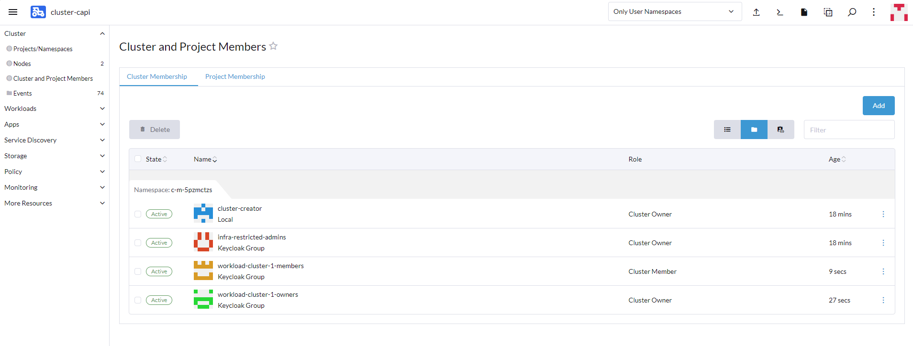

# Introduction

The Sylva platform uses Rancher to implement Role-Based Access Control (RBAC) on the management cluster and on the workload clusters.

The users first authenticate to the Rancher server running on the management cluster. In the case of Sylva, Rancher uses the Keycloak identity provider to authenticate the users. The users and groups of users are declared in Keycloak rather than in Rancher itself.

Rancher also performs user authorization, by which it determines what a user can do either globally to the platform (e.g., can he create a new cluster?), either on a specific cluster (e.g., can he create a new project?), or in a specific project (e.g., can he create a pod?).

Individual users or preferably groups of users are assigned in Rancher to roles on the various scopes (global, cluster or project) to define what they are allowed to do.

Default roles are available. Custom roles can be defined by a security administrator to offer more fine-grained permissions. The Rancher roles are mapped to Kubernetes roles and are enforced by Kubernetes RBAC mechanisms.

The organisation in terms of groups and corresponding permissions must be defined on a per deployment basis accordingly with the desired granularity of permissions and the different kinds of people able to access to the platform. A better protection is obtained by following the principle of least privilege. A number of custom roles must be defined to achieve this goal, but the list and permissions associated with the custom roles are not covered by this document as they depend on the project deploying the platform.

Please refer to the [Rancher documentation](https://ranchermanager.docs.rancher.com/pages-for-subheaders/authentication-permissions-and-global-configuration) for details on user management and RBAC.

Please refer to the [Keycloak administration guide](https://www.keycloak.org/docs/latest/server_admin/) for details on user and group management on Keycloak.

This document describes a possible method usable by default for managing the users and their permissions. Other approaches could be taken depending on the requirements of each CaaS supplier.

# Modes of user management

Two methods can be considered to manage the users and their permissions:
- the DevOps way, which is the preferred method, consists in describing the users and their permissions in a file on a git repository, and let the platform reconcile this description thanks to the devops component (fluxcd).
- the manual way, which is a more tedious and error prone method, whereby a security administrator creates users and groups on the Keycloak GUI, and assigns roles to these users and groups on the Rancher GUI.

The methods are exclusive: if the DevOps method is used, it fully describes the list of users and groups. A user or group added manually is deleted automatically at the next reconciliation.

The devops method is not yet available and will be described in a future release.

# Manual method

## Creation of security administrators

A limited set of users must be granted the permission to manage the permissions of the users of the platform.

Once the management cluster is done, follow these steps to define a group of security administrators:
1. Connect to Keycloak as the `admin` user at https://< keycloak FQDN >.
2. Select the `Sylva` realm on the top-left pop-up
3. Select the `Groups` tab on the left, create a group of users who will be allowed to provision other users and groups, i.e., a group of security administrators.

4. In the `Role mapping` tab of the group, `Assign role`, select `Filter by client`, and select the roles `manage-users` and `view-users` of the `realm-management` client. This role on Keycloak is necessary to be able to assign groups or users to a cluster or project from Rancher. If this role is not assigned, the groups and users on Keycloak are not presented when the user types the names in the window for assigning groups.

5. Select the `Users` tab on the left
In this initial stage, the only user created is `sylva-admin`. This user is a technical user account, and using it should be avoided.
6. Create nominative accounts, e.g., 'John Doe' with the `Add User` button.
Fill the user details, and add the user to the security administrators group.
Click the `Create` button

7. Select the `Credentials` tab, `Set password`, and fill an initial password.
By default, the `Temporary` toggle is set to on, by which the user will have to set an personal password the first time he connects.

The initial password must be sent to the user over a secure channel.

8. Repeat the procedure for other users who will be allowed to manage the other users

9. Logout from Keycloak

10. Connect to `https://< keycloak FQDN >/admin/sylva/console` with an account created in the previous step

The user is allowed to manage the groups and users

For the following steps, it is a better practice to use the nominative accounts in the security administrator groups than to use the keycloak `admin` account.

## Actions after the creation of a workload cluster

### Create groups for a workload cluster on Keycloak

A workload cluster is created to host a CNF or a set of CNFs.

The initial status of the permissions is that the members of the `infra-restricted-admins` group have the `Cluster Owner` role on the new workload cluster, as well as the `cluster-creator` technical account.

On Keycloak, select the `Groups` tab on the left and create on one or several groups for this workload cluster with the `Create group` button, depending on the types of permissions that must be granted to users of the workload cluster.  

For example, if the cluster `workload-cluster-1` is created, you can create the groups `workload-cluster-1-owners` and `workload-cluster-1-members`.

### Assign roles to the workload cluster

Login to Rancher

Select the new workload cluster and then `Cluster and Project Members`.

Then assign the groups created on Keycloak at the previous step to the corresponding roles with the `Add` button.

With the same example as above, assign the "Cluster owner" role to the group `cluster-1-owners`, and the "Cluster Member" role to the group `cluster-1-members`.

## Actions for creating a project on a workload cluster

### Create groups for a project on Keycloak

The initial status of the permissions is that two projects are created in the workload cluster, `Default` and `System`, with the `cluster-creator` technical account as `Project Owner`.

On Keycloak, select the `Groups` tab on the left and create on one or several groups for this project with the `Create group` button, depending on the types of permissions that must be granted to users of the project.  

For example, if the project `project-1` is created, you can create the groups `project-1-owners`, `project-1-members` and `project-1-readonly`.

### Assign roles to a new project on Rancher

In the "Projects/Namespaces" menu, create a new project for a CNF with the `Create Project` button.

Go to `Cluster and Project Members`, and select the `Project Membership` tab.

The user who performs this operation is the owner by default.

Use the "Add" button for the desired project to assign the project groups already created in keycloak to the project.

With the same example as above, assign the "Project owner" role to the group `project-1-owners`, the "Project member" role to the group `project-1-members` and the "Project read only" role to the group `project-1-readonly`

### Next steps

If additional projects must be created to host other CNFs, repeat the creation of groups on Keycloak and on Rancher.  
It is technically possible to use the same groups for several projects if desired, but is it a better practice to create dedicated groups for each project in order to have control over the permissions on each project individually.  
Although it is also technically possible to assign individual users to clusters and projects, it is a better practice to assign groups of users rather than individual users as the assignment of permissions can then be done directly on Keycloak without having to modify the configuration on Rancher.

## Management of the users

### Creation of new users

From there, users can be created in Keycloak, and their permissions in the workload cluster depend on the group(s) they are assigned to.

1. Select the `Users` tab on the left
2. Create nominative accounts with the `Add User` button.
Fill the user details, and add the user to the security administrators group.
Click the `Create` button

### Managing the permissions of a user

Permissions are granted to a user by assigning him to the corresponding group(s).

1. Select the `Users` tab on the left
2. Select the user
3. Open the `Groups` tab
4. To grant new permissions, click the `Join Group` button, select one or several groups, and click on the `Join` button.

5. To remove permissions, click on the `Leave` link next to the group(s) corresponding to the permissions that must be removed.

Several groups can be removed in one operation by selecting the desired groups and clicking the `Leave` link next to the `Join Group` button.

## Rancher roles

The roles mentioned above are roles defined by default in Rancher.
They can be seen by going to the `Users & Authentication` menu, then `Role Templates`.
The `Global`, `Cluster` and `Project/Namespaces` tabs allow to manage the roles for the respective scopes.

The default user roles as global level are :
- Administrator
- Restricted Administrator
- Standard User
- User-Base

The default user roles at cluster level are:
- Cluster Owner
- Cluster Member

The default user roles at project level are:
- Project Owner
- Project Member
- Read-only

The other roles allow to fine tune the permissions by granting additional specific roles to a user.

For example, the additional global role `Manage Users` grants the permission to manage users. Clicking on a role displays the corresponding role details as kubernetes roles:
 

`Standard Users` don't have this privilege. But it is possible to assign to a user or to a group of users the privileges of `Standard Users` plus `Manage Users` to avoid granting them the `Administrator` or `Restricted Administrator` roles which are much more powerful.

The global roles are managed in the `Users & Authentication` menu, under `Users` or `Groups`.
In `Groups`, click the `Assign Global Roles` button, select the desired group, select a `Global Permissions` as `Standard User`. Then you have the possibility to select additional roles, either in the `Built-in` (i.e., pre-defined) box, either in the `Custom box`.

It is also possible to define customized roles in Rancher by clicking on the `Create Role` button in each scope.
Give it a name, and fill the corresponding permissions with the kubernetes syntax of verbs/Resource/API groups/Non-Resource URLs.

# Devops method

This section will be documented in a future release.
