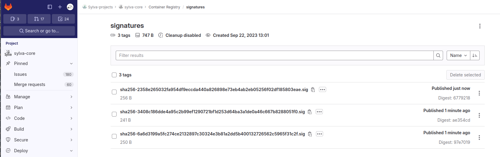

# Integrity of the upstream Images

This document explains how to sign the upstream images and admit a Pod only if the required signatures is found in the OCI registry storing the signatures, or if the image signature cannot be validated.

The OCI registry of sylva-core will be used to store the signatures. For the sake of illustration, this document consider the signature  of keycloak images: `quay.io/keycloak/keycloak:21.1.2`, `quay.io/keycloak/keycloak-operator:21.1.2` and `keycloak-realm-operator:1.0.0`.

This security control aims to guarantee the **integrity** of the signed image, i.e. mitigate the risk to run a tampered image tag from a stakeholder.

> ***Note*** that the decision to sign an image must be taken with a clear conscience. This decision process is out the scope of this document.

## Signing Keys

We chose to use the signing keys stored on the project [diskimage-builder](https://gitlab.com/sylva-projects/sylva-elements/diskimage-builderusing) (ID 43786055). Export the environment variable `GITLAB_TOKEN` with rights to read CI/CD variables on this project:

```shell
export GITLAB_TOKEN=glpat-Z7Dj....
```

Verify that the signing keys are available:

```shell
$ cosign public-key --key gitlab://43786055
-----BEGIN PUBLIC KEY-----
MFkwEwYHKoZIzj0CAQYIKoZIzj0DAQcDQgAEcuuLszwy0u7y394KY6GW1BgjfaU6
aK7e95MV+ikZnRfR5EHtqEk1tScNhMqQJMpuFs3QH1TVBr6TIWVLx5cUtg==
-----END PUBLIC KEY-----
```

## Signing and Storing signatures on the sylva-core OCI registry

According to [cosign documentation](https://github.com/sigstore/cosign#specifying-registry),  the `COSIGN_REPOSITORY` environment variable can be used to specify the location of the signature repository. Let's say that we will store the signatures in the OCI registry of `sylva-core` under a repository `signatures`:

```shell
COSIGN_REPOSITORY=registry.gitlab.com/sylva-projects/sylva-core/signatures
```

Signing the artifact identified by a tag can lead to sign a different image than the intended one. It is better to identify the artifact with a digest rather than tag. The digest of a manifest can be obtained by using `crane`:

```shell
$ crane digest quay.io/keycloak/keycloak:21.1.2
sha256:3408c186dde4a95c2b99ef1290721bf1d253d64ba3a1de0a46c667b8288051f0

$ crane digest quay.io/keycloak/keycloak-operator:21.1.2
sha256:6a6d3199a5fc274ce2132897c30324e3b81a2dd5b400132726562c5965f31c2f

$ crane digest quay.io/keycloak/keycloak-realm-operator:1.0.0
sha256:2358e265032fa954df9eccda440a826898e73eb4ab2eb05256f02df185803eae
```

Then, we must authenticate to the OCI registry since the signatures shall be stored as a new tags in this registry:

```shell
$ docker login -u $REGISTRY_USER -p $REGISTRY_PASSWORD registry.gitlab.com
WARNING! Using --password via the CLI is insecure. Use --password-stdin.
WARNING! Your password will be stored unencrypted in /home/paus6502/.docker/config.json.
Configure a credential helper to remove this warning. See
https://docs.docker.com/engine/reference/commandline/login/#credentials-store

Login Succeeded
```

We can now sign the images, which signatures will be stored in the `sylva-core` registry. By default `cosign`  stores a copy of the signature and some data (e.g. timestamp) on a `Rekor` server from **Sigstore**. We choose to not upload such a data with the option `--tlog-upload`:

```shell
COSIGN_REPOSITORY=registry.gitlab.com/sylva-projects/sylva-core/signatures cosign sign --key gitlab://43786055 --tlog-upload=false quay.io/keycloak/keycloak@sha256:3408c186dde4a95c2b99ef1290721bf1d253d64ba3a1de0a46c667b8288051f0

COSIGN_REPOSITORY=registry.gitlab.com/sylva-projects/sylva-core/signatures cosign sign --key gitlab://43786055 --tlog-upload=false quay.io/keycloak/keycloak-operator@sha256:6a6d3199a5fc274ce2132897c30324e3b81a2dd5b400132726562c5965f31c2f

COSIGN_REPOSITORY=registry.gitlab.com/sylva-projects/sylva-core/signatures cosign sign --key gitlab://43786055 --tlog-upload=false quay.io/keycloak/keycloak-realm-operator@sha256:2358e265032fa954df9eccda440a826898e73eb4ab2eb05256f02df185803eae
```

We can verify the location of the signatures:

```shell
$ COSIGN_REPOSITORY=registry.gitlab.com/sylva-projects/sylva-core/signatures cosign triangulate quay.io/keycloak/keycloak:21.1.2
registry.gitlab.com/sylva-projects/sylva-core/signatures:sha256-3408c186dde4a95c2b99ef1290721bf1d253d64ba3a1de0a46c667b8288051f0.sig
```



## Verifying

### Verify with Cosign

```json
$ COSIGN_REPOSITORY=registry.gitlab.com/sylva-projects/sylva-core/signatures cosign verify --key gitlab://43786055 --insecure-ignore-tlog quay.io/keycloak/keycloak:21.1.2 | jq
WARNING: Skipping tlog verification is an insecure practice that lacks of transparency and auditability verification for the signature.

Verification for quay.io/keycloak/keycloak:21.1.2 --
The following checks were performed on each of these signatures:
  - The cosign claims were validated
  - The signatures were verified against the specified public key
[
  {
    "critical": {
      "identity": {
        "docker-reference": "quay.io/keycloak/keycloak"
      },
      "image": {
        "docker-manifest-digest": "sha256:3408c186dde4a95c2b99ef1290721bf1d253d64ba3a1de0a46c667b8288051f0"
      },
      "type": "cosign container image signature"
    },
    "optional": null
  }
]
```

### Kyverno Policy to Verify Image Signatures using a signature repository

**Sylva** implements a **Kyverno** policy, `check-image`, to check the images signatures of some sensitive components, which repositories to be checked are specified in the field `.spec.rules.verifyImages` of the kyverno policy. So far, only the images of **Keycloak** and **Vault** are validated, signed and verified:

```yaml
  verifyImages:
    - imageReferences:
      - quay.io/keycloak/keycloak*
      - hashicorp/vault*
      - ghcr.io/banzaicloud/*
```

According to [Kyverno official documentation](https://kyverno.io/docs/writing-policies/verify-images/sigstore/#using-a-signature-repository), the signatures can be stored on a dedicated OCI registry (`registry.gitlab.com/sylva-projects/sylva-core/signatures` by default). This registry can be modified though the environment variables of the deployment:

```yaml
image_signature:
  action: Audit
  repository: registry.gitlab.com/sylva-projects/sylva-core/signatures
```

The field `image_signature.action` tunes the action to perform when verifying the images signature (for the repositories matching the selection rule of the kyverno policy). The possible values are:

- ***Audit*** (default): allows a pod without a signature (or with invalid signature) but the policy violation is recorded in the policy report
- ***Enforce***: denies pods (only if the pod leverages images that match the repositories list in the **Kyverno** policy) with unsigned image or with invalid signature

The audit mode allows to track the unsigned images without blocking the deployment. For example the report below shows that **Keycloak** images deserve attention:

```shell
$ kubectl get -A policyreport -l cpol.kyverno.io/check-image
NAMESPACE   NAME               PASS   FAIL   WARN   ERROR   SKIP   AGE
keycloak    cpol-check-image   5      3      0      0       0      8h
vault       cpol-check-image   4      0      0      0       0      8h
```

The following command allows to inspect the policy report and find out which images must be analyzed and  signed:

```shell
$ kubectl -n keycloak get polr cpol-check-image -o jsonpath='{.results[?(@.result=="fail")]}' | yq -p json -
message: unverified image quay.io/keycloak/keycloak:22.0.3
policy: check-image
resources:

  - apiVersion: batch/v1
    kind: Job
    name: sylva
    namespace: keycloak
    uid: 4bd227d1-6e11-49f5-aaba-b73bc1f451cc
    result: fail
    rule: autogen-check-image
    scored: true
    source: kyverno
    timestamp:
      nanos: 0
      seconds: 1696605625
    
<skip>
```

When all relevant images are signed, we can pass `image_signature.action` to `Enforce`.  If appropriate images are signed, the deployment shall succeed and the policy report does not raise issue:

```shell
$  kubectl get -A policyreport -l cpol.kyverno.io/check-image
NAMESPACE   NAME               PASS   FAIL   WARN   ERROR   SKIP   AGE
keycloak    cpol-check-image   8      0      0      0       0      8m2s
vault       cpol-check-image   4      0      0      0       0      10m
```

## References

- https://github.com/sigstore/cosign#specifying-registry
- https://kyverno.io/docs/writing-policies/verify-images/sigstore/#using-a-signature-repository
