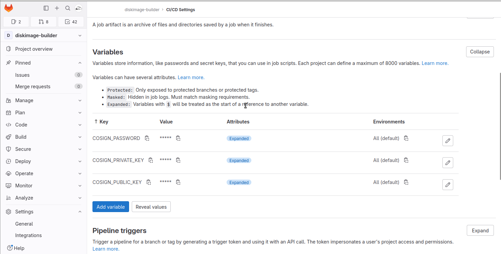

# Artifacts Signature

This document explains how to use `cosign` to sign the artifacts pushed to the OCI registry of this project.

## Generate Signing Keys

### Generating a Cosign Key Pair for a Gitlab Project

If you want a `cosign` key pair dedicated to a Gitlab project, e.g. the `cosign` key pair for sylva-core, you can generate keys with the GitLab provider. The later stores the Cosign signing material in the CI/CD variables of the project. The command is as follows:

```shell
cosign generate-key-pair gitlab://<project_id>
```

For example:

Export the environment variable `GITLAB_TOKEN` with rights to create CI/CD variables:

```shell
export GITLAB_TOKEN=glpat-Z7Dj....
```

Then generate the cosign key pair with the GitLab provider:

```shell
$ cosign generate-key-pair gitlab://43786055
Enter password for private key: 
Enter password for private key again: 
Password written to "COSIGN_PASSWORD" variable
Private key written to "COSIGN_PRIVATE_KEY" variable
Public key written to "COSIGN_PUBLIC_KEY" variable
Public key also written to cosign.pub
```

On success, three CI/CD variables are added to the project:



> **_SECURITY NOTICE_**: for a better security we recommend to store the private signing material in a KMS, e.g. Vault, instead the CI/CD variables, with a fine-grained access control to these material (in other words, with a fine-grained control on who is allowed to sign the artifacts).
>
> For example, if using Vault: when the signing is handled by a CI, the signing job shall authenticate against Vault with the JWT method (see https://docs.gitlab.com/ee/ci/secrets/) to fetch the signing keys. On the Vault side, a role is configured to grant only the Job's JWT with the appropriate bound claims, e.g. a set of GitLab user ID, to access the secret path with the signing keys.

The public key is in the file `cosign.pub` created in your current repository. You can also retrieve the public key with the command `cosign public-key --key gitlab://<project ID>`, for example:

```shell
$ cosign public-key --key gitlab://43786055
-----BEGIN PUBLIC KEY-----
MFkwEwYHKoZIzj0CAQYIKoZIzj0DAQcDQgAESbuSEUBFW0yndQABomJKA3dQwbKD
cSWbGpnECsZ7IvdUj9GGGlmPpYl8H0WCHCRuWGSGX58ZiiSuUQRDQoHAxw==
-----END PUBLIC KEY-----
```

### Generating a Cosign Key Pair for a Gitlab Group

When dealing with a bunch of Gitlab project aiming at producing Sylva artifacts, e.g. projects of the group `sylva-elements`, the cosign keypair should be created at the group to avoid different keys key per project, which would turn the signature verification of Sylva artifacts into a nightmare. In this case, all the the projects belonging to the group inherit of the same signing metrial stored in the group variables.
However  `cosign generate-key-pair gitlab://foo/bar`, used in the preceding section, only generates a cosign a key pair with a project as destination (cf. https://github.com/sigstore/cosign/issues/2914). To adress the issue, you can use the script `sylva-core/tools/security/groups-keys.sh`. This script generates the key pair in a target project (or copy an existing key pair from a given project) and then promotes it at the group level: 

```shell
$ ./groups-keys.sh -h
Generate a Cosign Key pair in a Gitlab project and promote it at the Gitlab group level.

Syntax: groups-keys.sh [-c|d|h] PROJECT_ID GROUP_ID
options:
c     Create Cosign key pair stored in CI variables of PROJECT_ID.
d     Delete key pair
h     Print this Help.
```

For example, to create a key pair in a givent Gitlab proect and promote it at the group level:

```shell
$ ./groups-keys.sh -c 57260766 63142339
Project Name: diskimage-builder (ID: 43786055)
Group Name: sylva-elements (ID: 63142339)
Generating Project key pair
Password written to "COSIGN_PASSWORD" variable
Private key written to "COSIGN_PRIVATE_KEY" variable
Public key written to "COSIGN_PUBLIC_KEY" variable
Public key also written to cosign.pub
Creating Group key pair
Group Variable COSIGN_PRIVATE_KEY created
Group Variable COSIGN_PASSWORD created
Group Variable COSIGN_PUBLIC_KEY created
```

Skip the flag `-c` if you want to promote an existing key pair at the group level. For example, to promote **diskimage-builder** cosign signing material at the **sylva-elements** group level, run the following command:

```shell
$ ./groups-keys.sh 57260766 63142339
Project Name: diskimage-builder (ID: 43786055)
Group Name: sylva-elements (ID: 63142339)
Creating Group key pair
Group Variable COSIGN_PRIVATE_KEY created
Group Variable COSIGN_PASSWORD created
Group Variable COSIGN_PUBLIC_KEY created
```

Now, you should have the `cosign` material stored in the CI/CD variable of the group **sylva-elements** and all projects of this group inherit from these CI/CD variables.

## Signing

Signing the artifact identified by a tag can lead to sign a different image than the intended one. It is better to identify the artifact with a digest rather than tag.

The manifest digest can be obtained via the API or by using crane. We will use the later in the CI:

```shell
curl -s --header "PRIVATE-TOKEN: $GITLAB_TOKEN" https://gitlab.com/api/v4/projects/43786055/registry/repositories/4349498/tags/cosign-0.1 | jq '.digest'
"sha256:b4affd8071d5c30f302b50a29b524d97cc25727dddc3d1ab9a46275ac5471a3b"
```

```shell
crane digest registry.gitlab.com/sylva-projects/sylva-elements/diskimage-builder/diskimage-builder-hardened:cosign-0.1
sha256:b4affd8071d5c30f302b50a29b524d97cc25727dddc3d1ab9a46275ac5471a3b
```

Authenticate to the registry before signing because the signature shall be stored in the OCI repository as a new tag:

```shell
docker login -u $REGISTRY_USER -p $REGISTRY_PASSWORD registry.gitlab.com
```

Then sign the artifact. In the CI, we can sign by refering the environment variable `COSIGN_PRIVATE_KEY`:

> **_NOTE_**: when refering  `COSIGN_PRIVATE_KEY`, the environment variable `COSIGN_PASSWORD` must be set, so that cosign can decrypt the private key

```shell
cosign sign --key env://COSIGN_PRIVATE_KEY registry.gitlab.com/sylva-projects/sylva-elements/diskimage-builder/diskimage-builder-hardened@sha256:b4affd8071d5c30f302b50a29b524d97cc25727dddc3d1ab9a46275ac5471a3b

    The sigstore service, hosted by sigstore a Series of LF Projects, LLC, is provided pursuant to the Hosted Project Tools Terms of Use, available at https://lfprojects.org/policies/hosted-project-tools-terms-of-use/.
    Note that if your submission includes personal data associated with this signed artifact, it will be part of an immutable record.
    This may include the email address associated with the account with which you authenticate your contractual Agreement.
    This information will be used for signing this artifact and will be stored in public transparency logs and cannot be removed later, and is subject to the Immutable Record notice at https://lfprojects.org/policies/hosted-project-tools-immutable-records/.

By typing 'y', you attest that (1) you are not submitting the personal data of any other person; and (2) you understand and agree to the statement and the Agreement terms at the URLs listed above.
tlog entry created with index: 27773186
Pushing signature to: registry.gitlab.com/sylva-projects/sylva-elements/diskimage-builder/diskimage-builder-hardened
```

It is also possible to sign by fetching the private key from GitLab (assuming `GITLAB_TOKEN` with read access on project variables):

```shell
cosign sign --key gitlab://43786055 registry.gitlab.com/sylva-projects/sylva-elements/diskimage-builder/diskimage-builder-hardened@sha256:b4affd8071d5c30f302b50a29b524d97cc25727dddc3d1ab9a46275ac5471a3b
```

 We can get rid of `crane` when pushing and signing sequentially (source: `flux push artifact --help`):

```shell
digest_url = $(flux push artifact oci://ghcr.io/org/config/app:$(git rev-parse --short HEAD) \
--source="$(git config --get remote.origin.url)" \
--revision="$(git branch --show-current)@sha1:$(git rev-parse HEAD)" \
--path="./path/to/local/manifest.yaml" --output json | jq -r '. | .repository + "@" + .digest')

cosign sign $digest_url
```

**Important Notice:**   By default, **artifact signatures are uploaded to [Rekor](https://github.com/sigstore/rekor)**. Quoting https://blog.sigstore.dev/cosign-2-0-released/:

> To not upload to Rekor, include `--tlog-upload=false`.
>
>* You must also include `--insecure-ignore-tlog=true` when verifying an artifact that was not uploaded to Rekor.
>* Examples of when you may want to skip uploading to the transparency log are if you have a private Sigstore deployment that does not use >transparency or a private artifact.
>* We (Sigstore) strongly encourage all other use-cases to upload artifact signatures to Rekor. Transparency is a critical component of supply chain security, to allow artifact maintainers and consumers to monitor a public log for their artifacts and signing identities.

## Verifying

The signature is verified against the public key fetched from an environment variable or from the GitLab project hosting the registry:

```shell
cosign verify --key env://COSIGN_PUBLIC_KEY registry.gitlab.com/sylva-projects/sylva-elements/diskimage-builder/diskimage-builder-hardened@sha256:b4affd8071d5c30f302b50a29b524d97cc25727dddc3d1ab9a46275ac5471a3b
```

When using the GitLab provider, set the environment variable `GITLAB_TOKEN` with read access on GitLab CI/CD variable:

```shell
$ export GITLAB_TOKEN=glpat-..... 

$ cosign verify --key gitlab://43786055 registry.gitlab.com/sylva-projects/sylva-elements/diskimage-builder/diskimage-builder-hardened@sha256:b4affd8071d5c30f302b50a29b524d97cc25727dddc3d1ab9a46275ac5471a3b

Verification for registry.gitlab.com/sylva-projects/sylva-elements/diskimage-builder/diskimage-builder-hardened@sha256:b4affd8071d5c30f302b50a29b524d97cc25727dddc3d1ab9a46275ac5471a3b --
The following checks were performed on each of these signatures:
  - The cosign claims were validated
  - Existence of the claims in the transparency log was verified offline
  - The signatures were verified against the specified public key

[{"critical":{"identity":{"docker-reference":"registry.gitlab.com/sylva-projects/sylva-elements/diskimage-builder/diskimage-builder-hardened"},"image":{"docker-manifest-digest":"sha256:b4affd8071d5c30f302b50a29b524d97cc25727dddc3d1ab9a46275ac5471a3b"},"type":"cosign container image signature"},"optional":{"Bundle":{"SignedEntryTimestamp":"MEQCIA3H+hWtfxrNLP/3kQh4wqrpaZmRZyi+Asr2c8mSCFqJAiBJR0OdX+hXvvMegZgOpVhflvOXgCu8gowh+tiHY/CD4g==","Payload":{"body":"eyJhcGlWZXJzaW9uIjoiMC4wLjEiLCJraW5kIjoiaGFzaGVkcmVrb3JkIiwic3BlYyI6eyJkYXRhIjp7Imhhc2giOnsiYWxnb3JpdGhtIjoic2hhMjU2IiwidmFsdWUiOiI0MDMxNmU4YzE2ZjBkNTE2YjQyYzU2NDZlMWM2MDhkN2JmMGU0YTIyODdlNmE3ZTJkY2QwMDZkY2JmNjgyYTJmIn19LCJzaWduYXR1cmUiOnsiY29udGVudCI6Ik1FVUNJUURpa3EwOEpVNzFaR0lZaGp2UHRnV2prbTdSLzNNS3RGU21qcDZwWGM4dkN3SWdXWmxRVjJSVUV1dFljQ0JaVEZJVDNWQkZIN3p1ZHBkK3V6dktSZGppQm5rPSIsInB1YmxpY0tleSI6eyJjb250ZW50IjoiTFMwdExTMUNSVWRKVGlCUVZVSk1TVU1nUzBWWkxTMHRMUzBLVFVacmQwVjNXVWhMYjFwSmVtb3dRMEZSV1VsTGIxcEplbW93UkVGUlkwUlJaMEZGVTJKMVUwVlZRa1pYTUhsdVpGRkJRbTl0U2t0Qk0yUlJkMkpMUkFwalUxZGlSM0J1UlVOeldqZEpkbVJWYWpsSFIwZHNiVkJ3V1d3NFNEQlhRMGhEVW5WWFIxTkhXRFU0V21scFUzVlZVVkpFVVc5SVFYaDNQVDBLTFMwdExTMUZUa1FnVUZWQ1RFbERJRXRGV1MwdExTMHRDZz09In19fX0=","integratedTime":1689609607,"logIndex":27773186,"logID":"c0d23d6ad406973f9559f3ba2d1ca01f84147d8ffc5b8445c224f98b9591801d"}}}}]
```

The payload is actually a [Hashed Rekord](https://github.com/sigstore/rekor/blob/main/types.md#hashed-rekord) which can be decoded as a [JWT](https://jwt.io/):

```json
{
  "apiVersion": "0.0.1",
  "kind": "hashedrekord",
  "spec": {
    "data": {
      "hash": {
        "algorithm": "sha256",
        "value": "40316e8c16f0d516b42c5646e1c608d7bf0e4a2287e6a7e2dcd006dcbf682a2f"
      }
    },
    "signature": {
      "content": "MEUCIQDikq08JU71ZGIYhjvPtgWjkm7R/3MKtFSmjp6pXc8vCwIgWZlQV2RUEutYcCBZTFIT3VBFH7zudpd+uzvKRdjiBnk=",
      "publicKey": {
        "content": "LS0tLS1CRUdJTiBQVUJMSUMgS0VZLS0tLS0KTUZrd0V3WUhLb1pJemowQ0FRWUlLb1pJemowREFRY0RRZ0FFU2J1U0VVQkZXMHluZFFBQm9tSktBM2RRd2JLRApjU1diR3BuRUNzWjdJdmRVajlHR0dsbVBwWWw4SDBXQ0hDUnVXR1NHWDU4WmlpU3VVUVJEUW9IQXh3PT0KLS0tLS1FTkQgUFVCTElDIEtFWS0tLS0tCg=="
      }
    }
  }
}
```
