# Sylva Security

## X509 Certificate Management

Sylva management cluster is shipped with its own Root authority, implemented by a cert-manager `ClusterIssuer` (see below), for which the certificate can be retrieved as follows:

```shell
 kubectl -n cert-manager get secret ca-key-pair -o jsonpath='{.data.ca\.crt}' | base64 -d
```

It is recommended to import this CA certificate in your browser in order to verify the server certificates sent by the exposed applications like `rancher` and `keycloak`. The way to import a CA certificate depends on the OS and the browser and, thus, are not detailed in this document.

Then, the X509 certificate for your additional services in the management cluster can be issued from `cert-manager` by using the `ClusterIssuer` named `ca-issuer`, as illustrated below:

```yaml
---
apiVersion: cert-manager.io/v1
kind: Certificate
metadata:
  name: rancher-tls
  namespace: cattle-system
spec:
  secretName: rancher-tls
  # Currently the certificate is trusted by the Sylva CA by referring to the ca-issuer.
  # It is possible to leverage an external authority by referring a vault-issuer or an acme-issuer.
  # In this case, configure the issuer according to the spec of the external authority and update issuerRef below
  issuerRef:
    name: ca-issuer
    kind: ClusterIssuer
  commonName: ${RANCHER_DNS}
  duration: 2160h # 90d
  renewBefore: 360h # 15d
  emailAddresses:
  - surname.name@sylva.org
  subject:
    organizations:
    - Sylva
    countries:
    - eu
    organizationalUnits:
    - DEV
  dnsNames:
  - ${RANCHER_DNS}
  - localhost
  ipAddresses:
  - 127.0.0.1
```

> **_Note_**: Enaling the PKI engine in Vault might allow the workload clusters requesting certifificate to be trusted by this root authority, typically by relying on a cert-manager Vault issuer. This feature is not yet supported but be likely included in one of the next releases.

## Password Management

The Sylva units offering a web UI (**Keycloak**, **Rancher**, **Hashicorp vault** and **flux-webui**) are configured with local administration accounts, which passwords/tokens are unique and randomly generated.

The passwords for **Keycloak**, **Rancher** and **flux-webui** can be retrieved from **Vault** (see next section).

In addition, Sylva is shipped with a Single-Sign-On (SSO) service provided by **Keycloak**. The user can thus connect to **Vault**, **Rancher** and **Flux-Webui** after being redirected once to **Keycloak** authentication. The SSO account to use is `sylva-admin` (login `sylva-admin`) from the  **Keycloak** realm `sylva`. The password for this account can be provided in your environment file `secrets.yaml` :

```yaml
cluster:
  admin_password:  < a password following the password policy >
```

> **_IMPORTANT NOTICE:_** this password must follow the **Keycloak** password policy: length(12) and upperCase(1) and lowerCase(1) and digits(1), otherwise the user `sylva-admin` is not created.

The following command will generate a password compliant with the password policy:

```shell
< /dev/urandom tr -dc 'A-Za-z0-9' | head -c12
```

If you don't set a password here, helm shall pick a random one. You can retrieve it in **vault** (secret/sso-account) by using the vault root token to authenticate against Vault (see next section) or by using the following command:

```shell
 kubectl get secrets sylva-units-values -o template="{{ .data.values }}" | base64 -d | grep admin_password
```

## Hashicorp Vault

The passwords for **Keycloak**, **Rancher** and **flux-webui** can be retrieved from **Vault**. You can authenticate against **Vault** through the OIDC authentication method or by using the **Vault** root token. For a comfortable user experience, we recommend to set  `.cluster.admin_password` in your `secrets.yaml` environment file and to connect through the OIDC authentication method.

> **_NOTE:_** If you don't provide `.cluster.admin_password` in the environment file `secrets.yaml`, connect to Vault by using the **Vault** root token and retrieve the randomly generated password for the SSO account in the vault path `/secret/sso-account`.

Note also that the OIDC authentication has restricted rights on **Vault** paths in comparison to the root token authentication, which, by nature, has full privileges on **Vault** resources:

| Privilege                                                                        | OIDC authentication | Root Token Authentication |
| -------------------------------------------------------------------------------- | ------------------- | ------------------------- |
| Read Secret                                                                      | yes                 | yes                       |
| Update and Create Secret                                                         | no                  | yes                       |
| Manage secrets engines                                                           | no                  | yes                       |
| Create, update, and delete auth methods                                          | yes                 | yes                       |
| Create and manage system policies                                                | yes                 | yes                       |
| Read system health check                                                         | yes                 | yes                       |
| Manage system backend other than health auth and policy (audit, config, etc... ) | no                  | yes                       |

### OIDC authentication

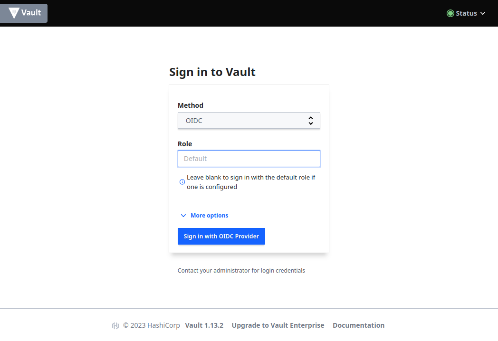

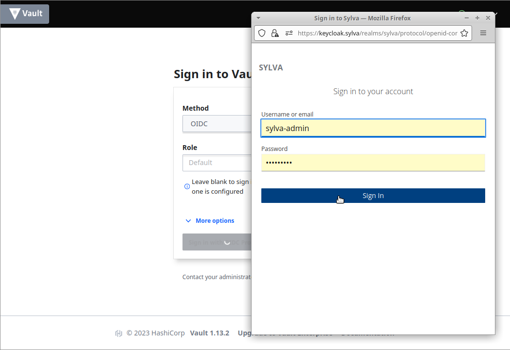

Once authenticated against **Vault**, the local account password of each management cluster service can be retrieved either from the **Vault GUI** or the **Vault CLI**.

### Token authentication

You can retrieve the Vault token with the following command.

```shell
kubectl -n vault get secret vault-unseal-keys -o jsonpath='{.data.vault-root}' | base64 -d
```

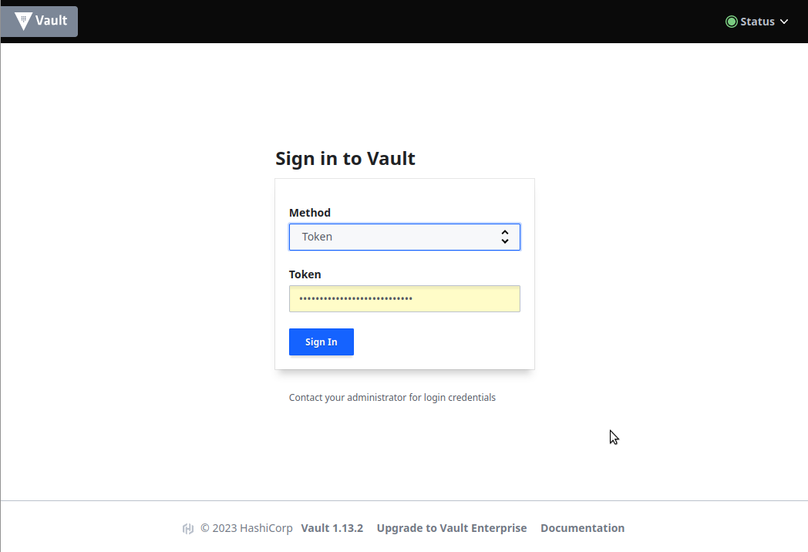

### Retrieve Secrets from Vault GUI

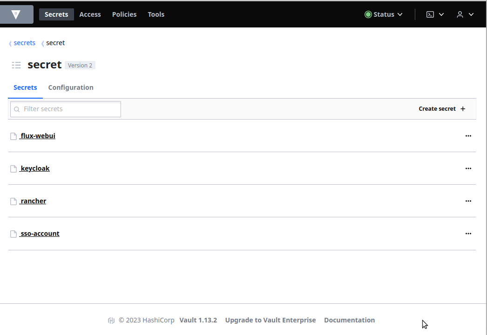

### Retrieve Secrets from Vault CLI

```shell
export VAULT_TOKEN=$(kubectl -n vault get secret vault-unseal-keys -o jsonpath='{.data.vault-root}' | base64 -d)
kubectl -n vault get secret vault-tls -o jsonpath='{.data.ca\.crt}' | base64 -d > vault-ca.crt
export VAULT_ADDR=https://vault.sylva
export VAULT_CACERT=$PWD/vault-ca.crt
```

```shell
$ vault kv list secret
Keys
----
flux-webui
keycloak
rancher
sso-account
```

```shell
$ vault kv get secret/rancher
=== Secret Path ===
secret/data/rancher

======= Metadata =======
Key                Value
---                -----
created_time       2023-06-09T13:49:58.903341566Z
custom_metadata    <nil>
deletion_time      n/a
destroyed          false
version            1

============ Data ============
Key                      Value
---                      -----
bootstrapPassword        <..bla bla..>
```

## Identity and Access Management

Identity and Access Management is addressed by **Keycloak** providing user management, single-sign-on, user federation and identity brokering.

### Keycloak Admin Console

To administrate **Keycloak**, go to the "Keycloak GUI", e.g. `https://keycloak.sylva` and select the [Administration Console](https://keycloak.sylva/admin/master/console).

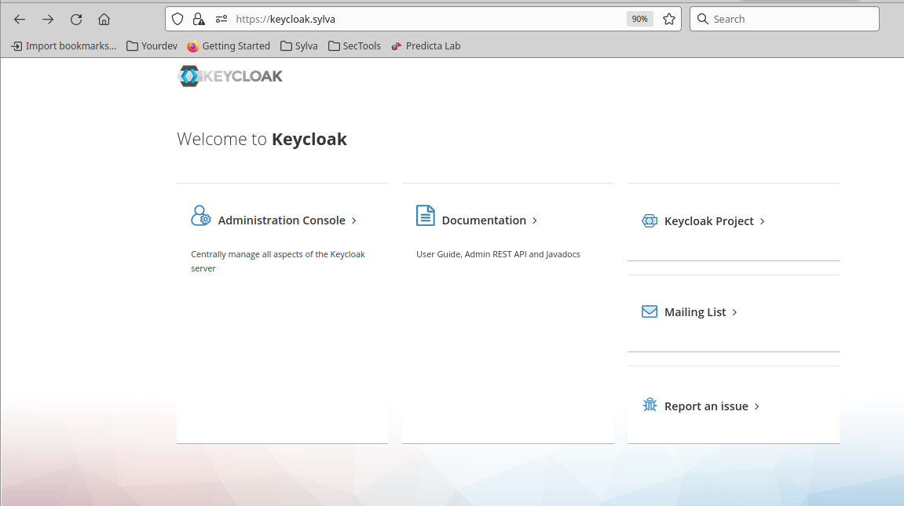

Then use the password in **Vault** under the path `secret/keycloak` to authenticate against **Keycloak** (the login name is `admin` by default, see sections above to learn how to get secrets from **Vault**).

> **_NOTE_**: when connecting to the administration console, you are logged in as administrator of the realm `master`. The administrator gets all privileges on other realms, i.e. `sylva`. It is thus useless to connect to the realm `sylva` with the `sylva-admin` credentials. Actually if this credential might grant access to realm `sylva`, it has no authorizations on **Keycloak** ressources.

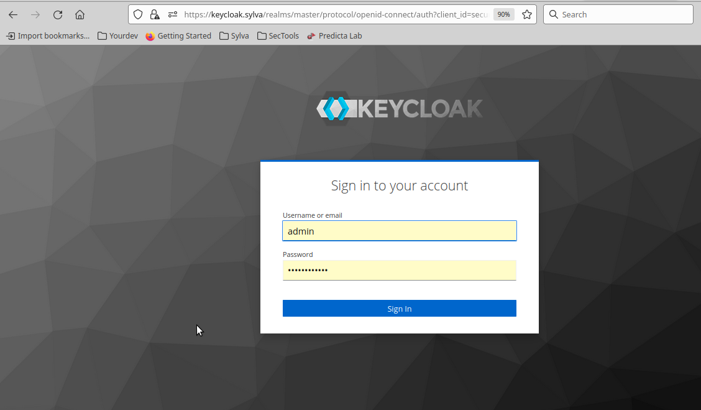

### Password Policy

Any passwords generated by Sylva follows a password policy enforced either on **Keycloak** (for user creation) or **Vault** (for generation of random secrets). For example, below is the policy definition at **Vault** side:

```yaml
apiVersion: redhatcop.redhat.io/v1alpha1
kind: PasswordPolicy
metadata:
  name: sylva-password-policy
spec:
  <snip>
  # password policy specified using Vault password policy syntax (https://www.vaultproject.io/docs/concepts/password-policies#password-policy-syntax)
  passwordPolicy: |
    length = 12
    rule "charset" {
    charset = "abcdefghijklmnopqrstuvwxyz"
    min-chars = 1
    }
    rule "charset" {
    charset = "ABCDEFGHIJKLMNOPQRSTUVWXYZ"
    min-chars = 1
    }
    rule "charset" {
    charset = "0123456789"
    min-chars = 1
    }

```

### User Management

The users and groups are centralized on **Keycloak**. They can be created on **Keycloak** (as depicted below) or imported from an external user federation (LDAP, AD, etc...)

> **_IMPORTANT NOTICE:_** Configuring an external user federation is out of scope of Sylva. However, if an external user federation is configured, the local **keycloak** accounts (e.g. `sylva-admin`) cannot be used anymore, unless the federation is configured to allow **keycloak** writing in the remote user directory. However granting such a privilege to **Keycloak** might raise a security risk that should be seriously evaluated.

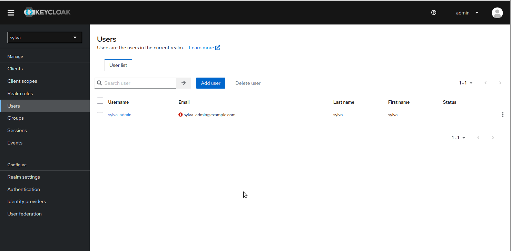

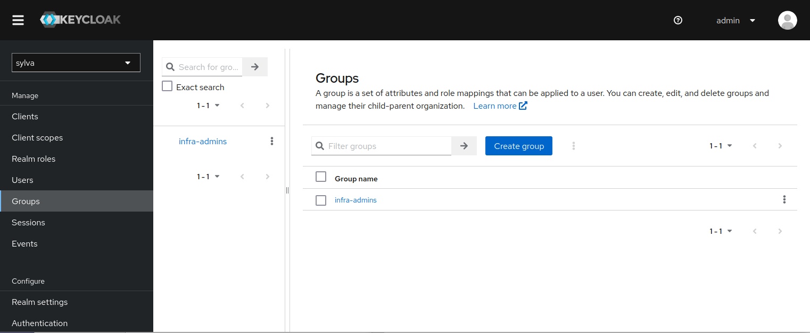

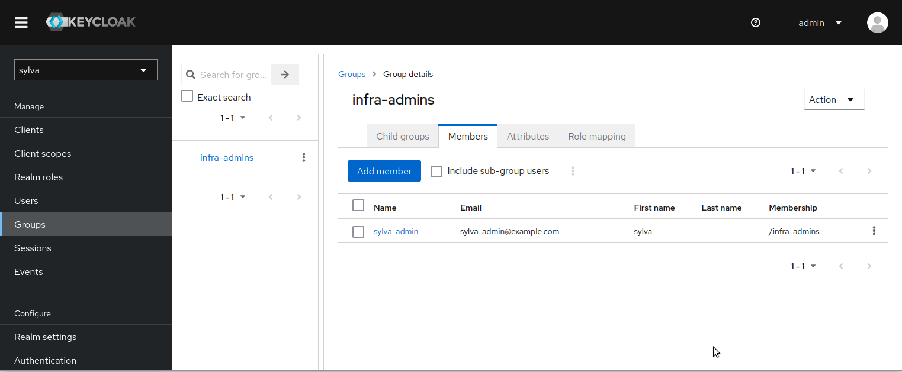

#### External Identity Provider

It can be interesting to configure Keycloak to rely on an external identity provider, for example `Gitlab.com` as shown below, or even your own company's IDP.

```json
{
  realm                   = "sylva"
  client_id               = "4ac6........885"
  client_secret           = "a9f.........b19"
  alias                   = "oidc"
  authorization_url       = "https://gitlab.com/oauth/authorize"
  user_info_url           = "https://gitlab.com/oauth/userinfo"
  token_url               = "https://gitlab.com/oauth/token"
  default_scopes          = "openid email profile"
  display_name            = "Gitlab"

  extra_config = {
    "clientAuthMethod" = "client_secret_post"
  }
}
```

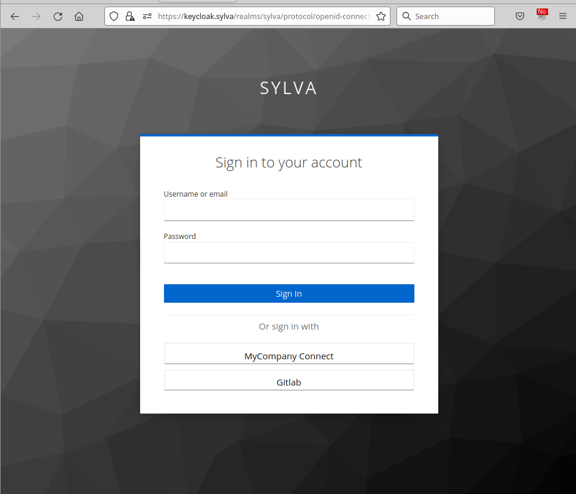

### Access Control to workload Clusters

If **Keycloak** plays a key role in access control to the workload cluster, it must be clear that **Keycloak** only manages the authentication of the users. The authorization part (i.e. define who can do what) is configured at the OIDC client (i.e. **Rancher**) side. For example, the following picture shows Rancher binding the admin role to the group infra-admins:

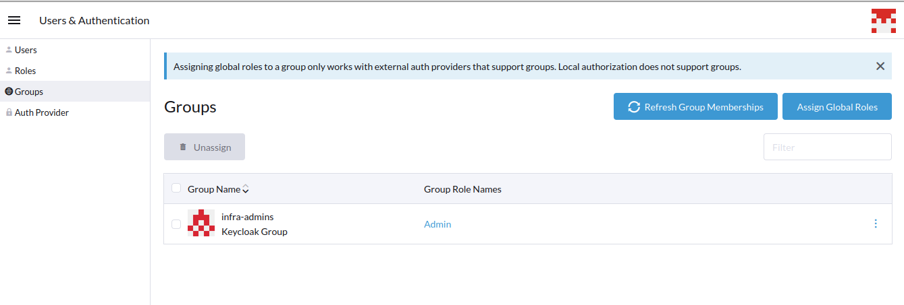

You can manage the binding from the Rancher Web UI via the `sylva-admin` account but, note that in this case, the  `sylva-admin`  account must be member of the Keycloak groups to bind. It is clearly unwanted and, thus, the group binding via the **Rancher** web-ui is only for testing purpose.

It is recommended to not use the GUI but to manage the group binding the via Rancher CRD (`globalrolebinding`, `projectroletemplatebindings` and `clusterroletemplatebindings`) or even with [Terraform Rancher provider](https://registry.terraform.io/providers/rancher/rancher2/latest/docs). Below are examples of CRD based binding:

```yaml
apiVersion: management.cattle.io/v3
kind: GlobalRoleBinding
metadata:
  name: grb-infra-admins
  annotations:
    cleanup.cattle.io/grbUpgradeCluster: "true"
    lifecycle.cattle.io/create.mgmt-auth-grb-controller: "true"
  finalizers:
  - controller.cattle.io/mgmt-auth-grb-controller
globalRoleName: admin
groupPrincipalName: keycloakoidc_group://infra-admins
```

Summarizing, **Rancher** acts as an authentication proxy, allowing a fine-grained access control relying on **Keycloak** users/groups management as depicted below.

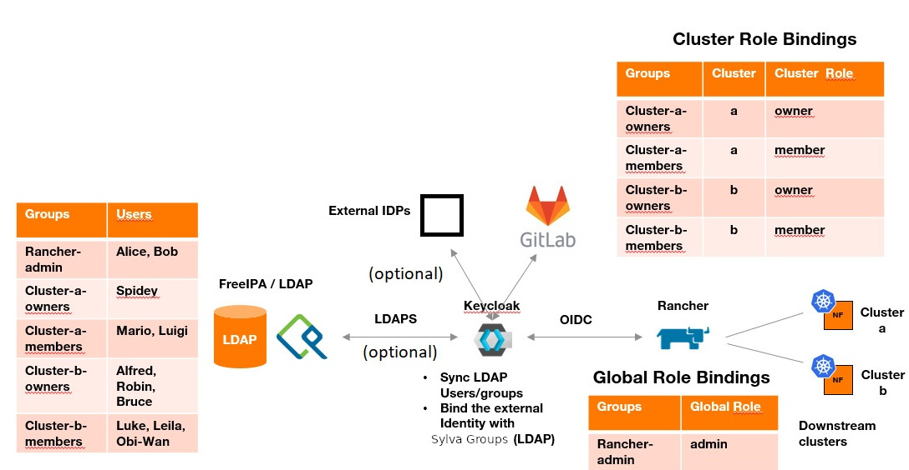

> **_IMPORTANT SECURITY NOTICE:_** the Rancher administrator has access to the resources of the the workload clusters, in particular to the volumes and to the k8s secrets of the workload clusters. As a consequence **it is crucial to have a strict access control on who is allowed to connect as an administrator to Rancher**.

## Kubernetes Security

High Security Grade clusters SHOULD rely on RKE2. RKE2 is hardened by default and pass the majority of the Kubernetes CIS controls without modification. RKE2 claims to focus on security and compliance within the U.S. Federal Government sector by:

- Providing defaults and configuration options that allow clusters to pass the CIS Kubernetes Benchmark v1.6 with minimal operator intervention.
- Enabling FIPS 140-2 compliance.
- Regularly scanning components for CVEs in Rancher build pipeline.

For a complete list of security controls, please refer to https://docs.rke2.io/security/cis_self_assessment16/.

When high security grade is required, Sylva can deploy RKE2 clusters with a `cis_profile` set to `cis-1.6` or `cis-1.23` depending on the Kubernetes release. The profile validates the system configuration against the corresponding CIS benchmark. This flag makes RKE2 check that host-level requirements have been met. It also configures runtime pod security policies and network policies (please refer to https://docs.rke2.io/security/hardening_guide/ for additional details).

### RKE2 Security Scan

Sylva includes the Kubernetes operator [cis-operator](https://github.com/rancher/cis-operator) that provides the ability to run  RKE2  security scans against the the CIS benchmark:

```shell
$ kubectl get clusterscans
NAME                CLUSTERSCANPROFILE              TOTAL   PASS   FAIL   SKIP   WARN   NOT APPLICABLE   LASTRUNTIMESTAMP   
rke2-cis-hardened   rke2-cis-1.6-profile-hardened   122     82     4      0      29     7                2023-04-28T14:45:22Z   
```

#### Fetch Scan Reports with kubectl

You can get the scan report with `kubectl`:

```shell
$ kubectl get clusterscanreports
NAME                                  LASTRUNTIMESTAMP                                            BENCHMARKVERSION
scan-report-rke2-cis-hardened-drnh8   2022-10-28 14:45:40.019124438 +0000 UTC m=+2336.836186254   rke2-cis-1.6-hardened   
```

The report is in JSON:

```shell
$ kubectl get clusterscanreport scan-report-rke2-cis-hardened-drnh8 -o jsonpath="{.spec.reportJSON}" | jq
{
  "version": "rke2-cis-1.6-hardened",
  "total": 122,
  "pass": 82,
  "fail": 4,
  "skip": 0,
  "warn": 29,
  "notApplicable": 7,
....
```

You can parse the JSON report and dump the output into more readable format with the Python script available here: https://dischord.org/2020/10/22/rancher-cis-operator-on-any-kubernetes-cluster/:

```shell
$ kubectl get clusterscanreport scan-report-rke2-cis-hardened-drnh8 \
-o jsonpath="{.spec.reportJSON}" \
| ./scanreport.py  
```

Finally, it should issue a report like this:

```
+--------+----------------------------------------+-----------------------------------------+---------------+
| ID     | Area                                   | Description                             | Result        |
+--------+----------------------------------------+-----------------------------------------+---------------+
| 1.1.1  | Control Plane Node Configuration Files | Ensure that the API server bla bla....  | pass          |
| 1.1.10 | Control Plane Node Configuration Files | Ensure that the Container bla bla....   | pass          | 
| 1.1.11 | Control Plane Node Configuration Files | Ensure that the etcd data bla bla....   | pass          |
...
| 4.2.11 | Kubelet                                | Ensure that the --rotate-cer bla bla... | pass          |
....
+--------+----------------------------------------+-----------------------------------------+---------------+
+-------+------+------+------+-----+-----+
| Total | Pass | Fail | Skip | N/A | app |
+-------+------+------+------+-----+-----+
|   124 |   93 |    6 |    0 |   8 |  18 |
+-------+------+------+------+-----+-----+
```

#### Getting Scan Reports from Rancher

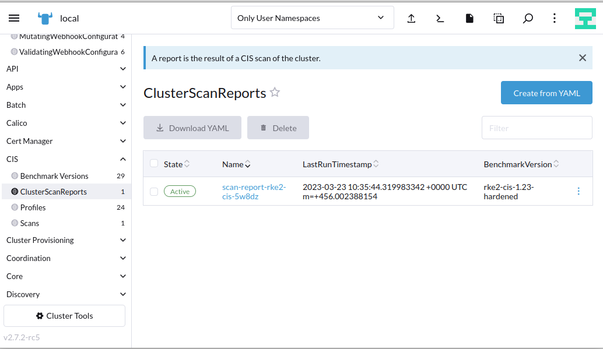

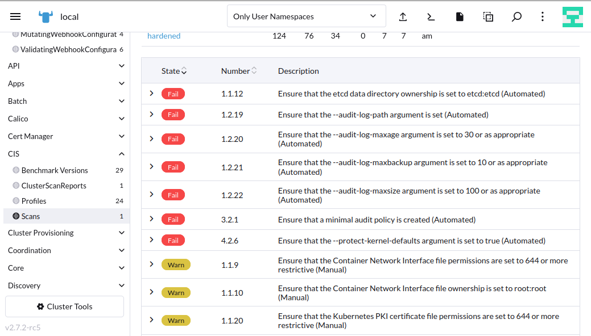

### Kubeadm Security Scan

You can issue security scan on `kubeadm` cluster by enabling the unit `trivy-operator` in in your environment file `values.yaml`:

```yaml
units:
  trivy-operator:
    enabled: yes
```

The `trivy-operator`  includes the CRD  `clustercompliancereports`, which provide can reports against various benchmark:

```shell
$ kubectl get clustercompliancereports
NAME             AGE
cis              4h4m
nsa              4h4m
pss-baseline     4h4m
pss-restricted   4h4m
```

Choosing the CIS benchmark:

```shell
kubectl get clustercompliancereports cis -o yaml
```

### Vulnerabilities Check

#### Trivy-Operator

To check vulnerabilities of **running** images, enable the deployment of trivy-operator in your `environment-values` file `values.yaml`:

```yaml
units:
  trivy-operator:
    enabled: yes
```

You can list the vulnerabilities reports and get a summary with the command:

```shell
kubectl get -A vulnerabilityreports -o wide
```

Then we can focus on a report and dig into it for details:

```shell
$ kubectl get -n calico-system vulnerabilityreport replicaset-calico-typha-89798ff7b-calico-typha -o wide
NAME                                             REPOSITORY                      TAG       SCANNER   AGE   CRITICAL   HIGH
replicaset-calico-typha-89798ff7b-calico-typha   rancher/mirrored-calico-typha   v3.25.0   Trivy     12m   1          1  
```

```shell
kubectl get -n calico-system vulnerabilityreport replicaset-calico-typha-89798ff7b-calico-typha -o yaml
```

It should issue a report like this:

```yaml
report:
  artifact:
    repository: rancher/mirrored-calico-typha
    tag: v3.25.0
  registry:
    server: index.docker.io
  scanner:
    name: Trivy
    vendor: Aqua Security
    version: 0.40.0
  summary:
    criticalCount: 1
    highCount: 1
    lowCount: 0
    mediumCount: 0
    noneCount: 0
    unknownCount: 0
  updateTimestamp: "2023-07-13T12:30:06Z"
  vulnerabilities:
  - fixedVersion: 2.16.0+incompatible
    installedVersion: v2.11.2-0.20200112161605-a7c079c43d51+incompatible
    links: []
    primaryLink: https://avd.aquasec.com/nvd/cve-2022-1996
    resource: github.com/emicklei/go-restful
    score: 9.1
    severity: CRITICAL
    target: ""
    title: Authorization Bypass Through User-Controlled Key
    vulnerabilityID: CVE-2022-1996
  - fixedVersion: 0.7.0
    installedVersion: v0.4.0
    links: []
    primaryLink: https://avd.aquasec.com/nvd/cve-2022-41723
    resource: golang.org/x/net
    score: 7.5
    severity: HIGH
    target: ""
    title: avoid quadratic complexity in HPACK decoding
    vulnerabilityID: CVE-2022-41723
```

> **_Note_** that trivy-operator includes, in addition to the vulnerability assessment, a bunch of audit and compliancy reports that are worth to be considered:

```shell
$ kubectl api-resources | grep aqua
clustercompliancereports                     compliance                         aquasecurity.github.io/v1alpha1            false        ClusterComplianceReport
clusterconfigauditreports                    clusterconfigaudit                 aquasecurity.github.io/v1alpha1            false        ClusterConfigAuditReport
clusterinfraassessmentreports                clusterinfraassessment             aquasecurity.github.io/v1alpha1            false        ClusterInfraAssessmentReport
clusterrbacassessmentreports                 clusterrbacassessmentreport        aquasecurity.github.io/v1alpha1            false        ClusterRbacAssessmentReport
configauditreports                           configaudit,configaudits           aquasecurity.github.io/v1alpha1            true         ConfigAuditReport
exposedsecretreports                         exposedsecret,exposedsecrets       aquasecurity.github.io/v1alpha1            true         ExposedSecretReport
infraassessmentreports                       infraassessment,infraassessments   aquasecurity.github.io/v1alpha1            true         InfraAssessmentReport
rbacassessmentreports                        rbacassessment,rbacassessments     aquasecurity.github.io/v1alpha1            true         RbacAssessmentReport
vulnerabilityreports                         vuln,vulns                         aquasecurity.github.io/v1alpha1            true         VulnerabilityReport

```

## Software Bill Of Material (SBOM)

The optional unit `sbom-operator` allows to build the Software Bill Of Material (SBOM) of Sylva. The unit deploys an [operator](https://artifacthub.io/packages/helm/ckotzbauer/sbom-operator) generating the SBOM of each image used in a Sylva cluster.

By default, the SBOMs is exported to `confimaps`, which can be retrieved as follows:

```shell
kubectl  get -A configmap -l ckotzbauer.sbom-operator.io
```

The `configmap` content is stored as `broli` compressed binary-data. The following commands show how to fetch a given SBOM:

```shell
kubectl  get -n kyverno configmap kyverno-cleanup-admission-reports-28146180-l6jv2-cleanup -o jsonpath='{.binaryData.sbom}' | base64 -d > sbom.br

brotli -d sbom.br
```

Instead of `configmaps`, the SBOMs can be exported to Git, OCI registry or [Dependency Track](https://owasp.org/www-project-dependency-track/). The later is an interesting OWASP tool for the analysis of the SBOM's component. To build  and export the Sylva SBOMs to an external Dependency Track server, you can modify the `values.yaml` of the `sbom-operator` chart file as follows:

```yaml
serviceAccount:
  create: true
  name: sbom-operator
securityContext:
   capabilities:
     drop:
     - ALL
   privileged: false
   readOnlyRootFilesystem: true
   runAsNonRoot: true
   runAsUser: 10001
   seccompProfile:
     type: RuntimeDefault
resources:
   limits:
     cpu: 500m
     memory: 500Mi
   requests:
     cpu: 100m
     memory: 100Mi
args:
  targets: dtrack
  verbosity: debug
  format: cyclonedx
  dtrack-base-url: https://dependency-track.example
  dtrack-api-key: xGNE...
envVars: # if using proxy
      - name: https_proxy
        value: http://proxy.example:8080
      - name: http_proxy
        value: http://proxy.example:8080
      - name: no_proxy
        value: localhost,127.0.0.0/8,192.168.0.0/16,172.16.0.0/12,10.0.0.0/8,172.20.36.130,keycloak.sylva,.cluster.local,.cluster.local.,.svc,.sylva
```

Dependency track displays all imported SBOMs and gives a summary of the vulnerabilities for each of them:

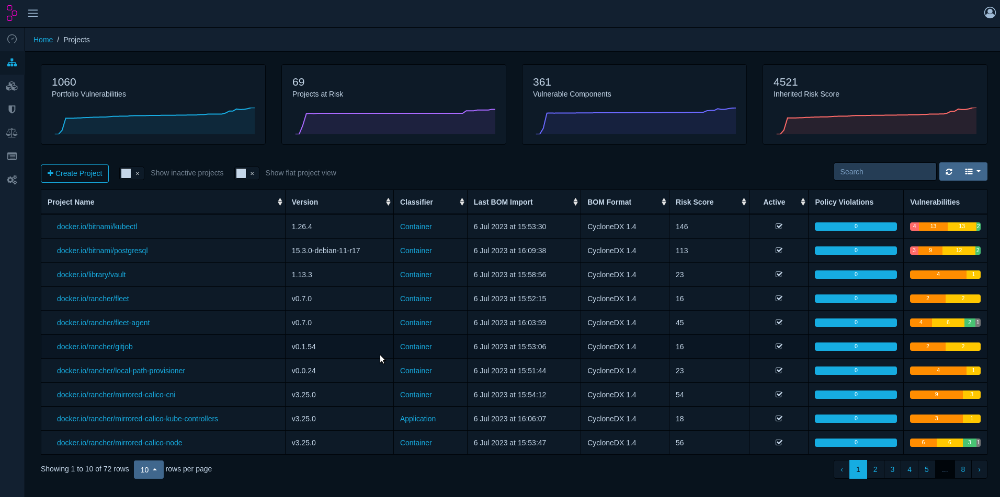

Then, for each images, we can have the list of components (softwares and packages) and check for their vulnerabilities:

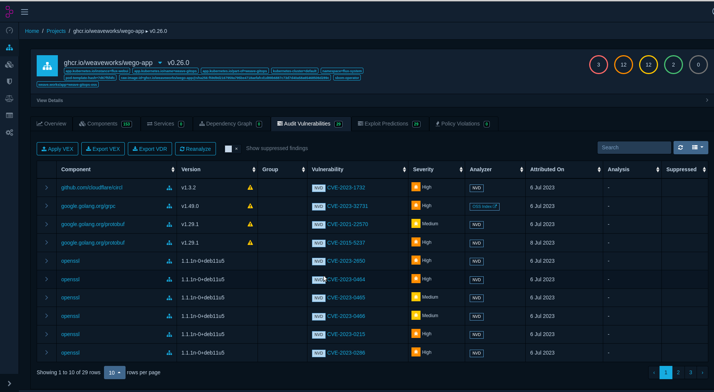
