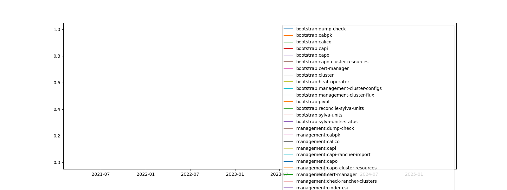

# Daily CI report

Following report shows results of various test-suites that have been executed against latest develop branch of [seen-bp-model-definitions-dev](https://gitlab.com/sylva-projects/sylva-core) during last 24 hours

Tests are either passed, or contain the name of the test that has failed

| id                                                                           | bootstrap:dump-check     | bootstrap:cabpk            | bootstrap:calico           | bootstrap:capi             | bootstrap:capo             | bootstrap:capo-cluster-resources   | bootstrap:cert-manager    | bootstrap:cluster          | bootstrap:heat-operator    | bootstrap:management-cluster-configs   | bootstrap:management-cluster-flux   | bootstrap:pivot             | bootstrap:reconcile-sylva-units   | bootstrap:sylva-units       | bootstrap:sylva-units-status   | management:dump-check                                                                                  | management:cabpk            | management:calico           | management:capi             | management:capi-rancher-import   | management:capo             | management:capo-cluster-resources   | management:cert-manager     | management:check-rancher-clusters                                    | management:cinder-csi       | management:cluster          | management:coredns          | management:default-storage-class   | management:first-login-rancher   | management:flux-system      | management:flux-webui                                    | management:heat-operator    | management:ingress-nginx    | management:k8s-gateway      | management:keycloak         | management:keycloak-legacy-operator   | management:keycloak-resources                                    | management:local-path-provisioner   | management:monitoring       | management:monitoring-crd   | management:namespace-defs   | management:postgres         | management:rancher          | management:rancher-add-keycloak-provider                                    | management:rancher-webhook-service   | management:sylva-ca         | management:sylva-ca-certs   | management:sylva-units-status                                    | management:update-rancher-admin                                    | management:vault            | management:vault-operator   | management:workload-capo-cluster-resources   | management:workload-cluster                                    | management:workload-cluster-calico                                    | management:workload-cluster-import                                    | management:workload-cluster-monitoring                                    | management:workload-cluster-monitoring-crd                                    | commit                                                                                                                                        | management:cattle-agent-first-workload-cluster   | bootstrap:cabpr            | management:cabpr                                 | management:cis-operator     | management:cis-operator-crd   | management:cis-operator-scan   | management:cattle-agent-first-workload-cluster-834166595-rke2-capo                                 |
|:-----------------------------------------------------------------------------|:-------------------------|:---------------------------|:---------------------------|:---------------------------|:---------------------------|:-----------------------------------|:--------------------------|:---------------------------|:---------------------------|:---------------------------------------|:------------------------------------|:----------------------------|:----------------------------------|:----------------------------|:-------------------------------|:-------------------------------------------------------------------------------------------------------|:----------------------------|:----------------------------|:----------------------------|:---------------------------------|:----------------------------|:------------------------------------|:----------------------------|:---------------------------------------------------------------------|:----------------------------|:----------------------------|:----------------------------|:-----------------------------------|:---------------------------------|:----------------------------|:---------------------------------------------------------|:----------------------------|:----------------------------|:----------------------------|:----------------------------|:--------------------------------------|:-----------------------------------------------------------------|:------------------------------------|:----------------------------|:----------------------------|:----------------------------|:----------------------------|:----------------------------|:----------------------------------------------------------------------------|:-------------------------------------|:----------------------------|:----------------------------|:-----------------------------------------------------------------|:-------------------------------------------------------------------|:----------------------------|:----------------------------|:---------------------------------------------|:---------------------------------------------------------------|:----------------------------------------------------------------------|:----------------------------------------------------------------------|:--------------------------------------------------------------------------|:------------------------------------------------------------------------------|:----------------------------------------------------------------------------------------------------------------------------------------------|:-------------------------------------------------|:---------------------------|:-------------------------------------------------|:----------------------------|:------------------------------|:-------------------------------|:---------------------------------------------------------------------------------------------------|
| [4099822086](https://gitlab.com/sylva-projects/sylva-core/-/jobs/4099822086) | **{+ passed +}** (1s) | **{+ passed +}** (134s) | **{+ passed +}** (427s) | **{+ passed +}** (135s) | **{+ passed +}** (82s)  | **{+ passed +}** (112s)         | **{+ passed +}** (62s) | **{+ passed +}** (425s) | **{+ passed +}** (127s) | **{+ passed +}** (481s)             | **{+ passed +}** (463s)          | **{+ passed +}** (631s)  | **{+ passed +}** (179s)        | **{+ passed +}** (494s)  | **{+ passed +}** (631s)     | **{+ passed +}** (1s)                                                                               | **{+ passed +}** (1924s) | **{+ passed +}** (2707s) | **{+ passed +}** (1927s) | **{+ passed +}** (2245s)      | **{+ passed +}** (1926s) | **{+ passed +}** (1949s)         | **{+ passed +}** (1893s) | **{- test-kubeadm-capo:management:check-rancher-clusters -}** :rage: | **{+ passed +}** (1893s) | **{+ passed +}** (1826s) | **{+ passed +}** (2702s) | **{+ passed +}** (1917s)        | **{+ passed +}** (2159s)      | **{+ passed +}** (2725s) | **{+ passed +}** (2014s)                              | **{+ passed +}** (2019s) | **{+ passed +}** (1918s) | **{+ passed +}** (1940s) | **{+ passed +}** (2069s) | **{+ passed +}** (2056s)           | **{+ passed +}** (2099s)                                      | **{+ passed +}** (2758s)         | **{+ passed +}** (2126s) | **{+ passed +}** (1931s) | **{+ passed +}** (2702s) | **{+ passed +}** (2022s) | **{+ passed +}** (2155s) | **{+ passed +}** (2159s)                                                 | **{+ passed +}** (2159s)          | **{+ passed +}** (1920s) | **{+ passed +}** (1962s) | **{- test-kubeadm-capo:management:sylva-units-status -}** :rage: | **{+ passed +}** (2130s)                                        | **{+ passed +}** (1947s) | **{+ passed +}** (2728s) | **{+ passed +}** (1978s)                  | **{- test-kubeadm-capo:management:workload-cluster -}** :rage: | **{- test-kubeadm-capo:management:workload-cluster-calico -}** :rage: | **{- test-kubeadm-capo:management:workload-cluster-import -}** :rage: | **{- test-kubeadm-capo:management:workload-cluster-monitoring -}** :rage: | **{- test-kubeadm-capo:management:workload-cluster-monitoring-crd -}** :rage: | [remove comment](https://gitlab.com/sylva-projects/sylva-core/tree/60153d1528aa23d99398cff2eaa43030c3fb7ed6)                                  |                                                  |                            |                                                  |                             |                               |                                |                                                                                                    |
| [4099232970](https://gitlab.com/sylva-projects/sylva-core/-/jobs/4099232970) | **{+ passed +}** (1s) | **{+ passed +}** (135s) | **{+ passed +}** (449s) | **{+ passed +}** (171s) | **{+ passed +}** (170s) | **{+ passed +}** (171s)         | **{+ passed +}** (61s) | **{+ passed +}** (447s) | **{+ passed +}** (164s) | **{+ passed +}** (502s)             | **{+ passed +}** (491s)          | **{+ passed +}** (697s)  | **{+ passed +}** (231s)        | **{+ passed +}** (516s)  | **{+ passed +}** (698s)     | **{+ passed +}** (1s)                                                                               | **{+ passed +}** (1927s) | **{+ passed +}** (2709s) | **{+ passed +}** (1928s) | **{+ passed +}** (2298s)      | **{+ passed +}** (1942s) | **{+ passed +}** (1965s)         | **{+ passed +}** (2799s) | **{+ passed +}** (2410s)                                          | **{+ passed +}** (1925s) | **{+ passed +}** (1813s) | **{+ passed +}** (2707s) | **{+ passed +}** (1965s)        | **{+ passed +}** (2230s)      | **{+ passed +}** (2718s) | **{- test-kubeadm-capo:management:flux-webui -}** :rage: | **{+ passed +}** (1940s) | **{+ passed +}** (2794s) | **{+ passed +}** (2797s) | **{+ passed +}** (2087s) | **{+ passed +}** (2118s)           | **{- test-kubeadm-capo:management:keycloak-resources -}** :rage: | **{+ passed +}** (2723s)         | **{+ passed +}** (2116s) | **{+ passed +}** (1931s) | **{+ passed +}** (2703s) | **{+ passed +}** (2022s) | **{+ passed +}** (2209s) | **{- test-kubeadm-capo:management:rancher-add-keycloak-provider -}** :rage: | **{+ passed +}** (2230s)          | **{+ passed +}** (2808s) | **{+ passed +}** (1966s) | **{- test-kubeadm-capo:management:sylva-units-status -}** :rage: | **{- test-kubeadm-capo:management:update-rancher-admin -}** :rage: | **{+ passed +}** (2013s) | **{+ passed +}** (1964s) | **{+ passed +}** (1979s)                  | **{+ passed +}** (2106s)                                    | **{+ passed +}** (2134s)                                           | **{+ passed +}** (2389s)                                           | **{+ passed +}** (2314s)                                               | **{+ passed +}** (2196s)                                                   | [use CI values from main](https://gitlab.com/sylva-projects/sylva-core/tree/4f76bba36e7c6fb313821477178b6651b209431c)                         | **{+ passed +}** (56s)                        |                            |                                                  |                             |                               |                                |                                                                                                    |
| [4099232967](https://gitlab.com/sylva-projects/sylva-core/-/jobs/4099232967) | **{+ passed +}** (1s) |                            |                            | **{+ passed +}** (87s)  | **{+ passed +}** (164s) | **{+ passed +}** (162s)         | **{+ passed +}** (61s) | **{+ passed +}** (849s) | **{+ passed +}** (166s) | **{+ passed +}** (894s)             | **{+ passed +}** (876s)          | **{+ passed +}** (1038s) | **{+ passed +}** (225s)        | **{+ passed +}** (906s)  | **{+ passed +}** (1044s)    | **{- test-rke2-capo:management:dump-check:management-cluster-dump/flux-kustomizations.yaml -}** :rage: |                             |                             |                             |                                  |                             |                                     |                             |                                                                      |                             |                             |                             |                                    |                                  |                             |                                                          |                             |                             |                             |                             |                                       |                                                                  |                                     |                             |                             |                             |                             |                             |                                                                             |                                      |                             |                             |                                                                  |                                                                    |                             |                             |                                              |                                                                |                                                                       |                                                                       |                                                                           |                                                                               | [use CI values from main](https://gitlab.com/sylva-projects/sylva-core/tree/4f76bba36e7c6fb313821477178b6651b209431c)                         |                                                  | **{+ passed +}** (132s) |                                                  |                             |                               |                                |                                                                                                    |
| [4099161650](https://gitlab.com/sylva-projects/sylva-core/-/jobs/4099161650) | **{+ passed +}** (1s) |                            |                            | **{+ passed +}** (100s) | **{+ passed +}** (136s) | **{+ passed +}** (114s)         | **{+ passed +}** (62s) | **{+ passed +}** (894s) | **{+ passed +}** (128s) | **{+ passed +}** (938s)             | **{+ passed +}** (922s)          | **{+ passed +}** (1098s) | **{+ passed +}** (204s)        | **{+ passed +}** (950s)  | **{+ passed +}** (1104s)    | **{- test-rke2-capo:management:dump-check:management-cluster-dump/flux-kustomizations.yaml -}** :rage: |                             |                             |                             |                                  |                             |                                     |                             |                                                                      |                             |                             |                             |                                    |                                  |                             |                                                          |                             |                             |                             |                             |                                       |                                                                  |                                     |                             |                             |                             |                             |                             |                                                                             |                                      |                             |                             |                                                                  |                                                                    |                             |                             |                                              |                                                                |                                                                       |                                                                       |                                                                           |                                                                               | [Update sylvactl (and sylva-toolbox container)](https://gitlab.com/sylva-projects/sylva-core/tree/06981974c32d4db41532c6802f9023ced0f20040)   |                                                  | **{+ passed +}** (135s) |                                                  |                             |                               |                                |                                                                                                    |
| [4098709509](https://gitlab.com/sylva-projects/sylva-core/-/jobs/4098709509) | **{+ passed +}** (1s) |                            |                            | **{+ passed +}** (135s) | **{+ passed +}** (131s) | **{+ passed +}** (143s)         | **{+ passed +}** (61s) | **{+ passed +}** (847s) | **{+ passed +}** (163s) | **{+ passed +}** (887s)             | **{+ passed +}** (875s)          | **{+ passed +}** (1022s) | **{+ passed +}** (204s)        | **{+ passed +}** (899s)  | **{+ passed +}** (1029s)    | **{+ passed +}** (1s)                                                                               |                             |                             | **{+ passed +}** (1867s) | **{+ passed +}** (2176s)      | **{+ passed +}** (1867s) | **{+ passed +}** (1890s)         | **{+ passed +}** (2728s) | **{- test-rke2-capo:management:check-rancher-clusters -}** :rage:    | **{+ passed +}** (1893s) | **{+ passed +}** (1987s) | **{+ passed +}** (2708s) | **{+ passed +}** (1923s)        | **{+ passed +}** (2104s)      | **{+ passed +}** (2720s) | **{+ passed +}** (2730s)                              | **{+ passed +}** (1875s) |                             | **{+ passed +}** (1898s) | **{+ passed +}** (2037s) | **{+ passed +}** (2056s)           | **{+ passed +}** (2080s)                                      | **{+ passed +}** (2741s)         | **{+ passed +}** (2111s) | **{+ passed +}** (1924s) | **{+ passed +}** (2714s) | **{+ passed +}** (1984s) | **{+ passed +}** (2084s) | **{+ passed +}** (2110s)                                                 | **{+ passed +}** (2104s)          | **{+ passed +}** (2745s) | **{+ passed +}** (1870s) | **{- test-rke2-capo:management:sylva-units-status -}** :rage:    | **{+ passed +}** (2187s)                                        | **{+ passed +}** (1900s) | **{+ passed +}** (2743s) | **{+ passed +}** (1879s)                  | **{- test-rke2-capo:management:workload-cluster -}** :rage:    |                                                                       | **{- test-rke2-capo:management:workload-cluster-import -}** :rage:    | **{- test-rke2-capo:management:workload-cluster-monitoring -}** :rage:    | **{- test-rke2-capo:management:workload-cluster-monitoring-crd -}** :rage:    | [Update sylvactl (and sylva-toolbox container)](https://gitlab.com/sylva-projects/sylva-core/tree/3380a598a03fffcd2a0b5c5b0e2a68102a4bd5b8)   |                                                  | **{+ passed +}** (96s)  | **{+ passed +}** (1880s)                      | **{+ passed +}** (1880s) | **{+ passed +}** (2713s)   | **{+ passed +}** (1890s)    |                                                                                                    |
| [4097912602](https://gitlab.com/sylva-projects/sylva-core/-/jobs/4097912602) | **{+ passed +}** (1s) |                            |                            | **{+ passed +}** (132s) | **{+ passed +}** (133s) | **{+ passed +}** (135s)         | **{+ passed +}** (62s) | **{+ passed +}** (987s) | **{+ passed +}** (130s) | **{+ passed +}** (1027s)            | **{+ passed +}** (1014s)         | **{+ passed +}** (1121s) | **{+ passed +}** (197s)        | **{+ passed +}** (1039s) | **{+ passed +}** (1129s)    | **{+ passed +}** (1s)                                                                               |                             |                             | **{+ passed +}** (2761s) | **{+ passed +}** (2146s)      | **{+ passed +}** (1871s) | **{+ passed +}** (1888s)         | **{+ passed +}** (2726s) | **{- test-rke2-capo:management:check-rancher-clusters -}** :rage:    | **{+ passed +}** (2721s) | **{+ passed +}** (1803s) | **{+ passed +}** (2701s) | **{+ passed +}** (2758s)        | **{+ passed +}** (2067s)      | **{+ passed +}** (2741s) | **{+ passed +}** (1873s)                              | **{+ passed +}** (2763s) |                             | **{+ passed +}** (2726s) | **{+ passed +}** (2054s) | **{+ passed +}** (2068s)           | **{+ passed +}** (2098s)                                      | **{+ passed +}** (2736s)         | **{+ passed +}** (2012s) | **{+ passed +}** (1911s) | **{+ passed +}** (2701s) | **{+ passed +}** (1948s) | **{+ passed +}** (2057s) | **{+ passed +}** (2122s)                                                 | **{+ passed +}** (2063s)          | **{+ passed +}** (2758s) | **{+ passed +}** (1871s) | **{- test-rke2-capo:management:sylva-units-status -}** :rage:    | **{+ passed +}** (2128s)                                        | **{+ passed +}** (1888s) | **{+ passed +}** (2732s) | **{+ passed +}** (1913s)                  | **{+ passed +}** (2733s)                                    |                                                                       | **{- test-rke2-capo:management:workload-cluster-import -}** :rage:    | **{- test-rke2-capo:management:workload-cluster-monitoring -}** :rage:    | **{- test-rke2-capo:management:workload-cluster-monitoring-crd -}** :rage:    | [hide missing cluster.cluster.x-k8s.io CRD error](https://gitlab.com/sylva-projects/sylva-core/tree/837ab7af61aa8fb70b0f425217ff48b54028a919) |                                                  | **{+ passed +}** (128s) | **{- test-rke2-capo:management:cabpr -}** :rage: | **{+ passed +}** (1877s) | **{+ passed +}** (2711s)   | **{+ passed +}** (1886s)    | **{- test-rke2-capo:management:cattle-agent-first-workload-cluster-834166595-rke2-capo -}** :rage: |

# Error frequency trend (in last 10 days and per test class)

# Today errors

**{-management:check-rancher-clusters-test-kubeadm-capo:management:check-rancher-clusters-}**: failure check-rancher-clusters unit ready status was: False

**{-management:sylva-units-status-test-kubeadm-capo:management:sylva-units-status-}**: failure sylva-units-status unit ready status was: False

**{-management:workload-cluster-test-kubeadm-capo:management:workload-cluster-}**: failure workload-cluster unit ready status was: Unknown

**{-management:workload-cluster-calico-test-kubeadm-capo:management:workload-cluster-calico-}**: failure workload-cluster-calico unit ready status was: False

**{-management:workload-cluster-import-test-kubeadm-capo:management:workload-cluster-import-}**: failure workload-cluster-import unit ready status was: False

**{-management:workload-cluster-monitoring-test-kubeadm-capo:management:workload-cluster-monitoring-}**: failure workload-cluster-monitoring unit ready status was: False

**{-management:workload-cluster-monitoring-crd-test-kubeadm-capo:management:workload-cluster-monitoring-crd-}**: failure workload-cluster-monitoring-crd unit ready status was: False

**{-management:flux-webui-test-kubeadm-capo:management:flux-webui-}**: failure flux-webui unit ready status was: False

**{-management:keycloak-resources-test-kubeadm-capo:management:keycloak-resources-}**: failure keycloak-resources unit ready status was: False

**{-management:rancher-add-keycloak-provider-test-kubeadm-capo:management:rancher-add-keycloak-provider-}**: failure rancher-add-keycloak-provider unit ready status was: False

**{-management:sylva-units-status-test-kubeadm-capo:management:sylva-units-status-}**: failure sylva-units-status unit ready status was: False

**{-management:update-rancher-admin-test-kubeadm-capo:management:update-rancher-admin-}**: failure update-rancher-admin unit ready status was: False

**{-management:dump-check-test-rke2-capo:management:dump-check:management-cluster-dump/flux-kustomizations.yaml-}**: failure management-cluster-dump/flux-kustomizations.yaml was not found: 

**{-management:dump-check-test-rke2-capo:management:dump-check:management-cluster-dump/flux-kustomizations.yaml-}**: failure management-cluster-dump/flux-kustomizations.yaml was not found: 

**{-management:check-rancher-clusters-test-rke2-capo:management:check-rancher-clusters-}**: failure check-rancher-clusters unit ready status was: False

**{-management:sylva-units-status-test-rke2-capo:management:sylva-units-status-}**: failure sylva-units-status unit ready status was: False

**{-management:workload-cluster-test-rke2-capo:management:workload-cluster-}**: failure workload-cluster unit ready status was: Unknown

**{-management:workload-cluster-import-test-rke2-capo:management:workload-cluster-import-}**: failure workload-cluster-import unit ready status was: False

**{-management:workload-cluster-monitoring-test-rke2-capo:management:workload-cluster-monitoring-}**: failure workload-cluster-monitoring unit ready status was: False

**{-management:workload-cluster-monitoring-crd-test-rke2-capo:management:workload-cluster-monitoring-crd-}**: failure workload-cluster-monitoring-crd unit ready status was: False

**{-management:cabpr-test-rke2-capo:management:cabpr-}**: failure cabpr unit ready status was: Unknown

**{-management:cattle-agent-first-workload-cluster-834166595-rke2-capo-test-rke2-capo:management:cattle-agent-first-workload-cluster-834166595-rke2-capo-}**: failure cattle-agent-first-workload-cluster-834166595-rke2-capo unit ready status was: False

**{-management:check-rancher-clusters-test-rke2-capo:management:check-rancher-clusters-}**: failure check-rancher-clusters unit ready status was: False

**{-management:sylva-units-status-test-rke2-capo:management:sylva-units-status-}**: failure sylva-units-status unit ready status was: False

**{-management:workload-cluster-import-test-rke2-capo:management:workload-cluster-import-}**: failure workload-cluster-import unit ready status was: Unknown

**{-management:workload-cluster-monitoring-test-rke2-capo:management:workload-cluster-monitoring-}**: failure workload-cluster-monitoring unit ready status was: False

**{-management:workload-cluster-monitoring-crd-test-rke2-capo:management:workload-cluster-monitoring-crd-}**: failure workload-cluster-monitoring-crd unit ready status was: Unknown

Process finished with exit code 0
